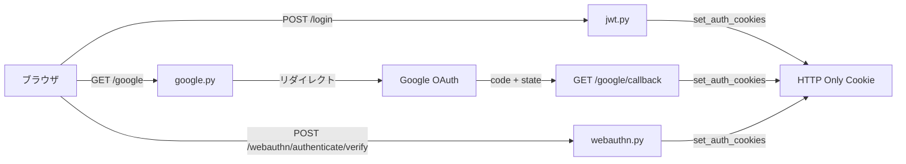

# REST API エンドポイント仕様書

**ステータス**: 実装ベース (2026-04-15 時点)
**対象ファイル**: `backend/app/api/` 配下の全エンドポイント

---

## このドキュメントの位置づけ

このドキュメントは `backend/app/api/` 配下のエンドポイント実装を網羅する**単一ソースオブトゥルース**です。

### 変更時のルール

1. エンドポイントの追加・削除・パス変更を行った場合は、このドキュメントを必ず同一コミット内で更新する
2. リクエスト/レスポンススキーマを変更した場合は「パラメータ」「レスポンス」セクションを更新する
3. 認証要件が変わった場合は「認証」フィールドを更新し、`CLAUDE.md` の API Routes セクションも確認する
4. MCP ツールとの対応関係が変わった場合は「関連 MCP ツール」を更新する

---

## 目次

1. [共通仕様](#1-共通仕様)
2. [Auth — 認証](#2-auth--認証)
3. [Users — ユーザー管理](#3-users--ユーザー管理)
4. [Projects — プロジェクト管理](#4-projects--プロジェクト管理)
5. [Tasks — タスク管理](#5-tasks--タスク管理)
6. [Documents — プロジェクトドキュメント](#6-documents--プロジェクトドキュメント)
7. [Knowledge — ナレッジベース](#7-knowledge--ナレッジベース)
8. [Bookmarks — ブックマーク](#8-bookmarks--ブックマーク)
9. [DocSites — 外部ドキュメントサイト](#9-docsites--外部ドキュメントサイト)
10. [MCP Keys — API キー管理](#10-mcp-keys--api-キー管理)
11. [MCP Usage — 使用状況統計](#11-mcp-usage--使用状況統計)
12. [Events — SSE イベント](#12-events--sse-イベント)
13. [Backup — バックアップ](#13-backup--バックアップ)
14. [Secrets — プロジェクトシークレット](#14-secrets--プロジェクトシークレット)
15. [Workspaces — エージェント管理](#15-workspaces--エージェント管理)
16. [Chat — チャットセッション](#16-chat--チャットセッション)
17. [Error Tracker — エラートラッカー](#17-error-tracker--エラートラッカー)
18. [Error Tracker Ingest — イベント受信 (Sentry 互換)](#18-error-tracker-ingest--イベント受信-sentry-互換)
19. [Attachments — 添付ファイル配信](#19-attachments--添付ファイル配信)
20. [Bookmark Assets — ブックマーク資産](#20-bookmark-assets--ブックマーク資産)
21. [Public Config — 公開設定](#21-public-config--公開設定)
22. [Health — ヘルスチェック](#22-health--ヘルスチェック)
23. [エンドポイント追加/変更時のチェックリスト](#23-エンドポイント追加変更時のチェックリスト)

---

## 1. 共通仕様

### ベース URL

```
/api/v1        — 全エンドポイント (Error Tracker Ingest を除く)
/api/{id}      — Error Tracker Ingest (Sentry SDK 互換パス、v1 プレフィックスなし)
/health        — ヘルスチェック (プレフィックスなし)
/mcp           — MCP stateful HTTP (このドキュメントの対象外)
```

### 認証方式

| 方式 | ヘッダー / Cookie | 使用箇所 |
|---|---|---|
| JWT Bearer | `Authorization: Bearer <access_token>` | 全 API エンドポイント |
| Cookie (アクセストークン) | `access_token` HttpOnly Cookie | ブラウザ SPA |
| Cookie (リフレッシュトークン) | `refresh_token` HttpOnly Cookie | `/auth/refresh` |
| X-API-Key | `X-API-Key: mtodo_<hex>` | MCP ツール (このドキュメントの対象外) |
| Agent Token | `Authorization: Bearer ta_<hex>` | エージェント向けリリースエンドポイント |
| Sentry DSN | `X-Sentry-Auth` ヘッダーまたはクエリパラメータ | Error Tracker Ingest |

アクセストークンの有効期限: **60分**。リフレッシュトークンの有効期限: **7日間** (ワンタイム使用)。

### 共通エラーレスポンス

全エンドポイントが `ORJSONResponse` を使用。

```json
{"detail": "エラーメッセージ"}
```

エラートラッカーの一部エンドポイントは構造化エラーを返す:

```json
{"detail": {"code": "not_found"}}
```

グローバル例外ハンドラーが 500 エラーをキャプチャし、エラートラッカーへ自動送信する。

### ページネーション規約

リスト系エンドポイントは `limit` / `skip` ベース:

| クエリパラメータ | 型 | デフォルト | 説明 |
|---|---|---|---|
| `limit` | `int` | エンドポイント依存 | 取得件数 |
| `skip` | `int` | `0` | スキップ件数 |

レスポンス形式:

```json
{"items": [...], "total": 100, "limit": 50, "skip": 0}
```

### プロジェクトロック

プロジェクトに `is_locked: true` が設定されている場合、書き込み系操作は **HTTP 423 Locked** を返す。

---

## 2. Auth — 認証

**ソースファイル**: `endpoints/auth/__init__.py`, `auth/jwt.py`, `auth/google.py`, `auth/webauthn.py`

**プレフィックス**: `/api/v1/auth`

### フロー概要



---

### POST /api/v1/auth/login

パスワード認証 (管理者ユーザーのみ)。

**認証**: 不要 (public)

**リクエストボディ**

| フィールド | 型 | 必須 | 制約 |
|---|---|---|---|
| `username` | `string` | はい | メールアドレス |
| `password` | `string` | はい | — |

**レスポンス**

| ステータス | 内容 |
|---|---|
| 200 | `TokenResponse` — `access_token`, `refresh_token` / HttpOnly Cookie セット |
| 401 | 認証情報が無効 |
| 403 | アカウント無効 / パスワードログイン無効化済み |

**副作用**: 失敗時 Redis にログイン失敗カウンターを記録 (レートリミット)。成功時カウンターをクリア。Cookie をセット。

---

### POST /api/v1/auth/refresh

リフレッシュトークンを使って新しいアクセストークンを発行。

**認証**: `refresh_token` Cookie (必須)

**レスポンス**

| ステータス | 内容 |
|---|---|
| 200 | `TokenResponse` — 新しい `access_token`, `refresh_token` / Cookie 更新 |
| 401 | Cookie なし / トークン無効 / JTI 使用済み |

**副作用**: 旧 JTI を Redis から削除 (ワンタイム使用)。新しい Cookie をセット。

---

### GET /api/v1/auth/me

現在のログインユーザー情報を返す。

**認証**: JWT Bearer (user)

**レスポンス**

| ステータス | 内容 |
|---|---|
| 200 | `{id, email, name, is_admin, picture_url, auth_type, has_passkeys, password_disabled}` |
| 401 | 未認証 |

---

### POST /api/v1/auth/logout

認証 Cookie を削除する。**未認証でも呼び出し可能**。

**認証**: 不要 (Cookie があれば削除)

**レスポンス**: 200 `{"detail": "Logged out"}`

---

### GET /api/v1/auth/google

Google OAuth 2.0 フローを開始。Google のサインイン画面へリダイレクト。

**認証**: 不要 (public)

**レスポンス**: 302 リダイレクト (Google)

**副作用**: `oauth_state` Cookie をセット。Redis に state を保存 (TTL: 10分)。

---

### GET /api/v1/auth/google/callback

Google からのコールバックを受け取り、JWT を発行。

**認証**: 不要 (state Cookie による CSRF 検証)

**クエリパラメータ**

| パラメータ | 型 | 必須 |
|---|---|---|
| `code` | `string` | はい |
| `state` | `string` | はい |

**レスポンス**

| ステータス | 内容 |
|---|---|
| 200 | `TokenResponse` / Cookie セット |
| 400 | state 不一致 / Google からのメールなし |
| 403 | `allowed_emails` コレクションに存在しないメール |
| 502 | Google API エラー |

**副作用**: 初回ログイン時にユーザードキュメントを新規作成。Cookie をセット。

---

### POST /api/v1/auth/webauthn/register/options

パスキー登録用チャレンジを生成 (ログイン済み管理者ユーザーのみ)。

**認証**: JWT Bearer (admin 認証タイプのユーザー)

**レスポンス**: 200 — WebAuthn PublicKeyCredentialCreationOptions (JSON)

**副作用**: Redis にチャレンジを保存 (TTL: 5分)。

---

### POST /api/v1/auth/webauthn/register/verify

パスキー登録を完了し、クレデンシャルをユーザードキュメントに保存。

**認証**: JWT Bearer (admin 認証タイプのユーザー)

**リクエストボディ**

| フィールド | 型 | 必須 |
|---|---|---|
| `credential` | `object` | はい (SimpleWebAuthn 形式) |
| `name` | `string` | いいえ |

**レスポンス**: 200 `{credential_id, name, created_at}`

**副作用**: ユーザードキュメントの `webauthn_credentials` に追加。Redis のチャレンジを削除。

---

### POST /api/v1/auth/webauthn/authenticate/options

パスキー認証用チャレンジを生成。

**認証**: 不要 (public)

**リクエストボディ**

| フィールド | 型 | 必須 |
|---|---|---|
| `email` | `string` | いいえ (指定時にそのユーザーのクレデンシャルのみ提示) |

**レスポンス**: 200 — WebAuthn PublicKeyCredentialRequestOptions (JSON)

**副作用**: Redis にチャレンジを保存 (TTL: 5分)。

---

### POST /api/v1/auth/webauthn/authenticate/verify

パスキー認証を完了し、JWT を発行。

**認証**: 不要 (パスキーによる認証)

**リクエストボディ**

| フィールド | 型 | 必須 |
|---|---|---|
| `credential` | `object` | はい (SimpleWebAuthn 形式) |

**レスポンス**

| ステータス | 内容 |
|---|---|
| 200 | `TokenResponse` / Cookie セット |
| 400 | クレデンシャル形式不正 / チャレンジ期限切れ |
| 401 | クレデンシャル不一致 / ユーザー不一致 |

**副作用**: `sign_count` を更新。Cookie をセット。Redis のチャレンジを削除。

---

### GET /api/v1/auth/webauthn/credentials

ログインユーザーの登録済みパスキー一覧。

**認証**: JWT Bearer (user)

**レスポンス**: 200 `[{credential_id, name, created_at}]`

---

### DELETE /api/v1/auth/webauthn/credentials/{credential_id}

パスキーを削除。パスワードログイン無効化中は最後のパスキーは削除不可。

**認証**: JWT Bearer (user)

**レスポンス**: 200 `{"ok": true}` / 400 / 404

**副作用**: ユーザードキュメントの `webauthn_credentials` から削除。

---

### PATCH /api/v1/auth/webauthn/password-disabled

パスワードログインの有効/無効を切り替える。

**認証**: JWT Bearer (admin 認証タイプのユーザー)

**リクエストボディ**

| フィールド | 型 | 必須 |
|---|---|---|
| `disabled` | `bool` | はい |

**レスポンス**: 200 `{"password_disabled": bool}` / 400 (パスキーなしで無効化しようとした場合)

---

## 3. Users — ユーザー管理

**ソースファイル**: `endpoints/users.py`

**プレフィックス**: `/api/v1/users`

---

### GET /api/v1/users

ユーザー一覧 (管理者のみ)。

**認証**: JWT Bearer (admin)

**クエリパラメータ**

| パラメータ | 型 | デフォルト |
|---|---|---|
| `limit` | `int` (ge=1) | 50 |
| `skip` | `int` (ge=0) | 0 |

**レスポンス**: 200 `{items: [UserDict], total, limit, skip}`

---

### POST /api/v1/users

ユーザーを新規作成 (管理者のみ)。

**認証**: JWT Bearer (admin)

**リクエストボディ**

| フィールド | 型 | 必須 | 制約 |
|---|---|---|---|
| `email` | `EmailStr` | はい | 重複不可 |
| `name` | `string` | はい | — |
| `password` | `string` | いいえ | min_length=6 / 省略時はランダム生成 |
| `is_admin` | `bool` | いいえ | デフォルト false |

**レスポンス**: 201 UserDict / 409 メール重複

---

### GET /api/v1/users/{user_id}

ユーザー詳細 (管理者のみ)。

**認証**: JWT Bearer (admin)

**レスポンス**: 200 UserDict / 404

---

### PATCH /api/v1/users/{user_id}

ユーザー情報を更新 (管理者のみ)。

**認証**: JWT Bearer (admin)

**リクエストボディ** (全フィールド optional)

| フィールド | 型 |
|---|---|
| `name` | `string` |
| `is_active` | `bool` |
| `is_admin` | `bool` |

**レスポンス**: 200 UserDict / 404

---

### POST /api/v1/users/{user_id}/reset-password

ユーザーのパスワードをリセット (管理者のみ)。

**認証**: JWT Bearer (admin)

**リクエストボディ** (optional)

| フィールド | 型 | 制約 |
|---|---|---|
| `password` | `string` | min_length=8 / 省略時はランダム生成 |

**レスポンス**: 200 `{"new_password": "..."}` / 400 (Google 認証ユーザー) / 404

**副作用**: `password_disabled` を false にリセット。

---

### DELETE /api/v1/users/{user_id}

ユーザーを削除 (管理者のみ)。自分自身は削除不可。

**認証**: JWT Bearer (admin)

**レスポンス**: 204 / 400 (自分自身) / 404

**副作用**: ①所有 MCP API キーを無効化 ②プロジェクトメンバーシップを削除 ③AllowedEmail の `created_by` を null ④ユーザードキュメントを削除。

---

### GET /api/v1/users/search/active

アクティブユーザーを名前・メールで検索。認証済み全ユーザーが利用可能。

**認証**: JWT Bearer (user)

**クエリパラメータ**

| パラメータ | 型 | デフォルト | 制約 |
|---|---|---|---|
| `q` | `string` | `""` | max_length=100 |
| `limit` | `int` | 20 | ge=1, le=50 |

**レスポンス**: 200 `[{id, name, email, picture_url}]`

---

### GET /api/v1/users/allowed-emails/

Google OAuth ログイン許可メール一覧 (管理者のみ)。

**認証**: JWT Bearer (admin)

**レスポンス**: 200 `[{id, email, created_at}]`

---

### POST /api/v1/users/allowed-emails/

許可メールを追加 (管理者のみ)。

**認証**: JWT Bearer (admin)

**リクエストボディ**

| フィールド | 型 | 必須 |
|---|---|---|
| `email` | `EmailStr` | はい |

**レスポンス**: 201 `{id, email, created_at}` / 409 重複

---

### DELETE /api/v1/users/allowed-emails/{entry_id}

許可メールを削除 (管理者のみ)。

**認証**: JWT Bearer (admin)

**レスポンス**: 204 / 404

---

## 4. Projects — プロジェクト管理

**ソースファイル**: `endpoints/projects.py`

**プレフィックス**: `/api/v1/projects`

---

### GET /api/v1/projects

アクセス可能なプロジェクト一覧。

**認証**: JWT Bearer (user)

**クエリパラメータ**

| パラメータ | 型 | デフォルト | 説明 |
|---|---|---|---|
| `include_hidden` | `bool` | false | 隠しプロジェクト (Common) を含めるか |

**レスポンス**: 200 `[ProjectDict]` — `sort_order` + `created_at` 昇順

---

### GET /api/v1/projects/common

隠しプロジェクト (Common) を取得。Chat/Bookmarks のクロスプロジェクト機能用。

**認証**: JWT Bearer (user)

**レスポンス**: 200 ProjectDict / 403 / 404 (未プロビジョニング)

---

### POST /api/v1/projects/reorder

プロジェクトの表示順を並び替え (管理者のみ)。

**認証**: JWT Bearer (admin)

**リクエストボディ**

| フィールド | 型 | 必須 | 制約 |
|---|---|---|---|
| `ids` | `[string]` | はい | min_length=1 |

**レスポンス**: 200 `{"reordered": int}`

---

### POST /api/v1/projects

プロジェクトを新規作成。作成者がオーナーとして自動追加。

**認証**: JWT Bearer (user)

**リクエストボディ**

| フィールド | 型 | 必須 | 制約 |
|---|---|---|---|
| `name` | `string` | はい | max_length=255 |
| `description` | `string` | いいえ | max_length=5000 |
| `color` | `string` | いいえ | `#RRGGBB` 形式、デフォルト `#6366f1` |

**レスポンス**: 201 ProjectDict

**副作用**: エラートラッキング設定を自動プロビジョニング。

**関連 MCP ツール**: `create_project`

---

### GET /api/v1/projects/{project_id}

プロジェクト詳細。メンバーまたは管理者のみアクセス可。

**認証**: JWT Bearer (user)

**レスポンス**: 200 ProjectDict / 403 / 404

**関連 MCP ツール**: `get_project`

---

### PATCH /api/v1/projects/{project_id}

プロジェクトを更新。オーナーまたは管理者のみ。

**認証**: JWT Bearer (user/owner or admin)

**リクエストボディ** (全フィールド optional)

| フィールド | 型 | 制約 |
|---|---|---|
| `name` | `string` | max_length=255 |
| `description` | `string` | max_length=5000 |
| `color` | `string` | `#RRGGBB` 形式 |
| `status` | `ProjectStatus` | — |
| `is_locked` | `bool` | — |

**レスポンス**: 200 ProjectDict / 403 / 404

---

### DELETE /api/v1/projects/{project_id}

プロジェクトをソフト削除 (アーカイブ)。オーナーまたは管理者のみ。

**認証**: JWT Bearer (user/owner or admin)

**レスポンス**: 204 / 403 / 404

**副作用**: プロジェクト内全タスクを `is_deleted=true` に更新。タスク添付ファイルをディスクから削除。プロジェクトステータスを `archived` に変更。

---

### POST /api/v1/projects/{project_id}/members

プロジェクトにメンバーを追加。オーナーまたは管理者のみ。

**認証**: JWT Bearer (user/owner or admin)

**リクエストボディ**

| フィールド | 型 | 必須 | 制約 |
|---|---|---|---|
| `user_id` | `string` | はい | ObjectId 形式 |
| `role` | `MemberRole` | いいえ | `owner`/`member`、デフォルト `member` |

**レスポンス**: 201 ProjectDict / 409 既にメンバー

---

### PATCH /api/v1/projects/{project_id}/members/{user_id}

メンバーのロールを変更。オーナーまたは管理者のみ。最後のオーナーは降格不可。

**認証**: JWT Bearer (user/owner or admin)

**リクエストボディ**

| フィールド | 型 | 必須 |
|---|---|---|
| `role` | `MemberRole` | はい |

**レスポンス**: 200 ProjectDict / 404 / 409 (最後のオーナー)

---

### DELETE /api/v1/projects/{project_id}/members/{user_id}

メンバーを削除。オーナーまたは管理者のみ。最後のオーナーは削除不可。

**認証**: JWT Bearer (user/owner or admin)

**レスポンス**: 204 / 404 / 409 (最後のオーナー)

---

### PUT /api/v1/projects/{project_id}/remote

プロジェクトにリモートエージェントをバインド。オーナーまたは管理者のみ。

**認証**: JWT Bearer (user/owner or admin)

**リクエストボディ**

| フィールド | 型 | 必須 | 制約 |
|---|---|---|---|
| `agent_id` | `string` | はい | ObjectId 形式 / 呼び出し元が所有するエージェント |
| `remote_path` | `string` | はい | min_length=1, max_length=1000 |
| `label` | `string` | いいえ | max_length=200 |

**レスポンス**: 200 ProjectDict / 403 / 404

---

### DELETE /api/v1/projects/{project_id}/remote

プロジェクトのリモートエージェントバインドを解除。オーナーまたは管理者のみ。

**認証**: JWT Bearer (user/owner or admin)

**レスポンス**: 200 ProjectDict / 403 / 404

---

### GET /api/v1/projects/{project_id}/summary

プロジェクトのタスクステータス別集計。

**認証**: JWT Bearer (user)

**レスポンス**: 200 `{project_id, total, by_status: {status: count}, completion_rate}`

---

## 5. Tasks — タスク管理

**ソースファイル**: `endpoints/tasks/__init__.py`, `tasks/crud.py`, `tasks/lifecycle.py`, `tasks/bulk.py`, `tasks/comments.py`, `tasks/attachments.py`

**プレフィックス**: `/api/v1/projects/{project_id}/tasks`

---

### GET /api/v1/projects/{project_id}/tasks

タスク一覧。複数のステータスをカンマ区切りで指定可能。

**認証**: JWT Bearer (user / プロジェクトメンバー)

**パスパラメータ**

| パラメータ | 型 | 必須 |
|---|---|---|
| `project_id` | `string` | はい |

**クエリパラメータ**

| パラメータ | 型 | 説明 |
|---|---|---|
| `status` | `string` | タスクステータス (カンマ区切りで複数指定可) |
| `priority` | `TaskPriority` | — |
| `assignee_id` | `string` | — |
| `tag` | `string` | — |
| `task_type` | `TaskType` | — |
| `needs_detail` | `bool` | — |
| `approved` | `bool` | — |
| `archived` | `bool` | — |
| `parent_task_id` | `string` | サブタスクのみ取得 |
| `limit` | `int` | ge=1 |
| `skip` | `int` | ge=0、デフォルト 0 |

**レスポンス**: 200 `{items: [TaskDict], total, limit, skip}`

**関連 MCP ツール**: `list_tasks`, `get_work_context`

---

### POST /api/v1/projects/{project_id}/tasks

タスクを新規作成。

**認証**: JWT Bearer (user / プロジェクトメンバー)

**リクエストボディ**

| フィールド | 型 | 必須 | 制約 |
|---|---|---|---|
| `title` | `string` | はい | — |
| `description` | `string` | いいえ | — |
| `priority` | `TaskPriority` | いいえ | `low`/`medium`/`high`/`urgent` |
| `status` | `TaskStatus` | いいえ | デフォルト `todo` |
| `task_type` | `TaskType` | いいえ | — |
| `decision_context` | `object` | いいえ | `background`, `decision_point`, `options` |
| `due_date` | `datetime` | いいえ | — |
| `assignee_id` | `string` | いいえ | — |
| `parent_task_id` | `string` | いいえ | サブタスク作成時 |
| `tags` | `[string]` | いいえ | — |

**レスポンス**: 201 TaskDict

**副作用**: SSE イベント `task.created` を Redis に発行。Tantivy インデックスに追加。

**関連 MCP ツール**: `create_task`

---

### GET /api/v1/projects/{project_id}/tasks/{task_id}

タスク詳細。

**認証**: JWT Bearer (user / プロジェクトメンバー)

**レスポンス**: 200 TaskDict / 404

**関連 MCP ツール**: `get_task`

---

### PATCH /api/v1/projects/{project_id}/tasks/{task_id}

タスクを更新。`exclude_unset` により null を明示的に送ることで due_date 等をクリア可能。

**認証**: JWT Bearer (user / プロジェクトメンバー)

**リクエストボディ** (CreateTaskRequest と同フィールドを optional で、加えて `needs_detail`, `approved`, `completion_report`)

**副作用**: `approved=true` 設定時にサブタスクを再帰的に承認 (`cascade_approve_subtasks`)。SSE イベント発行。インデックス更新。

**関連 MCP ツール**: `update_task`

---

### DELETE /api/v1/projects/{project_id}/tasks/{task_id}

タスクをソフト削除。

**認証**: JWT Bearer (user / プロジェクトメンバー)

**レスポンス**: 204 / 404

**副作用**: `is_deleted=true` に更新。添付ファイルをディスクから削除。SSE イベント `task.deleted` 発行。Tantivy インデックスから削除。

---

### POST /api/v1/projects/{project_id}/tasks/{task_id}/complete

タスクを完了状態にする。

**認証**: JWT Bearer (user / プロジェクトメンバー)

**リクエストボディ** (optional)

| フィールド | 型 |
|---|---|
| `completion_report` | `string` |

**レスポンス**: 200 TaskDict

**副作用**: `status=done`, `completed_at` セット。SSE イベント発行。

**関連 MCP ツール**: `complete_task`

---

### POST /api/v1/projects/{project_id}/tasks/{task_id}/reopen

タスクを再オープン。

**認証**: JWT Bearer (user / プロジェクトメンバー)

**レスポンス**: 200 TaskDict

**副作用**: `status=todo`, `completed_at=null`。SSE イベント発行。

---

### POST /api/v1/projects/{project_id}/tasks/{task_id}/archive

タスクをアーカイブ。

**認証**: JWT Bearer (user / プロジェクトメンバー)

**レスポンス**: 200 TaskDict

---

### POST /api/v1/projects/{project_id}/tasks/{task_id}/unarchive

タスクのアーカイブを解除。

**認証**: JWT Bearer (user / プロジェクトメンバー)

**レスポンス**: 200 TaskDict

---

### POST /api/v1/projects/{project_id}/tasks/{task_id}/comments

タスクにコメントを追加。

**認証**: JWT Bearer (user / プロジェクトメンバー)

**リクエストボディ**

| フィールド | 型 | 必須 |
|---|---|---|
| `content` | `string` | はい |

**レスポンス**: 201 TaskDict (コメント込み)

**副作用**: SSE イベント `comment.added` 発行。インデックス更新。

**関連 MCP ツール**: `add_task_comment`

---

### DELETE /api/v1/projects/{project_id}/tasks/{task_id}/comments/{comment_id}

コメントを削除。コメント投稿者または管理者のみ。

**認証**: JWT Bearer (user)

**レスポンス**: 204 / 403 / 404

**副作用**: SSE イベント `comment.deleted` 発行。

---

### POST /api/v1/projects/{project_id}/tasks/{task_id}/attachments

添付ファイルをアップロード。

**認証**: JWT Bearer (user / プロジェクトメンバー)

**リクエストボディ**: `multipart/form-data` — `file` フィールド

制約:
- 許可された Content-Type のみ (TODO: `_shared.py` の `ALLOWED_CONTENT_TYPES` を確認)
- 最大ファイルサイズ: `MAX_FILE_SIZE` (TODO: `_shared.py` の値を確認)

**レスポンス**: 201 `{id, filename, content_type, size, created_at}` / 400 / 507

**副作用**: ファイルを `UPLOADS_DIR/{task_id}/` に保存。`task.attachments` に追加。SSE イベント発行。

---

### DELETE /api/v1/projects/{project_id}/tasks/{task_id}/attachments/{attachment_id}

添付ファイルを削除。

**認証**: JWT Bearer (user / プロジェクトメンバー)

**レスポンス**: 204 / 404

**副作用**: ディスクからファイル削除。SSE イベント発行。

---

### POST /api/v1/projects/{project_id}/tasks/reorder

タスクの表示順を並び替え。

**認証**: JWT Bearer (user / プロジェクトメンバー)

**リクエストボディ**

| フィールド | 型 | 必須 |
|---|---|---|
| `task_ids` | `[string]` | はい |

**レスポンス**: 200 `{"reordered": int}`

---

### POST /api/v1/projects/{project_id}/tasks/export

タスクを Markdown または PDF でエクスポート。

**認証**: JWT Bearer (user / プロジェクトメンバー)

**リクエストボディ**

| フィールド | 型 | 必須 | 制約 |
|---|---|---|---|
| `task_ids` | `[string]` | はい | — |
| `format` | `string` | いいえ | `markdown`(デフォルト) / `pdf` |

**レスポンス**: 200 `text/markdown` または `application/pdf` ファイルダウンロード

---

### PATCH /api/v1/projects/{project_id}/tasks/batch

複数タスクの `needs_detail`, `approved`, `archived` を一括更新。

**認証**: JWT Bearer (user / プロジェクトメンバー)

**リクエストボディ**

| フィールド | 型 | 必須 |
|---|---|---|
| `updates` | `[{task_id, needs_detail?, approved?, archived?}]` | はい |

**レスポンス**: 200 `{updated: [TaskDict], failed: [{task_id, error}]}`

**副作用**: `approved=true` のタスクにはサブタスクへの連鎖承認。SSE イベント `tasks.batch_updated` 発行。

**関連 MCP ツール**: `bulk_archive_tasks`

---

## 6. Documents — プロジェクトドキュメント

**ソースファイル**: `endpoints/documents.py`

**プレフィックス**: `/api/v1/projects/{project_id}/documents`

---

### GET /api/v1/projects/{project_id}/documents/

ドキュメント一覧。

**認証**: JWT Bearer (user / プロジェクトメンバー)

**クエリパラメータ**

| パラメータ | 型 | 説明 |
|---|---|---|
| `category` | `string` | — |
| `tag` | `string` | — |
| `search` | `string` | タイトル・本文・タグの正規表現検索 |
| `limit` | `int` | デフォルト 50 |
| `skip` | `int` | デフォルト 0 |

**レスポンス**: 200 `{items: [DocumentDict], total, limit, skip}`

---

### POST /api/v1/projects/{project_id}/documents/

ドキュメントを新規作成。

**認証**: JWT Bearer (user / プロジェクトメンバー)

**リクエストボディ**

| フィールド | 型 | 必須 | 制約 |
|---|---|---|---|
| `title` | `string` | はい | min_length=1, max_length=255 |
| `content` | `string` | いいえ | max_length=100000 |
| `tags` | `[string]` | いいえ | — |
| `category` | `string` | いいえ | `DocumentCategory` 値、デフォルト `spec` |

**レスポンス**: 201 DocumentDict

**副作用**: Tantivy インデックスに追加。

**関連 MCP ツール**: `create_document`

---

### POST /api/v1/projects/{project_id}/documents/import

Markdown ファイルを一括インポート。YAML フロントマター対応 (`title`, `tags`, `category`)。

**認証**: JWT Bearer (user / プロジェクトメンバー)

**リクエストボディ**: `multipart/form-data` — `files` フィールド (最大 50 ファイル, 各 100KB)

**レスポンス**: 201 `{created: [DocumentDict], errors: [{filename, error}], imported: int, skipped: int}`

---

### POST /api/v1/projects/{project_id}/documents/export

ドキュメントを Markdown または PDF でエクスポート。

**認証**: JWT Bearer (user / プロジェクトメンバー)

**リクエストボディ**

| フィールド | 型 | 必須 |
|---|---|---|
| `document_ids` | `[string]` | はい |
| `format` | `string` | いいえ (`markdown`/`pdf`) |

**レスポンス**: 200 ファイルダウンロード

---

### POST /api/v1/projects/{project_id}/documents/reorder

ドキュメントの表示順を並び替え。

**認証**: JWT Bearer (user / プロジェクトメンバー)

**リクエストボディ**: `{document_ids: [string]}`

**レスポンス**: 200 `{"reordered": int}`

---

### GET /api/v1/projects/{project_id}/documents/{document_id}

ドキュメント詳細。

**認証**: JWT Bearer (user / プロジェクトメンバー)

**レスポンス**: 200 DocumentDict / 404

**関連 MCP ツール**: `get_document`

---

### PATCH /api/v1/projects/{project_id}/documents/{document_id}

ドキュメントを更新。更新前の状態が `DocumentVersion` として自動保存される。

**認証**: JWT Bearer (user / プロジェクトメンバー)

**リクエストボディ** (全フィールド optional)

| フィールド | 型 | 制約 |
|---|---|---|
| `title` | `string` | max_length=255 |
| `content` | `string` | max_length=100000 |
| `tags` | `[string]` | — |
| `category` | `string` | — |
| `task_id` | `string` | バージョン履歴に記録 |
| `change_summary` | `string` | バージョン履歴に記録 |

**レスポンス**: 200 DocumentDict

**副作用**: `DocumentVersion` を新規作成 (バージョン番号インクリメント)。インデックス更新。

**関連 MCP ツール**: `update_document`

---

### DELETE /api/v1/projects/{project_id}/documents/{document_id}

ドキュメントをソフト削除。

**認証**: JWT Bearer (user / プロジェクトメンバー)

**レスポンス**: 204 / 404

**副作用**: `is_deleted=true`。インデックスから削除。

---

### GET /api/v1/projects/{project_id}/documents/{document_id}/versions

バージョン履歴一覧。

**認証**: JWT Bearer (user / プロジェクトメンバー)

**クエリパラメータ**: `limit` (デフォルト 20), `skip`

**レスポンス**: 200 `{document_id, current_version, items: [VersionSummary], total}`

---

### GET /api/v1/projects/{project_id}/documents/{document_id}/versions/{version_num}

特定バージョンの詳細を取得。

**認証**: JWT Bearer (user / プロジェクトメンバー)

**レスポンス**: 200 VersionDict / 404

---

## 7. Knowledge — ナレッジベース

**ソースファイル**: `endpoints/knowledge.py`

**プレフィックス**: `/api/v1/knowledge`

プロジェクトに属さないグローバルなナレッジベース。

---

### GET /api/v1/knowledge/

ナレッジエントリー一覧。

**認証**: JWT Bearer (user)

**クエリパラメータ**

| パラメータ | 型 | 説明 |
|---|---|---|
| `category` | `string` | `KnowledgeCategory` 値 |
| `tag` | `string` | — |
| `search` | `string` | タイトル・本文・タグの正規表現検索 |
| `limit` | `int` | デフォルト 50 |
| `skip` | `int` | デフォルト 0 |

**レスポンス**: 200 `{items: [KnowledgeDict], total, limit, skip}`

---

### POST /api/v1/knowledge/

ナレッジエントリーを新規作成。

**認証**: JWT Bearer (user)

**リクエストボディ**

| フィールド | 型 | 必須 | 制約 |
|---|---|---|---|
| `title` | `string` | はい | min_length=1, max_length=255 |
| `content` | `string` | いいえ | max_length=50000 |
| `tags` | `[string]` | いいえ | — |
| `category` | `string` | いいえ | デフォルト `reference` |
| `source` | `string` | いいえ | — |

**レスポンス**: 201 KnowledgeDict

**副作用**: Tantivy インデックスに追加。

---

### POST /api/v1/knowledge/import

Markdown ファイルを一括インポート。

**認証**: JWT Bearer (user)

**リクエストボディ**: `multipart/form-data` — `files` フィールド (最大 50 ファイル, 各 50KB)

**レスポンス**: 201 `{created, errors, imported, skipped}`

---

### GET /api/v1/knowledge/{knowledge_id}

ナレッジエントリー詳細。

**認証**: JWT Bearer (user)

**レスポンス**: 200 KnowledgeDict / 404

---

### PATCH /api/v1/knowledge/{knowledge_id}

ナレッジエントリーを更新。

**認証**: JWT Bearer (user)

**レスポンス**: 200 KnowledgeDict / 404

**副作用**: インデックス更新。

---

### DELETE /api/v1/knowledge/{knowledge_id}

ナレッジエントリーをソフト削除。

**認証**: JWT Bearer (user)

**レスポンス**: 204 / 404

**副作用**: `is_deleted=true`。インデックスから削除。

---

## 8. Bookmarks — ブックマーク

**ソースファイル**: `endpoints/bookmarks/__init__.py`, `bookmarks/collections.py`, `bookmarks/items.py`

**プレフィックス (コレクション)**: `/api/v1/projects/{project_id}/bookmark-collections`

**プレフィックス (アイテム)**: `/api/v1/projects/{project_id}/bookmarks`

---

### POST /api/v1/projects/{project_id}/bookmark-collections/

ブックマークコレクションを作成。

**認証**: JWT Bearer (user / プロジェクトメンバー)

**リクエストボディ**

| フィールド | 型 | 必須 | 制約 |
|---|---|---|---|
| `name` | `string` | はい | 空白文字のみは不可 |
| `description` | `string` | いいえ | — |
| `icon` | `string` | いいえ | — |
| `color` | `string` | いいえ | — |

**レスポンス**: 201 CollectionDict

---

### GET /api/v1/projects/{project_id}/bookmark-collections/

コレクション一覧。

**認証**: JWT Bearer (user / プロジェクトメンバー)

**レスポンス**: 200 `{items: [CollectionDict]}`

---

### PATCH /api/v1/projects/{project_id}/bookmark-collections/{collection_id}

コレクションを更新。

**認証**: JWT Bearer (user / プロジェクトメンバー)

**レスポンス**: 200 CollectionDict / 404

---

### DELETE /api/v1/projects/{project_id}/bookmark-collections/{collection_id}

コレクションをソフト削除。配下のブックマークの `collection_id` を null に更新。

**認証**: JWT Bearer (user / プロジェクトメンバー)

**レスポンス**: 204 / 404

---

### POST /api/v1/projects/{project_id}/bookmark-collections/reorder

コレクションの表示順を並び替え。

**認証**: JWT Bearer (user / プロジェクトメンバー)

**リクエストボディ**: `{ids: [string]}`

**レスポンス**: 200 `{"reordered": int}`

---

### POST /api/v1/projects/{project_id}/bookmarks/

ブックマークを作成。バックグラウンドでクリッピング (スクリーンショット等) をキューイング。

**認証**: JWT Bearer (user / プロジェクトメンバー)

**リクエストボディ**

| フィールド | 型 | 必須 | 制約 |
|---|---|---|---|
| `url` | `string` | はい | — |
| `title` | `string` | いいえ | 省略時は URL を使用 |
| `description` | `string` | いいえ | — |
| `tags` | `[string]` | いいえ | 小文字正規化 |
| `collection_id` | `string` | いいえ | — |

**レスポンス**: 201 BookmarkDict

**副作用**: クリップキューに追加 (バックグラウンドでクリッピング実行)。

---

### GET /api/v1/projects/{project_id}/bookmarks/

ブックマーク一覧。

**認証**: JWT Bearer (user / プロジェクトメンバー)

**クエリパラメータ**

| パラメータ | 型 | 説明 |
|---|---|---|
| `collection_id` | `string` | — |
| `tag` | `string` | — |
| `starred` | `bool` | — |
| `search` | `string` | タイトル・URL・説明・タグの正規表現検索 |
| `limit` | `int` | デフォルト 50 |
| `skip` | `int` | デフォルト 0 |

**レスポンス**: 200 `{items: [BookmarkSummary], total, limit, skip}`

---

### GET /api/v1/projects/{project_id}/bookmarks/{bookmark_id}

ブックマーク詳細。

**認証**: JWT Bearer (user / プロジェクトメンバー)

**レスポンス**: 200 BookmarkDict / 404

---

### PATCH /api/v1/projects/{project_id}/bookmarks/{bookmark_id}

ブックマークを更新。

**認証**: JWT Bearer (user / プロジェクトメンバー)

**リクエストボディ** (全フィールド optional)

| フィールド | 型 |
|---|---|
| `title` | `string` |
| `description` | `string` |
| `tags` | `[string]` |
| `collection_id` | `string` |
| `is_starred` | `bool` |

**レスポンス**: 200 BookmarkDict / 404

---

### DELETE /api/v1/projects/{project_id}/bookmarks/{bookmark_id}

ブックマークをソフト削除。クリップ資産も削除。

**認証**: JWT Bearer (user / プロジェクトメンバー)

**レスポンス**: 204 / 404

**副作用**: クリップ資産 (画像等) をディスクから削除。

---

### POST /api/v1/projects/{project_id}/bookmarks/batch

複数ブックマークに対して一括操作。

**認証**: JWT Bearer (user / プロジェクトメンバー)

**リクエストボディ**

| フィールド | 型 | 必須 | 制約 |
|---|---|---|---|
| `action` | `string` | はい | `delete`/`star`/`unstar`/`set_collection`/`add_tags`/`remove_tags` |
| `bookmark_ids` | `[string]` | はい | — |
| `collection_id` | `string` | 条件 | `set_collection` 時に必須 |
| `tags` | `[string]` | 条件 | `add_tags`/`remove_tags` 時に必須 |

**レスポンス**: 200 `{affected: int, failed: [{id, error}]}`

---

### POST /api/v1/projects/{project_id}/bookmarks/{bookmark_id}/clip

クリッピングを再実行 (失敗時のリトライ等)。

**認証**: JWT Bearer (user / プロジェクトメンバー)

**レスポンス**: 200 `{status: "pending", bookmark_id: string}`

**副作用**: `clip_status=pending` にリセット。クリップキューに追加。

---

### POST /api/v1/projects/{project_id}/bookmarks/reorder

ブックマークの表示順を並び替え。

**認証**: JWT Bearer (user / プロジェクトメンバー)

**リクエストボディ**: `{ids: [string]}`

**レスポンス**: 200 `{"reordered": int}`

---

### POST /api/v1/projects/{project_id}/bookmarks/import

Raindrop.io CSV 形式のブックマークをインポート。

**認証**: JWT Bearer (user / プロジェクトメンバー)

**クエリパラメータ**: `collection_id` (optional)

**リクエストボディ**: `multipart/form-data` — `file` (CSV, max 10MB)

**レスポンス**: 200 インポート結果

**副作用**: インポートしたブックマークをクリップキューに一括追加。

---

## 9. DocSites — 外部ドキュメントサイト

**ソースファイル**: `endpoints/docsites.py`

**プレフィックス**: `/api/v1/docsites`

---

### GET /api/v1/docsites

インポート済みドキュメントサイト一覧。

**認証**: JWT Bearer (user)

**レスポンス**: 200 `[DocSiteSummary]` — `updated_at` 降順

---

### GET /api/v1/docsites/{site_id}

ドキュメントサイト詳細 (ナビゲーションツリー付き)。

**認証**: JWT Bearer (user)

**レスポンス**: 200 DocSiteDict / 404

---

### DELETE /api/v1/docsites/{site_id}

ドキュメントサイトと全ページを削除 (管理者のみ)。

**認証**: JWT Bearer (admin)

**レスポンス**: 204 / 403 / 404

**副作用**: `DocPage` コレクションから全ページ削除。Tantivy インデックスから削除。

---

### GET /api/v1/docsites/{site_id}/pages

サイト内の全ページ一覧 (本文なし)。

**認証**: JWT Bearer (user)

**レスポンス**: 200 `[{id, site_id, path, title, sort_order}]`

---

### GET /api/v1/docsites/{site_id}/pages/{page_path:path}

特定ページの詳細 (本文含む)。

**認証**: JWT Bearer (user)

**レスポンス**: 200 DocPageDict / 404

---

### GET /api/v1/docsites/{site_id}/assets/{asset_path:path}

ドキュメントサイトの静的アセット (画像等) を配信。パストラバーサル防止。

**認証**: JWT Bearer (user)

**レスポンス**: 200 FileResponse (Cache-Control: public, max-age=86400) / 400 / 404

---

### PUT /api/v1/docsites/{site_id}/assets/{asset_path:path}

静的アセットをアップロード / 置換 (管理者のみ)。

**認証**: JWT Bearer (admin)

**リクエストボディ**: `multipart/form-data` — `file`

対応拡張子: `.webp`, `.avif`, `.png`, `.jpg`, `.jpeg`, `.gif`, `.svg`, `.ico`, `.pdf`, `.json`, `.css`, `.js`, `.html`, `.xml`, `.txt`, `.woff2`, `.woff`, `.mp4`, `.webm`

**レスポンス**: 201 `{path: string, size: int}` / 400 (非対応拡張子) / 403

---

### GET /api/v1/docsites/{site_id}/search

サイト内ページを全文検索。Tantivy 優先、フォールバックとして MongoDB regex。

**認証**: JWT Bearer (user)

**クエリパラメータ**

| パラメータ | 型 | 必須 | 制約 |
|---|---|---|---|
| `q` | `string` | はい | 空文字は 400 |
| `limit` | `int` | いいえ | 1-100、デフォルト 20 |
| `skip` | `int` | いいえ | デフォルト 0 |

**レスポンス**: 200 `{items: [DocPageDict (+ _score)], total, limit, skip, _meta: {search_engine}}`

---

## 10. MCP Keys — API キー管理

**ソースファイル**: `endpoints/mcp_keys.py`

**プレフィックス**: `/api/v1/mcp-keys`

MCP ツール呼び出し用の API キーを管理。キー本体はハッシュ化して保存され、作成時のみ平文で返される。

---

### GET /api/v1/mcp-keys

現在のユーザーが所有する有効な API キー一覧。

**認証**: JWT Bearer (user)

**レスポンス**: 200 `[{id, name, last_used_at, created_at}]`

---

### POST /api/v1/mcp-keys

API キーを新規作成。キー本体 (`mtodo_<hex>`) は作成時のみ返される。

**認証**: JWT Bearer (user)

**リクエストボディ**

| フィールド | 型 | 必須 |
|---|---|---|
| `name` | `string` | はい |

**レスポンス**: 201 `{id, name, last_used_at, created_at, key: "mtodo_..."}`

---

### DELETE /api/v1/mcp-keys/{key_id}

API キーを無効化 (論理削除)。

**認証**: JWT Bearer (user)

**レスポンス**: 204 / 404

---

## 11. MCP Usage — 使用状況統計

**ソースファイル**: `endpoints/mcp_usage.py`

**プレフィックス**: `/api/v1/mcp/usage`

全エンドポイントが管理者のみ。

---

### GET /api/v1/mcp/usage/summary

ツール別の総呼び出し数・エラー率・平均応答時間。

**認証**: JWT Bearer (admin)

**クエリパラメータ**: `days` (1-365、デフォルト 30)

**レスポンス**: 200 `{since, days, total_calls, total_errors, tool_count, items: [ToolStat]}`

---

### GET /api/v1/mcp/usage/unused

過去 N 日間で呼び出しゼロのツール一覧 (削除候補)。

**認証**: JWT Bearer (admin)

**クエリパラメータ**: `days` (1-365、デフォルト 30)

**レスポンス**: 200 `{since, days, registered_count, used_count, unused_count, unused: [string]}`

---

### GET /api/v1/mcp/usage/timeseries

指定ツールの時系列データ (1時間粒度)。

**認証**: JWT Bearer (admin)

**クエリパラメータ**

| パラメータ | 型 | 必須 | 制約 |
|---|---|---|---|
| `tool` | `string` | はい | — |
| `days` | `int` | いいえ | 1-90、デフォルト 7 |

**レスポンス**: 200 `{tool, days, points: [{hour, count, error_count, avg_duration_ms, max_duration_ms}]}`

---

### GET /api/v1/mcp/usage/errors

個別イベントログ (エラー / スローコール)。

**認証**: JWT Bearer (admin)

**クエリパラメータ**

| パラメータ | 型 | 制約 |
|---|---|---|
| `tool` | `string` | optional |
| `limit` | `int` | 1-500、デフォルト 50 |
| `only_errors` | `bool` | デフォルト false |

**レスポンス**: 200 `{items: [{id, ts, tool_name, api_key_id, duration_ms, success, error_class, arg_size_bytes, reason}]}`

---

### GET /api/v1/mcp/usage/health

計測機能のヘルスチェック。

**認証**: JWT Bearer (admin)

**レスポンス**: 200 `{enabled, sampling_rate, slow_call_ms, registered_tools, bucket_doc_count, event_doc_count}`

---

### GET /api/v1/mcp/usage/dashboard

ダッシュボード用の全体 KPI サマリー。

**認証**: JWT Bearer (admin)

**クエリパラメータ**: `days` (1-365、デフォルト 30)

**レスポンス**: 200 KPI サマリー (TODO: レスポンス詳細は実装を確認)

---

## 12. Events — SSE イベント

**ソースファイル**: `endpoints/events.py`

**プレフィックス**: `/api/v1/events`

タスク変更・コメント追加等のリアルタイム通知を Server-Sent Events (SSE) で配信。

### 認証フロー (チケットベース)

JWT を EventSource URL に含めるとログに残るため、ワンタイムチケットを使用:

```
POST /api/v1/events/ticket  →  {ticket: "xxx"}
GET  /api/v1/events?ticket=xxx  →  SSE Stream
```

---

### POST /api/v1/events/ticket

SSE 接続用の短命チケットを発行。

**認証**: JWT Bearer (user)

**レスポンス**: 200 `{ticket: string}`

**副作用**: Redis に `sse_ticket:{ticket}` = `user_id` を 30秒 TTL で保存。

---

### GET /api/v1/events

SSE ストリームに接続。チケット消費後は Redis Pub/Sub の `todo:events` チャンネルをサブスクライブ。

**認証**: `?ticket=<ticket>` クエリパラメータ (ワンタイム使用)

**クエリパラメータ**

| パラメータ | 型 | 必須 |
|---|---|---|
| `ticket` | `string` | はい |

**レスポンス**: 200 `text/event-stream`

イベント形式:
```
data: {"type": "connected"}
data: {"project_id": "...", "event": "task.created", ...}
: keepalive
```

**副作用**: チケットを Redis から削除 (ワンタイム使用)。非管理者はメンバーのプロジェクトのみフィルタリング。

---

## 13. Backup — バックアップ

**ソースファイル**: `endpoints/backup.py`

**プレフィックス**: `/api/v1/backup`

全エンドポイントが管理者のみ。

---

### POST /api/v1/backup/export

MongoDB + アセットファイルの完全バックアップを `.zip` で作成しダウンロード。

**認証**: JWT Bearer (admin)

**レスポンス**: 200 `application/zip` ファイルダウンロード (`backup_YYYYMMDD_HHMMSS.zip`)

アーカイブ構造:
```
backup.zip
├── db.agz            (mongodump --gzip --archive)
├── docsite_assets/   (DocsiteアセットD ir)
└── bookmark_assets/  (ブックマークアセットDir)
```

**副作用**: `/tmp/backups/` に一時ファイルを作成 (レスポンス後に削除)。

---

### POST /api/v1/backup/import

`.zip` (または旧形式 `.agz`) バックアップからリストア。

**認証**: JWT Bearer (admin)

**リクエストボディ**: `multipart/form-data` — `file` (max 500MB)

**レスポンス**

| ステータス | 内容 |
|---|---|
| 200 | `{status: "ok", message, assets_restored: {docsite_assets: int, bookmark_assets: int}, indexes_rebuilt: {tasks, knowledge, documents, docsites, bookmarks}}` |
| 400 | ファイル形式不正 / パストラバーサル検知 |
| 413 | ファイルサイズ超過 |
| 500 | mongorestore 失敗 |

**副作用**: MongoDB を上書き (`--drop`)。アセットファイルを置換。Tantivy インデックスを全再構築。

---

## 14. Secrets — プロジェクトシークレット

**ソースファイル**: `endpoints/secrets.py`

**プレフィックス**: `/api/v1/projects/{project_id}/secrets`

プロジェクトスコープの暗号化シークレット (環境変数等)。値は AES 暗号化して保存。リスト・更新は全メンバーが可能だが、作成・変更・削除はオーナーまたは管理者のみ。

---

### GET /api/v1/projects/{project_id}/secrets/

シークレット一覧 (値は含まない)。

**認証**: JWT Bearer (user / プロジェクトメンバー)

**クエリパラメータ**: `limit` (デフォルト 50), `skip`

**レスポンス**: 200 `{items: [SecretDict (値なし)], total, limit, skip}`

---

### POST /api/v1/projects/{project_id}/secrets/

シークレットを作成 (オーナーのみ)。

**認証**: JWT Bearer (user / project owner or admin)

**リクエストボディ**

| フィールド | 型 | 必須 | 制約 |
|---|---|---|---|
| `key` | `string` | はい | 環境変数名形式 (`[A-Za-z_][A-Za-z0-9_]*`) |
| `value` | `string` | はい | max_length=10000 |
| `description` | `string` | いいえ | max_length=1000 |

**レスポンス**: 201 SecretDict (値なし) / 409 重複キー

**副作用**: 値を暗号化して保存。`SecretAccessLog` に `set` 操作を記録。

---

### PUT /api/v1/projects/{project_id}/secrets/{key}

シークレットを更新 (オーナーのみ)。

**認証**: JWT Bearer (user / project owner or admin)

**リクエストボディ** (全フィールド optional)

| フィールド | 型 | 制約 |
|---|---|---|
| `value` | `string` | max_length=10000 |
| `description` | `string` | max_length=1000 |

**レスポンス**: 200 SecretDict / 404

**副作用**: `SecretAccessLog` に `set` 操作を記録。

---

### DELETE /api/v1/projects/{project_id}/secrets/{key}

シークレットを削除 (オーナーのみ)。

**認証**: JWT Bearer (user / project owner or admin)

**レスポンス**: 200 `{success: true, key: string}` / 404

**副作用**: `SecretAccessLog` に `delete` 操作を記録。

---

### GET /api/v1/projects/{project_id}/secrets/{key}/value

シークレットの復号済み値を取得。全メンバーがアクセス可能だが監査ログに記録。

**認証**: JWT Bearer (user / プロジェクトメンバー)

**レスポンス**: 200 `{key: string, value: string}` / 404

**副作用**: `SecretAccessLog` に `get` 操作を記録。

---

## 15. Workspaces — エージェント管理

**ソースファイル**: `endpoints/workspaces/__init__.py`, `workspaces/agents.py`, `workspaces/releases.py`, `workspaces/websocket.py`

**プレフィックス**: `/api/v1/workspaces`

リモートエージェント (Claude Code エージェント) の管理・バイナリ配布・WebSocket 接続。

---

### GET /api/v1/workspaces/agents

エージェント一覧 (管理者のみ、自分所有のもの)。

**認証**: JWT Bearer (admin)

**レスポンス**: 200 `[AgentDict]`

---

### POST /api/v1/workspaces/agents

エージェントを新規作成 (管理者のみ)。

**認証**: JWT Bearer (admin)

**リクエストボディ**

| フィールド | 型 | 必須 |
|---|---|---|
| `name` | `string` | はい |

**レスポンス**: 201 `{...AgentDict, token: "ta_..."}`  — トークンは作成時のみ返される

---

### PATCH /api/v1/workspaces/agents/{agent_id}

エージェントの自動更新設定を更新 (管理者のみ)。

**認証**: JWT Bearer (admin)

**リクエストボディ** (全フィールド optional)

| フィールド | 型 | 制約 |
|---|---|---|
| `auto_update` | `bool` | — |
| `update_channel` | `string` | `stable`/`beta` |

**レスポンス**: 200 AgentDict / 404

---

### DELETE /api/v1/workspaces/agents/{agent_id}

エージェントを削除。接続中の場合は WebSocket を強制切断 (管理者のみ)。

**認証**: JWT Bearer (admin)

**レスポンス**: 204 / 404

---

### POST /api/v1/workspaces/agents/{agent_id}/rotate-token

エージェントのトークンを再発行。旧トークンは即時無効化 (管理者のみ)。

**認証**: JWT Bearer (admin)

**レスポンス**: 200 `{...AgentDict, token: "ta_..."}` / 404

**副作用**: 接続中のエージェントを強制切断。

---

### POST /api/v1/workspaces/agents/{agent_id}/check-update

接続中エージェントに対して手動で更新チェックをプッシュ (管理者のみ)。

**認証**: JWT Bearer (admin)

**レスポンス**: 200 `{pushed: bool, reason?: string, release_id?, version?, current?}` / 404 / 409 (未接続)

---

### GET /api/v1/workspaces/releases

エージェントリリース一覧 (管理者のみ)。

**認証**: JWT Bearer (admin)

**クエリパラメータ**: `os_type` (optional), `channel` (optional)

**レスポンス**: 200 `[ReleaseDict]` — `created_at` 降順

---

### POST /api/v1/workspaces/releases

エージェントバイナリをアップロード (管理者のみ)。

**認証**: JWT Bearer (admin)

**リクエストボディ**: `multipart/form-data`

| フィールド | 型 | 必須 | 制約 |
|---|---|---|---|
| `version` | `string` | はい | `x.y.z` 形式 |
| `os_type` | `string` | はい | `linux`/`darwin`/`win32` 等 |
| `channel` | `string` | いいえ | `stable`(デフォルト)/`beta` |
| `arch` | `string` | いいえ | `x64`(デフォルト) |
| `release_notes` | `string` | いいえ | — |
| `file` | `UploadFile` | はい | バイナリ |

**レスポンス**: 201 ReleaseDict / 409 重複

**副作用**: `AGENT_RELEASES_DIR/{os_type}/{channel}/{arch}/` にファイルを保存。SHA256 を計算。

---

### DELETE /api/v1/workspaces/releases/{release_id}

リリースを削除 (管理者のみ)。

**認証**: JWT Bearer (admin)

**レスポンス**: 204 / 404

**副作用**: ディスクからバイナリを削除。

---

### GET /api/v1/workspaces/releases/latest

最新リリースを返す。エージェント向け (Agent Token 認証)。

**認証**: `Authorization: Bearer ta_<token>` (Agent Token)

**クエリパラメータ**

| パラメータ | 型 | 必須 |
|---|---|---|
| `os_type` | `string` | はい |
| `channel` | `string` | いいえ (デフォルト `stable`) |
| `arch` | `string` | いいえ (デフォルト `x64`) |

**レスポンス**: 200 ReleaseDict / 404

---

### GET /api/v1/workspaces/releases/{release_id}/download

リリースバイナリをダウンロード。エージェント向け (Agent Token 認証)。

**認証**: `Authorization: Bearer ta_<token>` (Agent Token)

**レスポンス**: 200 `application/octet-stream` (ヘッダー `X-Agent-Release-Sha256`) / 404 / 410 (ファイル消失)

---

### WebSocket /api/v1/workspaces/agent/ws

エージェント接続用 WebSocket。

**認証**: 最初のメッセージで `{"type": "auth", "token": "ta_..."}` を送信。

**CSWSH 対策**: ブラウザから接続する場合、`Origin` ヘッダーが `FRONTEND_URL` に一致する必要がある。サーバー間通信 (`Origin` なし) は許可。

**メッセージ形式 (送信)**:
```json
{"type": "auth", "token": "ta_..."}
{"type": "agent_info", "hostname": "...", "os": "linux", "shells": ["bash"], "agent_version": "1.0.0"}
{"type": "ping"}
{"type": "chat_event", ...}
{"type": "chat_complete", ...}
{"type": "chat_error", ...}
{"type": "result", "request_id": "...", "payload": {...}}
```

**メッセージ形式 (受信)**:
```json
{"type": "auth_ok", "agent_id": "..."}
{"type": "pong"}
{"type": "update_available", ...}
{"type": "rpc_request", "request_id": "...", ...}
```

---

## 16. Chat — チャットセッション

**ソースファイル**: `endpoints/chat.py`

**プレフィックス**: `/api/v1/chat`

Claude Code Web Chat のセッション管理・メッセージ取得・リアルタイム通信。

---

### POST /api/v1/chat/sessions

チャットセッションを新規作成。

**認証**: JWT Bearer (user / プロジェクトメンバー)

**リクエストボディ**

| フィールド | 型 | 必須 | 制約 |
|---|---|---|---|
| `project_id` | `string` | はい | メンバーのプロジェクト |
| `title` | `string` | いいえ | max_length=255、省略時は日時から自動生成 |
| `model` | `string` | いいえ | max_length=100 |

**レスポンス**: 201 SessionDict

**副作用**: プロジェクトの `remote.remote_path` から `working_dir` を継承。

---

### GET /api/v1/chat/sessions

チャットセッション一覧。

**認証**: JWT Bearer (user)

**クエリパラメータ**: `project_id` (optional)

**レスポンス**: 200 `[SessionDict]` — `updated_at` 降順。非管理者はメンバープロジェクトのみ。

---

### GET /api/v1/chat/sessions/{session_id}

セッション詳細。

**認証**: JWT Bearer (user / プロジェクトメンバー)

**レスポンス**: 200 SessionDict / 404

---

### PATCH /api/v1/chat/sessions/{session_id}

セッションを更新 (タイトル・モデル)。

**認証**: JWT Bearer (user / プロジェクトメンバー)

**リクエストボディ** (全フィールド optional): `title`, `model`

**レスポンス**: 200 SessionDict / 404

---

### DELETE /api/v1/chat/sessions/{session_id}

セッションとメッセージを削除。

**認証**: JWT Bearer (user / プロジェクトメンバー)

**レスポンス**: 204 / 404

**副作用**: セッション内の全 `ChatMessage` を削除。

---

### GET /api/v1/chat/sessions/{session_id}/messages

セッション内のメッセージ一覧。

**認証**: JWT Bearer (user / プロジェクトメンバー)

**クエリパラメータ**: `limit` (デフォルト 100), `skip`

**レスポンス**: 200 `{items: [MessageDict], total, limit, skip}`

---

### WebSocket /api/v1/chat/ws/{session_id}

チャット用 WebSocket (マルチブラウザファンアウト対応)。

**認証**: Cookie (WebSocket 接続時に自動送信される `access_token` Cookie を使用)

**送信メッセージ**:
```json
{"type": "ping"}
{"type": "send_message", "content": "Hello Claude"}
{"type": "cancel"}
```

**受信メッセージ**:
```json
{"type": "status", "session_status": "idle|busy"}
{"type": "user_message", "message": MessageDict}
{"type": "chat_event", ...}
{"type": "pong"}
{"type": "error", "detail": "..."}
```

---

## 17. Error Tracker — エラートラッカー

**ソースファイル**: `endpoints/error_tracker.py`

**プレフィックス**: `/api/v1/error-tracker`

エラートラッキングの設定・Issue 管理・イベント参照。標準 JWT 認証 (プロジェクトメンバー)。

---

### GET /api/v1/error-tracker/projects

メンバーのプロジェクトに紐付くエラートラッキング設定一覧。

**認証**: JWT Bearer (user)

**レスポンス**: 200 `[{id, project_id, name, allowed_origins, rate_limit_per_min, retention_days, scrub_ip, auto_create_task_on_new_issue, enabled, keys: [{public_key, secret_key_prefix, expire_at, created_at}]}]`

---

### PATCH /api/v1/error-tracker/projects/{error_project_id}

エラートラッキング設定を更新。プロジェクトメンバーのみ。

**認証**: JWT Bearer (user / project member)

**リクエストボディ** (全フィールド optional)

| フィールド | 型 | 制約 |
|---|---|---|
| `allowed_origins` | `[string]` | — |
| `allowed_origin_wildcard` | `bool` | — |
| `rate_limit_per_min` | `int` | ge=1, le=100000 |
| `retention_days` | `int` | ge=1, le=90 |
| `scrub_ip` | `bool` | — |
| `auto_create_task_on_new_issue` | `bool` | — |

**レスポンス**: 200 更新後の設定

**副作用**: `ErrorAuditLog` に `update_settings` 操作を記録。

---

### GET /api/v1/error-tracker/projects/{error_project_id}/issues

Issue 一覧。

**認証**: JWT Bearer (user / project member)

**クエリパラメータ**

| パラメータ | 型 | 説明 |
|---|---|---|
| `status` | `string` | `unresolved`/`resolved`/`ignored` |
| `environment` | `string` | — |
| `release` | `string` | — |
| `limit` | `int` | デフォルト 50 |

**レスポンス**: 200 `[IssueDict]` — `last_seen` 降順

---

### GET /api/v1/error-tracker/issues/{issue_id}

Issue 詳細。

**認証**: JWT Bearer (user / project member)

**レスポンス**: 200 IssueDict / 403 / 404

---

### GET /api/v1/error-tracker/issues/{issue_id}/events

Issue に紐付くイベントログ (最新 3日分)。

**認証**: JWT Bearer (user / project member)

**クエリパラメータ**: `limit` (デフォルト 20)

**レスポンス**: 200 `[EventDict]`

---

### POST /api/v1/error-tracker/issues/{issue_id}/resolve

Issue を解決済みにする。

**認証**: JWT Bearer (user / project member)

**リクエストボディ** (optional): `{resolution?: string, until?: ISO datetime}`

**レスポンス**: 200 IssueDict / 403 / 404

---

### POST /api/v1/error-tracker/issues/{issue_id}/ignore

Issue を無視する。

**認証**: JWT Bearer (user / project member)

**リクエストボディ** (optional): `{resolution?: string, until?: ISO datetime}`

**レスポンス**: 200 IssueDict / 400 (until 形式不正) / 403 / 404

---

### POST /api/v1/error-tracker/issues/{issue_id}/reopen

解決済み / 無視の Issue を再オープン。

**認証**: JWT Bearer (user / project member)

**レスポンス**: 200 IssueDict / 403 / 404

---

## 18. Error Tracker Ingest — イベント受信 (Sentry 互換)

**ソースファイル**: `api/error_tracker_ingest.py`

**プレフィックス**: なし (`/api/{project_id}/envelope/` ルート直下)

Sentry SDK 互換のエンベロープ受信エンドポイント。`/api/v1/` プレフィックスなし。

---

### OPTIONS /api/{project_id}/envelope/

CORS プリフライト。プロジェクトの `allowed_origins` に基づいてレスポンスを返す。

**認証**: 不要

**レスポンス**: 204 (CORS ヘッダー付き)

---

### POST /api/{project_id}/envelope/

Sentry エンベロープを受信してエラーイベントをキューに追加。

**認証**: DSN 認証 (`X-Sentry-Auth` ヘッダーまたはクエリパラメータ `sentry_key`)

**リクエスト**: Sentry エンベロープ形式 (マルチアイテム) — `Content-Type: application/x-sentry-envelope`

**レスポンス**

| ステータス | 内容 |
|---|---|
| 200 | `{id: event_id}` |
| 400 | エンベロープ形式不正 / 添付ファイルのみ |
| 403 | Origin 不許可 |
| 413 | ペイロードサイズ超過 |
| 429 | レートリミット超過 (`Retry-After` ヘッダー付き) |
| 503 | レートリミッター (Redis) 障害 |

**副作用**: `event` アイテムを `errors:ingest` Redis Stream に追加。`session`/`transaction`/`client_report` は受け入れるが処理しない (`session` は将来対応 T14)。

---

## 19. Attachments — 添付ファイル配信

**ソースファイル**: `endpoints/attachments.py`

**プレフィックス**: `/api/v1/attachments`

タスク添付ファイルの静的配信。アップロード・削除は `/projects/{id}/tasks/{id}/attachments` から。

---

### GET /api/v1/attachments/{task_id}/{filename}

添付ファイルを配信。パストラバーサル防止あり。

**認証**: JWT Bearer (user / プロジェクトメンバー)

**パスパラメータ**

| パラメータ | 型 | 必須 |
|---|---|---|
| `task_id` | `string` | はい |
| `filename` | `string` | はい |

**レスポンス**: 200 FileResponse / 400 (パストラバーサル) / 403 / 404

---

## 20. Bookmark Assets — ブックマーク資産

**ソースファイル**: `endpoints/bookmark_assets.py`

**プレフィックス**: `/api/v1/bookmark-assets`

ブックマークのクリップ資産 (サムネイル・画像等) を配信。

---

### GET /api/v1/bookmark-assets/{bookmark_id}/{filename:path}

クリップ資産を配信。パストラバーサル防止あり。

**認証**: JWT Bearer (user)

**レスポンス**: 200 FileResponse (Cache-Control: public, max-age=86400) / 400 / 404

対応形式: `.jpg`, `.jpeg`, `.png`, `.gif`, `.webp`, `.svg`, `.ico`, `.avif`

---

## 21. Public Config — 公開設定

**ソースファイル**: `endpoints/public_config.py`

**プレフィックス**: `/api/v1` (タグ: `config`)

---

### GET /api/v1/public-config

SPA が認証前に必要な公開設定を返す。現在は Sentry DSN のみ。

**認証**: 不要 (public)

**レスポンス**: 200 `{"sentry_dsn": string | null}`

DSN 形式: `{scheme}://{public_key}@{host}/{project_id}`

注: DSN ホストは `BASE_URL` / `FRONTEND_URL` から構築し、クライアントの `Host` ヘッダーを使用しない (Host ヘッダーインジェクション対策)。

---

## 22. Health — ヘルスチェック

**ソースファイル**: `main.py` (インライン定義)

**プレフィックス**: なし

---

### GET /health

MongoDB と Redis の疎通確認。

**認証**: 不要 (public)

**レスポンス**

| ステータス | 内容 |
|---|---|
| 200 | `{"status": "ok", "mongo": "ok", "redis": "ok"}` |
| 503 | `{"status": "unhealthy", "mongo": "down"|"ok", "redis": "down"|"ok"}` |

---

## 23. エンドポイント追加/変更時のチェックリスト

エンドポイントの追加・変更・削除を行う際は以下を確認してください。

### 追加時

- [ ] このドキュメント (`docs/api/endpoints.md`) を更新する
- [ ] `backend/app/main.py` にルーターを登録する
- [ ] Pydantic スキーマを定義または更新する
- [ ] 認証レベル (`get_current_user` / `get_admin_user`) を正しく設定する
- [ ] 対応するテストを `backend/tests/` に追加する
- [ ] フロントエンドの型定義 (`frontend/src/types/`) を更新する
- [ ] 対応する MCP ツールがある場合は `backend/app/mcp/tools/` も更新する

### 変更時

- [ ] このドキュメントのパラメータ・レスポンス・副作用を更新する
- [ ] 破壊的変更の場合は API バージョニングを検討する
- [ ] SSE イベントのスキーマ変更はフロントのイベントリスナーも確認する
- [ ] `CLAUDE.md` の API Routes セクションとの整合性を確認する

### 削除時

- [ ] このドキュメントから削除する
- [ ] `main.py` からルーター登録を削除する
- [ ] フロントエンドの呼び出し箇所をすべて削除または置換する
- [ ] 対応する MCP ツールがある場合は合わせて削除または更新する
- [ ] テストを削除または無効化する

### モデル変更時

- [ ] このドキュメントのリクエスト/レスポンス形式を更新する
- [ ] Beanie ドキュメントのマイグレーション要否を確認する
- [ ] 既存データへの影響 (必須フィールド追加など) を確認する
