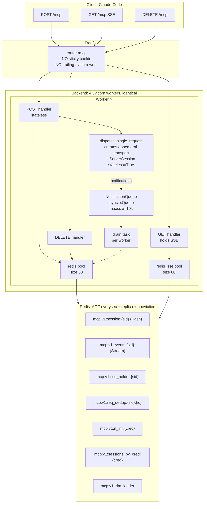
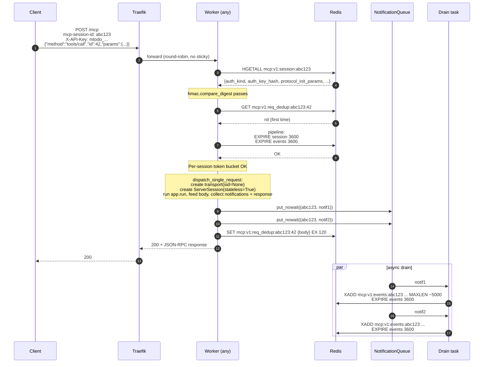
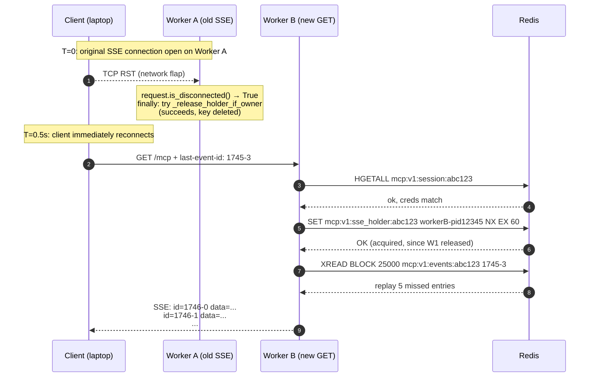
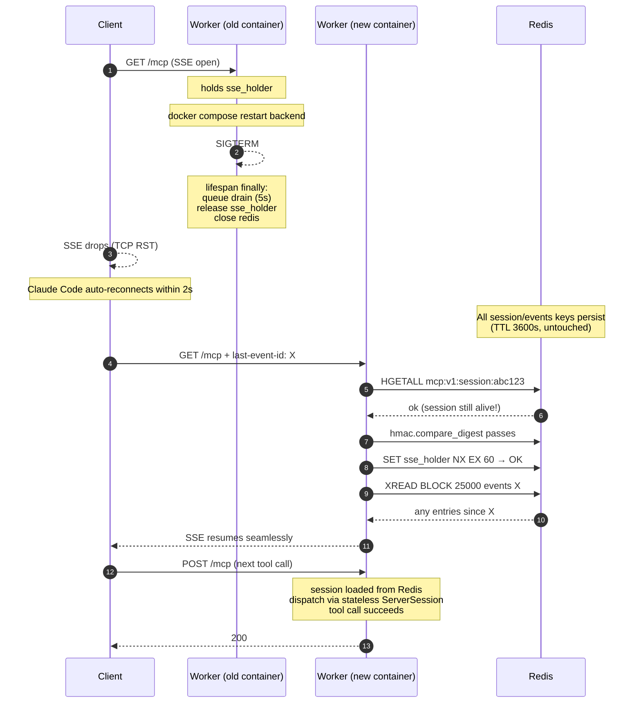
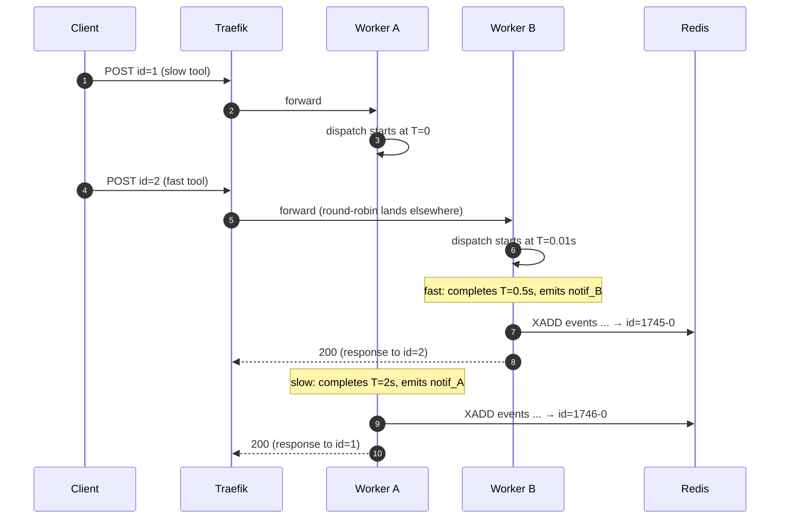
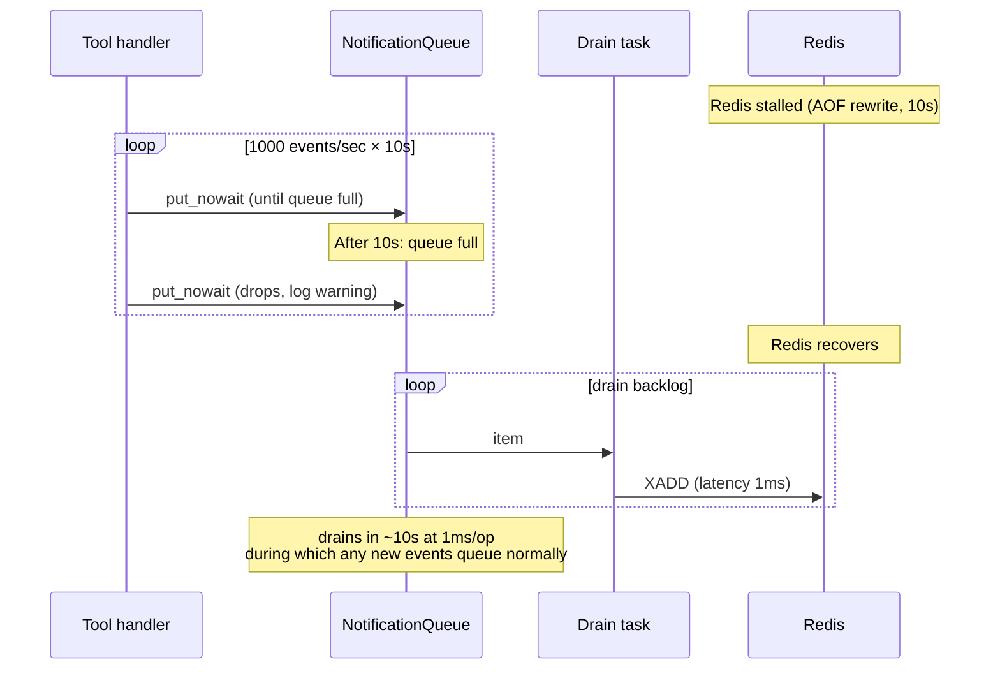
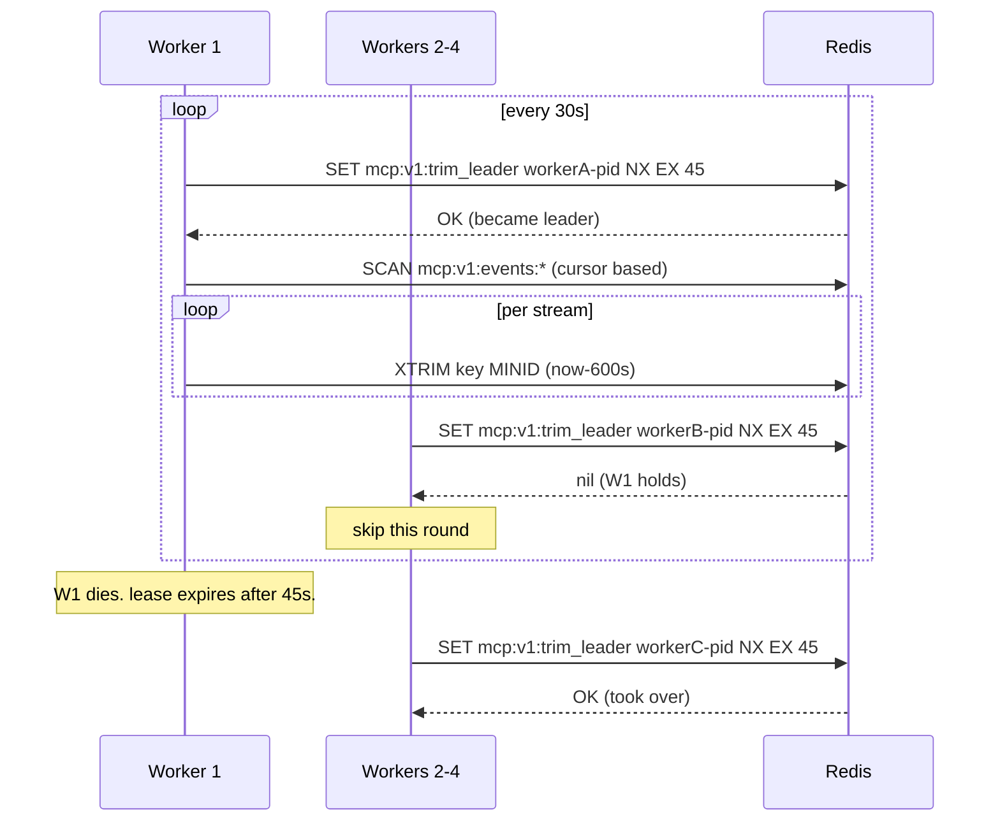

# MCP Stateless Transport — Architecture Diagrams & Simulation

Companion to `mcp-stateless-transport.md`. Walks through the design
under specific scenarios to surface failure modes before implementation.

**Key correction since v2 review**: `§6.2 ServerSession reconstruction`
turns out to be a solved problem. The MCP SDK already provides
`Server.run(read_stream, write_stream, init_options, stateless=True)`,
which constructs a `ServerSession` pre-initialized via
`InitializationState.Initialized`. We use this verbatim — no private
attribute access required. CLAUDE.md's prohibition on
`stateless_http=True` referred to FastMCP's *per-request session id
minting* mode; we keep our own session id in Redis and use stateless
mode only as an internal dispatch primitive.

---

## A. Component diagram (target)



Compared with the current state: workers are interchangeable, no
sticky cookie, no per-worker session map, no cross-worker recovery
machinery.

---

## B. Single POST flow (happy path)



**Verification points:**
- Worker holds zero per-session state across requests ✓
- Notification XADD does not block the response ✓
- Both session and events Hash/Stream TTLs refreshed on every POST
  (closes v1 stream-TTL-drift hole) ✓

---

## C. Concurrent SSE reconnect scenario (client flakes)

This is where v1 broke. v2 fixes it; let's trace.



**What if W1's TCP FIN gets lost and W1 never sees the disconnect?**

```mermaid
sequenceDiagram
    autonumber
    participant C as Client
    participant W1 as Worker A (zombie SSE)
    participant W2 as Worker B
    participant R as Redis

    Note over W1: holds sse_holder lock
    C-->>W1: TCP FIN lost
    Note over W1: still in XREAD BLOCK 25000 loop

    Note over C: client reconnects
    C->>W2: GET /mcp
    W2->>R: SET sse_holder NX EX 60
    R-->>W2: nil (W1 still owns it)
    W2-->>C: 409 Retry-After: 5

    Note over W1: 25s later: XREAD returns empty<br/>request.is_disconnected() — Starlette<br/>only knows on next read; on idle SSE this<br/>is detected via the keepalive write below
    W1-->>W1: send_sse_comment("keepalive")
    Note over W1: write fails (BrokenPipe)<br/>finally: release lock

    C->>W2: retry
    W2->>R: SET sse_holder NX EX 60 → OK
```

**Edge case the diagram surfaces**: if the keepalive write happens to
land *just* before the OS notices the dead TCP, BrokenPipe surfaces
on the next iteration. Worst case: 25 s + 25 s = 50 s before W1 lets
go. The 60 s lock TTL is still safe (refresh runs every 30 s and CAS
on `worker_id`, so W1's refresh is fine; new GET just keeps getting
409 for ≤50 s).

**Improvement noted**: increase keepalive frequency to 10 s (still
well under any proxy idle), so dead-zombie detection drops to
≤25+10=35 s worst case. Update §8 in v3.

---

## D. Backend restart scenario (the original broken case)



**Verification**: this is the exact scenario the user wanted —
"再起動時にMCPのセッション切れも直りますか？" — and it works because
all state is in Redis. Container teardown is invisible to the client
beyond a momentary SSE blip.

---

## E. Cross-worker concurrent POST with notification (v2 review M-A: ordering)

The architect-review's MEDIUM concern: two POSTs on the same sid
arrive at different workers; their notifications interleave.



**Question**: does this matter?

MCP spec says each session is logically serial (clients don't
interleave requests on the same session). JSON-RPC over HTTP is
naturally request-scoped. **Real Claude Code never does this**
intentionally. If a buggy or adversarial client does it:
- Notification ordering is `XADD` arrival order, not request order.
- Tool side effects (Mongo writes) interleave per Mongo's own
  isolation — same as any concurrent POST today.

**Decision**: document, do not enforce.

> §3.1 invariant **6 (new)**: Per-session request serialization is
> the client's responsibility. The server processes any POST that
> presents a valid sid+credential, regardless of in-flight overlap.
> Notification ordering reflects emission order, which under
> concurrent dispatch is non-deterministic.

This avoids a per-session lock that would re-introduce the v1
bottleneck (single-session throughput cap, head-of-line blocking).

---

## F. Initialize-rate race (v2 review M-B)

The architect's MEDIUM: two concurrent `initialize`s with the same
credential both pass the `SCARD` check before either `SADD`s, so the
session cap can be exceeded by 1 transiently.

```mermaid
sequenceDiagram
    participant W1 as Worker A
    participant W2 as Worker B
    participant R as Redis

    Note over W1,W2: cred has 31 sessions; cap is 32

    W1->>R: SCARD sessions_by_cred:H
    R-->>W1: 31 (under cap, proceed)
    W2->>R: SCARD sessions_by_cred:H
    R-->>W2: 31 (under cap, proceed)
    W1->>R: HSET session:newA + SADD sessions_by_cred:H newA
    W2->>R: HSET session:newB + SADD sessions_by_cred:H newB
    Note over R: SCARD now 33 — overshot by 1
```

**Atomic fix**: a Lua script that does check-then-add in one round trip:

```lua
-- KEYS[1] = sessions_by_cred:H
-- ARGV[1] = new_session_id
-- ARGV[2] = max_sessions
-- ARGV[3] = ttl_seconds
local count = redis.call('SCARD', KEYS[1])
if count >= tonumber(ARGV[2]) then
  return 0  -- rejected
end
redis.call('SADD', KEYS[1], ARGV[1])
redis.call('EXPIRE', KEYS[1], ARGV[3])
return 1  -- admitted
```

Then `if EVAL(script, ...) == 0: return 403 max sessions reached`.

**Update §9.1 in v3** to mandate this Lua pattern. Cost: 1 extra
EVAL per initialize, atomic, eliminates the race.

---

## G. Notification queue overflow (v2 review M-D: sizing)

Scenario: Redis stalls for 10s (AOF rewrite). One worker's queue at
1k events/s × 10s = 10k items, which is exactly the bound.



**Defensible numbers**:
- 10k items × ~1KB serialized = ~10MB per worker × 4 = 40MB total
  worst-case memory cost. Acceptable.
- 10s of Redis stall absorbed without dropping; longer stalls drop
  the oldest **(queue is FIFO, drops happen on put — i.e., newest
  events are dropped, not oldest)**. Document this.
- **Add watermark alert**: gauge `mcp_notification_queue_depth`
  per worker; alert at 80% (8k).
- **Add throughput rationale**: "designed for sustained 100 notif/s
  per worker, peak 1000/s for ≤10s."

**Update §7 in v3** with the memory math and watermark gauge.

---

## H. XTRIM sweep ownership (v2 review M-C from db reviewer)

Scenario: 4 workers each running XTRIM MINID every 30s = 4× write
amplification on every active stream.

**Fix via leader lease:**



This makes the sweep cost 1× regardless of worker count. Cheap
contention (one Redis SET per worker per cycle); worst-case 45s
without a sweep when the leader fails (acceptable, since MAXLEN ~5000
is the safety net).

**Update §4.2 / new §4.6 in v3.**

---

## I. SECRET_KEY overload (security review HIGH)

Currently §10.1 reuses `settings.SECRET_KEY` (JWT signing key) for
the credential HMAC. CLAUDE.md forbids overloading secrets. Concrete
impact:

```
Today:                              After fix:
SECRET_KEY ──┬── JWT signing       SECRET_KEY        ── JWT signing
             └── MCP HMAC          MCP_SESSION_HMAC_KEY ── MCP HMAC
```

Rotation of `SECRET_KEY` would today force every MCP session to
re-initialize (because `auth_key_hash` becomes invalid). With a
dedicated key, the two rotations are decoupled.

**Add to .env required keys (now 6 total)**:

| Key | Purpose | Min length |
|---|---|---|
| `SECRET_KEY` | JWT access-token signing | 32 |
| `REFRESH_SECRET_KEY` | JWT refresh-token signing | 32 |
| `MCP_SESSION_HMAC_KEY` | MCP credential binding hash | **32 (new)** |
| `MONGO_URI` | DB | — |
| `REDIS_URI` | Cache/session store | — |
| `FRONTEND_URL` | Public SPA URL | — |

Generation: same `secrets.token_urlsafe(48)` recipe; startup-fail if
absent or sub-32-byte (mirroring existing `_is_weak_secret`).

**Update §10.1 in v3 + CLAUDE.md required env vars table.**

---

## J. SSE pool sizing math (v2 db review)

§12.4 specifies `redis_sse` pool size = `max_sse_per_worker + 10` = 60.

Per-worker connections in flight:
- 50 SSE × 1 XREAD BLOCK each = 50 connections
- 50 SSE × 1 CAS refresh task = 50 connections (BUT short-lived,
  ~1ms every 20s — very low concurrent demand)
- Headroom for new GETs starting before old connections released

**Architect's correction**: bump headroom from `+10` to
`+max_sse_per_worker` = 100, so refresh tasks never contend with
XREAD holders even momentarily. Cost: +40 connection slots in pool;
zero memory cost when idle.

**Total Redis client load (4 workers)**:
- App pool: 4 × 50 = 200
- SSE pool: 4 × 100 = 400
- Total: 600 connections.

Redis default `maxclients=10000` — well under. But pin it explicitly:

```
# redis.conf additions
maxclients 1024
```

1024 gives ~70% headroom over the 600 baseline; smaller value catches
runaway clients before they impact performance. Document `ulimit -n`
on the Redis container ≥ 2048.

**Update §12.4 in v3.**

---

## K. What changes for v3 (delta from v2)

Based on this simulation:

| Change | Section | Severity |
|---|---|---|
| Use `Server.run(..., stateless=True)` directly (no private attr access) | §6 rewrite | HIGH (correctness) |
| Add new env var `MCP_SESSION_HMAC_KEY` (separate from JWT key) | §10.1 + CLAUDE.md | HIGH (CLAUDE.md compliance) |
| Lua script for atomic SCARD+SADD on initialize | §9.1 | MEDIUM (correctness) |
| Leader-elected XTRIM sweep | §4.2, new §4.7 | MEDIUM (efficiency) |
| Document per-session ordering as client responsibility (no lock) | new §3.1 inv. 6 | MEDIUM (ship) |
| Notification queue: drop policy (drop new on put-when-full), watermark gauge, throughput rationale | §7 | MEDIUM (observability) |
| SSE keepalive 25s → 10s (faster zombie detection) | §8 | LOW |
| `redis_sse` pool +10 → +max_sse_per_worker (=100) | §12.4 | LOW |
| Pin Redis `maxclients 1024` + `ulimit -n` ≥2048 | §12.4 | LOW |

Every change is a **localized edit** to v2; the structural design is
sound. No re-architecture required.

---

## L. Open questions remaining

1. **OAuth refresh token UX**: if Claude Desktop refreshes the
   access token mid-session, our `auth_key_hash` mismatch returns 403.
   The UX expectation is that Claude Desktop handles this transparently
   by re-initializing — needs verification during step 6 of §16.
2. **FastMCP version pinning**: `Server.run(stateless=True)` is
   public API and stable; safer than the private-attribute path
   considered in v2. Still pin to a known-good version + add an
   integration test that exercises stateless dispatch end-to-end.
3. **Rate-limit number rationale**: §9 numbers (30 init/min,
   32 sessions, 50 req/s burst 200) — add one-line derivation per v2
   reviewer feedback.

---

## M. Ready for v3?

The simulation surfaced **9 concrete edits** to v2 (§K table). None
require structural change. The H-A concern from the v2 review
(ServerSession reconstruction risk) **dissolves** because MCP SDK's
`stateless=True` is the official primitive. Every other v2 issue is
addressed by a localized fix.

After applying §K changes, v3 should be implementation-ready.
