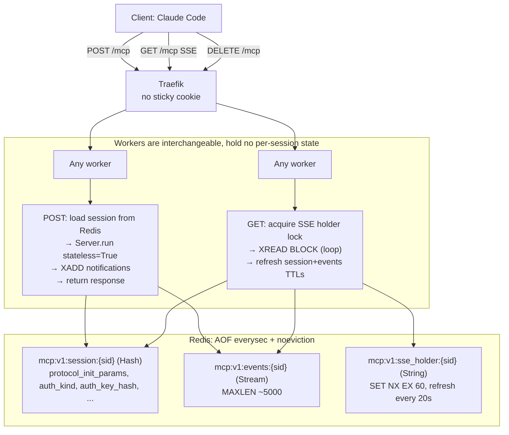

# MCP Stateless Transport — Redis-Backed Session Externalization

**Status**: Design proposal — **v3** (simplified), 2026-04-15
**Supersedes**: `app/mcp/session_manager.py` (`ResilientSessionManager`),
`app/mcp/session_registry.py` (`RedisSessionRegistry`),
`app/mcp/session_store.py` (`RedisEventStore`),
Traefik sticky cookie `_sticky_mcp`,
`app/mcp/well_known.py` `McpTrailingSlashMiddleware`.

## ⚠ Authentication: BOTH X-API-Key AND OAuth Bearer are MANDATORY

This server is consumed by clients that **either** present a long-lived
`X-API-Key` header **or** an OAuth 2.1 Bearer token (via the FastMCP-
backed OAuth provider — see `backend/app/mcp/oauth/`). The transport
layer **MUST** accept and validate either credential class. Removing or
breaking either path is a regression that takes down at least one
class of client (Claude Code uses X-API-Key by default; Claude
Desktop's MCP integration uses OAuth).

Concretely:
- `extract_and_validate_credentials()` (§5.4) checks `X-API-Key`
  first, then `Authorization: Bearer ...` — **both branches must
  remain functional**.
- The session Hash records `auth_kind` (`"api_key"` or `"oauth"`) and
  the same `auth_kind` is required on every subsequent request.
- The OAuth metadata routes (`/.well-known/oauth-authorization-server`,
  `/.well-known/oauth-protected-resource/mcp/`) and the OAuth flow
  routes (`/mcp/authorize`, `/mcp/token`, `/mcp/register`) **MUST** be
  served and **MUST** advertise the public `BASE_URL` (not localhost).
  An incorrect `BASE_URL` causes Claude Desktop to follow OAuth
  metadata to an unreachable host and report "connection timed out".
- Per MCP spec, when a credential is missing or invalid, the server
  **MUST** return `401` with a `WWW-Authenticate: Bearer ...` header
  pointing at the protected-resource metadata, so OAuth-capable
  clients can discover the auth flow. X-API-Key clients see the same
  401 and can recover by re-presenting the key.

Any change to authentication code paths must be tested against
**both** authentication modes before being merged.

**Scope discipline**: this design solves exactly three problems —
(1) cold-start POST hangs, (2) sessions die on backend restart,
(3) server-initiated notifications don't cross worker boundaries.
Anything not load-bearing for those three is **out of scope** and
can be added later if it becomes a real problem. No rate limiting,
no session caps, no dedup, no notification sequence numbers, no
leader-elected sweeps, no constant-time response padding. We are
building for 4 internal users, not a multi-tenant SaaS.

---

## 1. Why this exists

Current transport assumes **session state lives in a single
worker's memory**. Multi-worker (`WEB_CONCURRENCY=4`) was bolted on
with a sticky cookie, a Redis registry, and a custom session
manager — all of which compound rather than compose.

Observed symptoms:
- Cold-start POST /mcp hangs for the 30 s client timeout; all four
  uvicorn workers show **idle main thread** under py-spy.
- Backend restart kills active Claude Code sessions; reconnect
  returns "Session not found" or hangs.
- Server-initiated notifications (e.g., `tools/list_changed`,
  tool-progress) **never reach** clients whose SSE is on a different
  worker than the notification source.

Root cause: the FastMCP
`StreamableHTTPSessionManager` holds a `StreamableHTTPServerTransport`
in a process-local dict keyed by session id. Each transport has an
anyio memory-stream pair and an `app.run` task. None of that
survives worker boundaries or process restarts.

---

## 2. Architecture



### 2.1 Invariants

1. **Workers hold no per-session state between requests.** All
   session state is in Redis.
2. **One SSE connection per session.** Enforced by
   `SET mcp:v1:sse_holder:{sid} NX EX 60` — second GET gets 409.
3. **TTLs refreshed in pairs.** Every POST and every 30 s of live
   SSE pipelines `EXPIRE session` + `EXPIRE events`, so replay
   buffers never silently expire while sessions are still active.
4. **initialize is the one stateful call.** Drives the SDK with
   `stateless=False` so the handshake runs normally; captures
   `protocol_init_params` into Redis. Everything after that is
   `stateless=True` dispatch.
5. **Any POST can land on any worker.** No sticky cookie, no
   cross-worker recovery, no session-creation lock. The session id
   and credential are sufficient.

---

## 3. Redis keys

Prefix `mcp:v1:` everywhere. A `v2:` bump would ship an incompatible
schema without a flag day.

### 3.1 `mcp:v1:session:{sid}` — Hash

| Field | Purpose |
|---|---|
| `initialized_at` | ISO-8601 string, debugging only |
| `protocol_init_params` | JSON of `InitializeRequestParams` — captured at initialize, used to reconstruct dispatch context |
| `auth_kind` | `api_key` \| `oauth` |
| `auth_key_hash` | HMAC of the credential (§6) — checked on every request |
| `capabilities_json` | JSON of negotiated server capabilities |

TTL: 3600 s, refreshed on every POST and every 30 s of live SSE.

### 3.2 `mcp:v1:events:{sid}` — Stream

Server → client message buffer. `Last-Event-ID` == Redis stream
entry id.

| Field | Purpose |
|---|---|
| `data` | JSON-encoded SSE data payload (the JSON-RPC notification) |

Trim policy: `MAXLEN ~ 5000 APPROX` on every XADD. No time-based
sweep, no leader election — MAXLEN is sufficient. Idle streams are
reaped by their own TTL (3600 s, refreshed alongside session).

### 3.3 `mcp:v1:sse_holder:{sid}` — String

Single-SSE lock. `SET NX EX 60`; holder refreshes via
value-CAS Lua every 20 s (Redlock 3× margin). Expired holder lets
the next GET take over within ≤60 s.

That's it. Three keys.

---

## 4. Handlers

### 4.1 POST /mcp

```python
async def handle_post(scope, receive, send):
    request = Request(scope, receive)
    body = await request.json()
    sid = request.headers.get("mcp-session-id")
    creds, access_token = await extract_and_validate_credentials(request)
    method = body.get("method")

    # initialize: stateful single-shot (see §5).
    if method == "initialize":
        return await handle_initialize(request, body, creds, access_token, send)

    # Non-initialize: require a known session matching the credential.
    if sid is None:
        return send_jsonrpc_error(send, 400, -32600, "missing mcp-session-id")

    session = await redis.hgetall(f"mcp:v1:session:{sid}")
    if not session:
        return send_jsonrpc_error(send, 404, -32001, "session expired; re-initialize")

    if not hmac.compare_digest(
        session["auth_key_hash"],
        hash_credential(creds, session["auth_kind"]),
    ):
        return send_jsonrpc_error(send, 403, -32003, "credential mismatch")

    # Paired TTL refresh (inv. 3).
    pipe = redis.pipeline()
    pipe.expire(f"mcp:v1:session:{sid}", 3600)
    pipe.expire(f"mcp:v1:events:{sid}", 3600)
    await pipe.execute()

    result = await dispatch(body, stateless=True,
                            request=request, access_token=access_token)

    # Notifications go to the Stream; clients receive them via SSE.
    for n in result.notifications:
        await redis.xadd(
            f"mcp:v1:events:{sid}",
            {"data": orjson.dumps(n)},
            maxlen=5000, approximate=True,
        )

    return send_raw_json(send, orjson.dumps(result.response))
```

Simplifications vs earlier drafts:
- No request-id dedup. Claude Code doesn't retry aggressively on
  5xx; the current transport has no dedup either and nobody has
  complained.
- No per-session rate limiter. Add it when a runaway agent actually
  causes a problem.
- XADD is in-line. If Redis ever becomes slow enough that in-line
  XADD blocks POSTs, we'll add a background queue. Not today.

### 4.2 GET /mcp (SSE)

```python
async def handle_get(scope, receive, send):
    request = Request(scope, receive)
    sid = request.headers.get("mcp-session-id")
    if not sid:
        return send_status(send, 400)

    session = await redis.hgetall(f"mcp:v1:session:{sid}")
    if not session:
        return send_status(send, 404)

    creds, _ = await extract_and_validate_credentials(request)
    if not hmac.compare_digest(
        session["auth_key_hash"],
        hash_credential(creds, session["auth_kind"]),
    ):
        return send_status(send, 403)

    worker_id = f"{os.getpid()}:{uuid4().hex[:8]}"
    acquired = await redis_sse.set(
        f"mcp:v1:sse_holder:{sid}", worker_id, nx=True, ex=60,
    )
    if not acquired:
        return send_status(send, 409, headers={"Retry-After": "5"})

    cursor = request.headers.get("last-event-id", "0-0")
    refresh_task = asyncio.create_task(_holder_refresh_loop(sid, worker_id))
    ttl_task = asyncio.create_task(_ttl_refresh_loop(sid))
    await send_sse_headers(send)

    try:
        while not await request.is_disconnected():
            entries = await redis_sse.xread(
                {f"mcp:v1:events:{sid}": cursor}, block=10_000, count=100,
            )
            if not entries:
                try:
                    await send_sse_comment(send, "keepalive")
                except (BrokenPipeError, ConnectionResetError):
                    break
                continue
            for _, items in entries:
                for entry_id, fields in items:
                    try:
                        await send_sse_event(send, entry_id, fields[b"data"])
                    except (BrokenPipeError, ConnectionResetError):
                        return
                    except (KeyError, UnicodeDecodeError):
                        logger.exception("Malformed event sid=%s id=%s",
                                         sid[:8], entry_id)
                    cursor = entry_id
    finally:
        refresh_task.cancel()
        ttl_task.cancel()
        await _release_holder_if_owner(sid, worker_id)
```

Helpers:

```python
async def _holder_refresh_loop(sid, worker_id):
    """Refresh the holder lease every 20s via value-CAS."""
    script = """
    if redis.call('GET', KEYS[1]) == ARGV[1] then
        return redis.call('EXPIRE', KEYS[1], tonumber(ARGV[2]))
    else
        return 0
    end
    """
    while True:
        await asyncio.sleep(20)
        await redis_sse.eval(script, 1,
                             f"mcp:v1:sse_holder:{sid}", worker_id, 60)


async def _ttl_refresh_loop(sid):
    """Keep session+events alive during long SSE idle (no POSTs)."""
    while True:
        await asyncio.sleep(30)
        pipe = redis_sse.pipeline()
        pipe.expire(f"mcp:v1:session:{sid}", 3600)
        pipe.expire(f"mcp:v1:events:{sid}", 3600)
        await pipe.execute()
```

### 4.3 DELETE /mcp

```python
async def handle_delete(scope, receive, send):
    request = Request(scope, receive)
    sid = request.headers.get("mcp-session-id")
    if not sid:
        return send_status(send, 400)

    session = await redis.hgetall(f"mcp:v1:session:{sid}")
    if not session:
        return send_status(send, 204)  # idempotent

    creds, _ = await extract_and_validate_credentials(request)
    if not hmac.compare_digest(
        session["auth_key_hash"],
        hash_credential(creds, session["auth_kind"]),
    ):
        return send_status(send, 403)

    pipe = redis.pipeline()
    pipe.delete(f"mcp:v1:session:{sid}")
    pipe.delete(f"mcp:v1:events:{sid}")
    pipe.delete(f"mcp:v1:sse_holder:{sid}")
    await pipe.execute()
    return send_status(send, 204)
```

---

## 5. Dispatch via SDK `Server.run(stateless=...)`

The MCP SDK already provides the primitive we need:
`ServerSession(stateless=True)` starts in
`InitializationState.Initialized`, skipping the handshake. The SDK
uses this exact pattern in `_handle_stateless_request`. No private
attribute access; no fork.

CLAUDE.md's ban on `stateless_http=True` refers to FastMCP's
top-level kwarg (which mints a fresh sid per request and kills
session continuity). The SDK's per-dispatch `stateless=True` is a
different primitive and is explicitly permitted (see updated
CLAUDE.md).

### 5.1 Unified dispatch

```python
async def dispatch(
    body: dict,
    *,
    stateless: bool,
    request: Request,
    access_token: AccessToken | None,
) -> DispatchResult:
    """Drive the MCP SDK for one JSON-RPC message.

    stateless=True  → tool-call path (session already initialized).
    stateless=False → initialize path (SDK runs real handshake).
    """
    from fastmcp.server.dependencies import (
        _current_http_request,
        _current_access_token,
    )

    # Buffer size must exceed max notifications a tool might emit,
    # since we consume messages after the task is driving them.
    c2s_tx, c2s_rx = anyio.create_memory_object_stream(max_buffer_size=8)
    s2c_tx, s2c_rx = anyio.create_memory_object_stream(max_buffer_size=128)

    notifications: list[dict] = []
    response: dict | None = None
    req_id = body.get("id")

    async def run_server():
        await _mcp_server.run(
            c2s_rx, s2c_tx,
            _mcp_server.create_initialization_options(),
            stateless=stateless,
        )

    # FastMCP's tool helpers read these contextvars; we must set them
    # since we've replaced the middleware that normally does.
    req_tok = _current_http_request.set(request)
    tok_tok = _current_access_token.set(access_token)
    try:
        async with anyio.create_task_group() as tg:
            tg.start_soon(run_server)
            await c2s_tx.send(JSONRPCMessage.model_validate(body))

            async for outgoing in s2c_rx:
                msg = outgoing.root
                if isinstance(msg, JSONRPCNotification):
                    notifications.append(msg.model_dump(mode="json"))
                    continue
                if (isinstance(msg, (JSONRPCResponse, JSONRPCError))
                        and msg.id == req_id):
                    response = msg.model_dump(mode="json")
                    break

            # Close the client→server side to signal EOF; don't touch
            # s2c_tx (SDK owns it; closing early raises
            # ClosedResourceError on in-flight notifications).
            await c2s_tx.aclose()
    finally:
        _current_http_request.reset(req_tok)
        _current_access_token.reset(tok_tok)

    return DispatchResult(response=response, notifications=notifications)
```

### 5.2 initialize handler

```python
async def handle_initialize(request, body, creds, access_token, send):
    user = await authenticate(creds)

    # stateless=False → SDK runs the handshake.
    result = await dispatch(body, stateless=False,
                            request=request, access_token=access_token)
    capabilities = result.response["result"]["capabilities"]

    sid = uuid4().hex
    pipe = redis.pipeline()
    pipe.hset(f"mcp:v1:session:{sid}", mapping={
        "initialized_at": now_iso(),
        "protocol_init_params": orjson.dumps(body["params"]).decode(),
        "auth_kind": user["auth_kind"],
        "auth_key_hash": hash_credential(creds, user["auth_kind"]),
        "capabilities_json": orjson.dumps(capabilities).decode(),
    })
    pipe.expire(f"mcp:v1:session:{sid}", 3600)
    await pipe.execute()

    # Note: any notifications emitted during initialize go to /dev/null
    # (no session id existed yet to bind them to). Not a real scenario —
    # initialize emits no tool notifications.

    return send_json_response(send, result.response, extra_headers={
        "mcp-session-id": sid,
    })
```

Note §11.2 session-fixation defense: the initialize handler
**ignores any inbound `mcp-session-id` header** and always mints a
fresh one. A stolen or guessed sid can never be "re-initialized".

### 5.3 FastMCP contextvar dependency (load-bearing)

Our tools use `fastmcp.server.dependencies.get_http_request()` and
`get_access_token()` inside `auth.py` and throughout the codebase.
Those helpers read module-level `ContextVar`s that the FastMCP ASGI
middleware normally populates. Since we remove that middleware
(§8), our dispatch wrapper must set them (done in §5.1).

The contextvar symbols are private (underscore-prefixed). Step 1 of
§9 imports them directly; a unit test asserts they exist and are
settable, so a FastMCP upgrade that renames them fails the build
instead of breaking production.

### 5.4 OAuth token validation

The FastMCP middleware chain also used to validate OAuth Bearer
tokens before the session manager saw the request. With that
middleware removed, our handler boundary validates on every
request:

```python
async def extract_and_validate_credentials(request) -> tuple[Credentials, AccessToken | None]:
    api_key = request.headers.get("x-api-key")
    if api_key:
        return Credentials(api_key=api_key), None

    auth_header = request.headers.get("authorization", "")
    if auth_header.startswith("Bearer "):
        raw = auth_header[7:].strip()
        token = await _oauth_provider.verify_access_token(raw)
        if token is None:
            raise AuthError("invalid_token")
        return Credentials(bearer_token=raw), token

    raise AuthError("missing credentials")
```

Revoked/expired tokens stop working on the next request regardless
of session state. The `auth_key_hash` check is a *binding* check
(same credential as initialize), not a *validity* check.

---

## 6. Credential binding

### 6.1 HKDF-derived hash key (no new env var)

```python
from cryptography.hazmat.primitives.hashes import SHA256
from cryptography.hazmat.primitives.kdf.hkdf import HKDF

@functools.cache
def _mcp_hmac_key() -> bytes:
    """Derive a dedicated HMAC key from SECRET_KEY using HKDF-SHA256.

    Avoids overloading SECRET_KEY directly (CLAUDE.md: "Never overload
    a single secret for multiple security purposes"). The domain label
    ensures a different derived key than any future HKDF use of SECRET_KEY.
    """
    return HKDF(
        algorithm=SHA256(), length=32, salt=None,
        info=b"mcp-session-hmac-v1",
    ).derive(settings.SECRET_KEY.encode("utf-8"))


def hash_credential(creds, kind: Literal["api_key", "oauth"]) -> str:
    """Domain-separated HMAC of the credential.

    - Domain prefix prevents cross-class (api_key vs oauth) collisions.
    - HMAC key is derived from SECRET_KEY, so a Redis dump without
      SECRET_KEY cannot be used to match candidate credentials offline.
    - OAuth hashes the raw bearer token, not the subject — so a second
      valid token for the same user is a distinct credential and cannot
      hijack an existing session.
    """
    if kind == "api_key":
        material = b"mcp-apikey\x00" + creds.api_key.encode()
    elif kind == "oauth":
        material = b"mcp-oauth\x00" + creds.bearer_token.encode()
    else:
        raise ValueError(f"unknown auth kind: {kind}")
    return hmac.new(_mcp_hmac_key(), material, hashlib.sha256).hexdigest()
```

### 6.2 Trade-off acknowledged

Rotating `SECRET_KEY` invalidates the derived MCP HMAC key and
therefore invalidates every live MCP session. Users re-initialize
on next request. Acceptable — same cost as any other SECRET_KEY
rotation (which also invalidates all JWT access tokens).

### 6.3 Threat coverage

| Attack | Protection |
|---|---|
| Stolen session id, no credential | Every request re-validates HMAC |
| Redis read compromise | Hashes not offline-matchable without SECRET_KEY |
| api_key/oauth namespace collision | Domain prefix |
| Second OAuth token hijack | Token-hash binding (not subject) |
| Session-fixation via inbound sid | Initialize mints fresh, ignores header |
| Session id guessing | uuid4 = 122 bits |

Not covered: TLS-stripped MitM (TLS is the control), stolen
credential (rotation is the control), Redis write compromise
(backend is the control).

---

## 7. Error codes

| Condition | HTTP | JSON-RPC | Notes |
|---|---|---|---|
| Malformed JSON | 400 | -32700 | parse error |
| Missing mcp-session-id on non-init | 400 | -32600 | |
| Session expired | 404 | -32001 | client should re-initialize |
| Credential mismatch | 403 | -32003 | |
| Concurrent SSE conflict | 409 | — | `Retry-After: 5` |
| Redis unreachable | 503 | — | loud fail; no silent fallback |
| Tool handler raises | 200 | tool-defined | SDK serializes |

---

## 8. What gets removed

| File / config | Reason |
|---|---|
| `backend/app/mcp/session_manager.py` (331 LoC) | `ResilientSessionManager` obsolete |
| `backend/app/mcp/session_registry.py` (131 LoC) | replaced by `mcp:v1:session:{sid}` Hash |
| `backend/app/mcp/session_store.py` | replaced by `mcp:v1:events:{sid}` Stream |
| `backend/app/mcp/streamable_http_app.py` | we mount our own ASGI app |
| `backend/app/mcp/well_known.py` `McpTrailingSlashMiddleware` | we route `/mcp` and `/mcp/` explicitly |
| `docker-compose.yml` `backend-mcp-svc` sticky-cookie labels | affinity no longer needed |

Retained (zero or near-zero changes): `server.py`, `auth.py`,
`tools/*`, `oauth/*`, `middleware/usage_tracking.py`.

---

## 9. Implementation order

1. **Stateless POST handler + session Hash** (initialize + one
   tool call end-to-end). fakeredis unit tests. Mount at a temporary
   path alongside the existing `/mcp` to test in isolation.
2. **`dispatch()` helper + contextvar bridge** (§5.1, §5.3). Unit
   test asserts private contextvar imports succeed.
3. **OAuth Bearer validation at handler boundary** (§5.4).
4. **HKDF credential hash** (§6). Unit test pinning exact hash
   output for api_key vs oauth inputs to catch silent breakage.
5. **SSE handler + holder lock + TTL refresh loops** (§4.2).
6. **DELETE /mcp** (§4.3).
7. **Switchover**: route `/mcp` to the new handler, remove the old
   mount. Delete removal list (§8).
8. **Soak test**: restart the backend with an active Claude Code
   session; verify it resumes without re-initialize.

Each step ships independently. The new code path runs alongside the
old until step 7.

---

## 10. Redis operational requirements

Add to `docker-compose.yml` Redis service:

- `appendonly yes`, `appendfsync everysec`
- `maxmemory-policy noeviction` (LRU would evict live sessions)
- `maxclients 2048` (baseline ~600, absorbs reconnect bursts)

That's it. No replica, no separate HMAC key env var, no leader
lease keys. The single-Redis-single-host model matches the rest of
the deployment.

---

## 11. Logging

Redact in every log line and stack trace:

- `X-API-Key` header value
- `Authorization` header value
- `mcp-session-id` — first 8 chars + `...` only
- `auth_key_hash` — never logged
- `protocol_init_params` / `client_info_*` — DEBUG level only

Implementation: one `logging.Filter` on the root logger.

---

## 12. Open questions (not blockers)

1. **OAuth refresh UX**: Claude Desktop's token refresh produces a
   new access token, which hashes differently, which returns 403 on
   next request. Client should handle this as a re-initialize
   trigger. Verify during step 8.
2. **MCP SDK version pin**: we rely on `Server.run(stateless=True)`
   and a few private FastMCP contextvars. Pin the SDK version in
   `pyproject.toml`; the step-2 and step-4 unit tests catch any
   breakage on upgrade.
3. **Sampling callbacks**: unsupported (dispatch uses a short-lived
   stream pair). No current tool uses them. When we need one, add a
   request-response channel then.

---

## 13. What we're NOT building (and why)

If any of these later become real problems, add them individually:

- **Rate limiting** (per-credential, per-session): no runaway-agent
  incidents observed; internal tool with a handful of users.
- **Request-id dedup**: Claude Code doesn't retry JSON-RPC
  aggressively; current transport has no dedup either.
- **Session cap per credential**: internal tool, abuse model is
  "operator misconfigures", not "adversary".
- **Notification sequence numbers**: Redis Streams provide ordered
  delivery by construction.
- **Leader-elected XTRIM sweep**: `MAXLEN ~ 5000` on each XADD is a
  hard cap; no time-based sweep needed.
- **Write-liveness gate on holder refresh**: 60 s lock TTL handles
  zombie SSE within one minute.
- **Constant-time 404**: timing oracle on session existence is
  not a meaningful threat for an internal tool.
- **Background notification queue with bounded drop**: inline XADD
  is fine at expected load; add the queue if Redis latency ever
  blocks POSTs.
- **Dedicated `MCP_SESSION_HMAC_KEY` env var**: HKDF derivation
  from SECRET_KEY (§6) provides the same domain separation without
  adding a required env var, per CLAUDE.md discipline.

Removing these from the design removed ~500 lines of documentation
and several Lua scripts' worth of implementation. Each can return
in a focused, scoped change when justified by real traffic.
