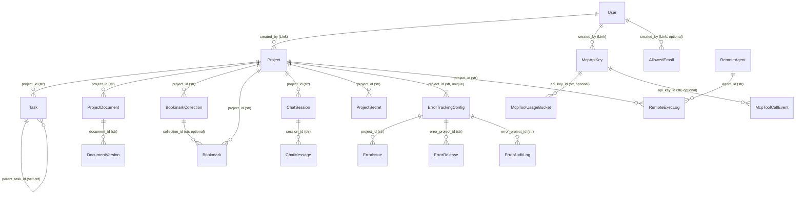

# データモデル仕様書

**Status**: Living document — モデル変更時は必ず本ドキュメントも更新する  
**初版**: 2026-04-15  
**対象コード**: `backend/app/models/` 配下の全モデル

---

## このドキュメントの位置づけ

本ドキュメントは **API 仕様書・MCP ツール仕様書の土台** となる唯一の正式なデータモデルリファレンスです。

- Beanie (MongoDB ODM) のモデル定義コードが「実装上の真実」であり、本ドキュメントはその仕様を人間が読める形で整理したものです
- REST API のリクエスト/レスポンス設計、MCP ツールの引数仕様を策定する際は **本ドキュメントのフィールド定義を土台** にしてください
- モデルに変更を加えた場合は **コードと同じ PR / コミットで本ドキュメントも更新** してください（末尾の「変更時のチェックリスト」も参照）

---

## 目次

1. [ER 図](#1-er-図)
2. [コアドメイン](#2-コアドメイン)
   - 2.1 [User](#21-user)
   - 2.2 [AllowedEmail](#22-allowedemail)
   - 2.3 [Project](#23-project)
   - 2.4 [Task](#24-task)
3. [認証・認可](#3-認証認可)
   - 3.1 [McpApiKey](#31-mcpapikey)
4. [コンテンツ管理](#4-コンテンツ管理)
   - 4.1 [ProjectDocument / DocumentVersion](#41-projectdocument--documentversion)
   - 4.2 [Knowledge](#42-knowledge)
   - 4.3 [DocSite / DocPage](#43-docsite--docpage)
   - 4.4 [BookmarkCollection / Bookmark](#44-bookmarkcollection--bookmark)
5. [チャット](#5-チャット)
   - 5.1 [ChatSession / ChatMessage](#51-chatsession--chatmessage)
6. [リモートエージェント](#6-リモートエージェント)
   - 6.1 [RemoteAgent](#61-remoteagent)
   - 6.2 [RemoteExecLog](#62-remoteexeclog)
   - 6.3 [AgentRelease](#63-agentrelease)
7. [シークレット管理](#7-シークレット管理)
   - 7.1 [ProjectSecret](#71-projectsecret)
   - 7.2 [SecretAccessLog](#72-secretaccesslog)
8. [エラートラッカー](#8-エラートラッカー)
   - 8.1 [ErrorTrackingConfig](#81-errortrackingconfig)
   - 8.2 [ErrorIssue](#82-errorissue)
   - 8.3 [ErrorRelease](#83-errorrelease)
   - 8.4 [ErrorAuditLog](#84-errorauditlog)
   - 8.5 [error_events_YYYYMMDD（日別パーティション）](#85-error_events_yyyymmdd日別パーティション)
9. [MCP 計測・フィードバック](#9-mcp-計測フィードバック)
   - 9.1 [McpToolUsageBucket](#91-mcptoolusagebucket)
   - 9.2 [McpToolCallEvent](#92-mcptoolcallevent)
   - 9.3 [McpApiFeedback](#93-mcpapifeedback)
10. [変更時のチェックリスト](#10-変更時のチェックリスト)

---

## 1. ER 図

コレクション間の主要な参照関係を示す概念 ER 図です。MongoDB は外部キー制約を持たないため、参照はアプリケーションコードで解決されます。

> **注意**: `Link[User]` は Beanie の参照型で、MongoDB ObjectId を格納します。`project_id: str` や `created_by: str` のような `str` 型の参照フィールドは、アプリケーション側で ObjectId を文字列化したものです。Beanie の自動 fetch は行われません。

---

## 2. コアドメイン

### 2.1 User

**概要**: 認証済みユーザーを表すコアドキュメント。管理者は email/password で、一般ユーザーは Google OAuth で認証します。WebAuthn（パスキー）も追加可能。

**コレクション名**: `users`

#### フィールド一覧

| フィールド名 | 型 | 必須 | デフォルト | 制約 | 説明 |
|---|---|---|---|---|---|
| `email` | `str` | ✓ | — | unique インデックス | ログイン識別子 |
| `name` | `str` | ✓ | — | — | 表示名 |
| `auth_type` | `AuthType` | ✓ | — | `"admin"` or `"google"` | 認証方式 |
| `google_id` | `str \| None` | — | `None` | — | Google OAuth の sub claim |
| `password_hash` | `str \| None` | — | `None` | — | bcrypt ハッシュ。admin のみ設定 |
| `is_active` | `bool` | — | `True` | — | アカウント有効フラグ |
| `is_admin` | `bool` | — | `False` | — | 管理者権限 |
| `picture_url` | `str \| None` | — | `None` | — | Google プロフィール画像 URL |
| `password_disabled` | `bool` | — | `False` | — | パスワード認証を無効化（WebAuthn 移行後等） |
| `webauthn_credentials` | `list[WebAuthnCredential]` | — | `[]` | — | 登録済みパスキー一覧（埋め込み） |
| `created_at` | `datetime` | — | UTC now | — | 作成日時 |
| `updated_at` | `datetime` | — | UTC now | — | 最終更新日時 |

#### 埋め込み: WebAuthnCredential

| フィールド名 | 型 | 必須 | デフォルト | 説明 |
|---|---|---|---|---|
| `credential_id` | `str` | ✓ | — | base64url エンコードされた認証器 ID |
| `public_key` | `str` | ✓ | — | base64url エンコードされた公開鍵 |
| `sign_count` | `int` | — | `0` | リプレイ攻撃検知用カウンター |
| `transports` | `list[str]` | — | `[]` | 例: `["usb", "nfc", "ble", "internal"]` |
| `created_at` | `datetime` | — | UTC now | 登録日時 |
| `name` | `str` | — | `""` | ユーザーが設定するラベル |

#### インデックス

Beanie `Indexed(str, unique=True)` により自動生成:

| フィールド | 種類 |
|---|---|
| `email` | unique |

#### 不変条件・ビジネスルール

- `auth_type == "admin"` の場合: `password_hash` が設定される。`google_id` は `None`
- `auth_type == "google"` の場合: `google_id` が設定される。`password_hash` は `None`（または WebAuthn 追加後も `None` のまま）
- `password_disabled = True` のとき、パスワード認証エンドポイントは 401 を返す
- `is_active = False` のユーザーはログイン不可

#### 関連

- `AllowedEmail.email` に事前登録されていない Google アカウントはログイン不可
- `Project.created_by`、`McpApiKey.created_by` から `Link[User]` で参照される

#### 既知の注意点

- `save_updated()` を呼ぶと `updated_at` が自動更新される。直接 `save()` を呼ぶと `updated_at` が更新されない
- `password_hash` はレスポンスシリアライザで除外すること（`serializers.py` で対応済み）

---

### 2.2 AllowedEmail

**概要**: Google OAuth でのサインアップを許可するメールアドレスのホワイトリスト。管理者が事前に登録しておく。

**コレクション名**: `allowed_emails`

#### フィールド一覧

| フィールド名 | 型 | 必須 | デフォルト | 制約 | 説明 |
|---|---|---|---|---|---|
| `email` | `str` | ✓ | — | unique インデックス | 許可するメールアドレス |
| `created_by` | `Link[User] \| None` | — | `None` | — | 登録した管理者ユーザー |
| `created_at` | `datetime` | — | UTC now | — | 登録日時 |

#### インデックス

| フィールド | 種類 |
|---|---|
| `email` | unique |

#### 不変条件・ビジネスルール

- `AllowedEmail` に存在するメールアドレスのみ Google OAuth でのサインインが許可される
- admin ユーザー（`auth_type == "admin"`）はこのテーブルの制約を受けない

---

### 2.3 Project

**概要**: タスク・ドキュメント・ブックマーク等を束ねる最上位の組織単位。メンバーシップを内包し、リモートエージェントへのバインディングも保持する。

**コレクション名**: `projects`

#### フィールド一覧

| フィールド名 | 型 | 必須 | デフォルト | 制約 | 説明 |
|---|---|---|---|---|---|
| `name` | `str` | ✓ | — | インデックスあり | プロジェクト名 |
| `description` | `str` | — | `""` | — | 説明文 |
| `color` | `str` | — | `"#6366f1"` | 16進カラーコード | UI 表示カラー |
| `status` | `ProjectStatus` | — | `"active"` | `"active"` or `"archived"` | プロジェクト状態 |
| `is_locked` | `bool` | — | `False` | — | `True` のとき新規タスク作成・編集をブロック |
| `sort_order` | `int` | — | `0` | — | プロジェクト一覧の並び順 |
| `hidden` | `bool` | — | `False` | — | `True` のときサイドバーから非表示。Chat・Bookmarks 等のシングルトン用途 |
| `remote` | `ProjectRemoteBinding \| None` | — | `None` | — | リモートエージェントへのバインディング（埋め込み） |
| `members` | `list[ProjectMember]` | — | `[]` | — | メンバー一覧（埋め込み） |
| `created_by` | `Link[User]` | ✓ | — | — | 作成者 |
| `created_at` | `datetime` | — | UTC now | — | 作成日時 |
| `updated_at` | `datetime` | — | UTC now | — | 最終更新日時 |

#### 埋め込み: ProjectMember

| フィールド名 | 型 | 必須 | デフォルト | 説明 |
|---|---|---|---|---|
| `user_id` | `str` | ✓ | — | `User._id` の文字列表現 |
| `role` | `MemberRole` | — | `"member"` | `"owner"` or `"member"` |
| `joined_at` | `datetime` | — | UTC now | 参加日時 |

#### 埋め込み: ProjectRemoteBinding

プロジェクトをリモートエージェントの特定ディレクトリに紐付ける。MCP の `remote_*` ツールや Chat セッションが実行ホストと cwd の解決に使用する。

| フィールド名 | 型 | 必須 | デフォルト | 説明 |
|---|---|---|---|---|
| `agent_id` | `str` | ✓ | — | `RemoteAgent._id` の文字列表現 |
| `remote_path` | `str` | ✓ | — | リモートマシン上の絶対パス |
| `label` | `str` | — | `""` | UI 表示用ラベル |
| `updated_at` | `datetime` | — | UTC now | 最終更新日時 |

#### インデックス

Beanie `Indexed(str)` により自動生成:

| フィールド | 種類 |
|---|---|
| `name` | 非 unique（同名プロジェクト可） |

#### 不変条件・ビジネスルール

- `is_locked = True` のプロジェクトでは、タスクの作成・更新・削除エンドポイントが 423 を返す（`check_not_locked()` で強制）
- `status = "archived"` はソフト廃止状態。削除ではない
- `hidden = true` のプロジェクトは API の一覧から除外されるが、ID を直接指定すればアクセス可能
- `McpApiKey` はオーナーの `Project.members` メンバーシップを継承する（廃止された `project_scopes` フィールドは無視される）

#### 関連

- `Task.project_id`、`ProjectDocument.project_id`、`Bookmark.project_id` 等から参照される
- `ProjectRemoteBinding.agent_id` → `RemoteAgent._id`
- `ErrorTrackingConfig.project_id` → `Project._id`

#### 既知の注意点

- `remote_workspaces` コレクションは 2026-04-08 に廃止され、`Project.remote` 埋め込みに移行済み
- `save_updated()` を呼ぶと `updated_at` が自動更新される

---

### 2.4 Task

**概要**: プロジェクト内の作業単位。アクションタスク（`action`）と意思決定タスク（`decision`）の 2 種類があり、サブタスク階層（`parent_task_id` による自己参照）をサポートする。

**コレクション名**: `tasks`

#### フィールド一覧

| フィールド名 | 型 | 必須 | デフォルト | 制約 | 説明 |
|---|---|---|---|---|---|
| `project_id` | `str` | ✓ | — | インデックスあり | 所属プロジェクト |
| `title` | `str` | ✓ | — | — | タスクタイトル |
| `description` | `str` | — | `""` | — | タスク詳細（Markdown 可） |
| `status` | `TaskStatus` | — | `"todo"` | enum 参照 | 進捗状態 |
| `priority` | `TaskPriority` | — | `"medium"` | `"low"` / `"medium"` / `"high"` / `"urgent"` | 優先度 |
| `due_date` | `datetime \| None` | — | `None` | — | 期限日時（UTC） |
| `assignee_id` | `str \| None` | — | `None` | — | 担当者の `User._id` 文字列 |
| `parent_task_id` | `str \| None` | — | `None` | — | 親タスクの `Task._id` 文字列（サブタスク構造） |
| `task_type` | `TaskType` | — | `"action"` | `"action"` or `"decision"` | タスク種別 |
| `decision_context` | `DecisionContext \| None` | — | `None` | — | `task_type == "decision"` のときの意思決定コンテキスト（埋め込み） |
| `tags` | `list[str]` | — | `[]` | — | タグ一覧 |
| `comments` | `list[Comment]` | — | `[]` | — | コメント一覧（埋め込み） |
| `attachments` | `list[Attachment]` | — | `[]` | — | 添付ファイルメタデータ一覧（埋め込み） |
| `activity_log` | `list[ActivityEntry]` | — | `[]` | — | フィールド変更履歴（埋め込み） |
| `created_by` | `str` | ✓ | — | — | 作成者の `User._id` 文字列 |
| `completion_report` | `str \| None` | — | `None` | — | 完了時レポート（Markdown 可） |
| `completed_at` | `datetime \| None` | — | `None` | — | `status = "done"` になった日時 |
| `is_deleted` | `bool` | — | `False` | — | ソフトデリートフラグ。`True` のとき通常クエリから除外 |
| `archived` | `bool` | — | `False` | — | アーカイブフラグ |
| `needs_detail` | `bool` | — | `False` | — | 詳細情報の追記が必要なフラグ（AI エージェントが立てる） |
| `approved` | `bool` | — | `False` | — | 人間による承認済みフラグ |
| `sort_order` | `int` | — | `0` | — | プロジェクト内の表示順 |
| `created_at` | `datetime` | — | UTC now | — | 作成日時 |
| `updated_at` | `datetime` | — | UTC now | — | 最終更新日時 |

#### TaskStatus 値

| 値 | 説明 |
|---|---|
| `todo` | 未着手 |
| `in_progress` | 作業中 |
| `on_hold` | 一時停止 |
| `done` | 完了 |
| `cancelled` | キャンセル |

#### 埋め込み: Comment

| フィールド名 | 型 | 必須 | デフォルト | 説明 |
|---|---|---|---|---|
| `id` | `str` | — | ObjectId 生成 | コメント識別子（ObjectId 文字列） |
| `content` | `str` | ✓ | — | コメント本文 |
| `author_id` | `str` | ✓ | — | 投稿者の `User._id` 文字列 |
| `author_name` | `str` | ✓ | — | 投稿者名（非正規化コピー） |
| `created_at` | `datetime` | — | UTC now | 投稿日時 |

#### 埋め込み: Attachment

| フィールド名 | 型 | 必須 | デフォルト | 説明 |
|---|---|---|---|---|
| `id` | `str` | — | ObjectId 生成 | 添付ファイル識別子 |
| `filename` | `str` | ✓ | — | ファイル名 |
| `content_type` | `str` | ✓ | — | MIME タイプ |
| `size` | `int` | ✓ | — | バイト数 |
| `created_at` | `datetime` | — | UTC now | アップロード日時 |

添付ファイルの実体は `UPLOADS_DIR/<task_id>/` 以下にディスク保存される。タスク削除時（`is_deleted = True` へのソフトデリートではなく、APIの DELETE ハンドラ内）にディレクトリごと削除される。

#### 埋め込み: ActivityEntry

| フィールド名 | 型 | 必須 | デフォルト | 説明 |
|---|---|---|---|---|
| `field` | `str` | ✓ | — | 変更されたフィールド名 |
| `old_value` | `str \| None` | — | `None` | 変更前の値（文字列化） |
| `new_value` | `str \| None` | — | `None` | 変更後の値（文字列化） |
| `changed_by` | `str` | — | `""` | 変更者識別子 |
| `changed_at` | `datetime` | — | UTC now | 変更日時 |

#### 埋め込み: DecisionContext（`task_type == "decision"` のとき使用）

| フィールド名 | 型 | 必須 | デフォルト | 説明 |
|---|---|---|---|---|
| `background` | `str` | — | `""` | 意思決定の背景 |
| `decision_point` | `str` | — | `""` | 何を決めるか |
| `options` | `list[DecisionOption]` | — | `[]` | 選択肢一覧（`label` + `description`） |
| `recommendation` | `str \| None` | — | `None` | 推奨する選択肢 |

#### インデックス

`Settings.indexes` で定義された複合インデックス:

| インデックス | 用途 |
|---|---|
| `(project_id, is_deleted, status)` | プロジェクト内のステータス別一覧 |
| `(assignee_id, is_deleted)` | 担当者別タスク一覧 |
| `(is_deleted, status, due_date)` | 期限付きタスク一覧 |
| `(parent_task_id, is_deleted)` | サブタスク取得 |
| `(due_date, status, is_deleted)` | 期限順ソート |
| `(created_by, is_deleted)` | 作成者別タスク |
| `(project_id, parent_task_id)` | プロジェクト内サブタスク取得 |
| `(is_deleted, approved, status)` | `get_work_context` の承認済みタスク |
| `(is_deleted, needs_detail, status)` | `get_work_context` の詳細待ちタスク |
| `(project_id, is_deleted, sort_order)` | ソート付き一覧 |

#### 不変条件・ビジネスルール

**status 遷移**

- `status = "done"` に遷移したとき `completed_at = UTC now` が自動セットされる（`transition_status()` メソッド）
- `status` が `"done"` 以外に変更されたとき `completed_at = None` にリセットされる
- `status` 変更は必ず `record_change()` で `activity_log` に記録される

**needs_detail / approved フラグ**

- `needs_detail = True` をセットすると `approved` が自動的に `False` にリセットされる
- `approved = True` をセットすると `needs_detail` が自動的に `False` にリセットされる
- `approved = True` に変更すると、そのタスクの **全サブタスクにもカスケードで `approved = True`** が伝播する（`cascade_approve_subtasks()` 経由、BFS で再帰的に適用）

**ソフトデリート**

- 削除は `is_deleted = True` によるソフトデリート。通常の一覧クエリは `is_deleted == False` でフィルタリングされる
- タスク削除時に添付ファイルのディスク領域（`UPLOADS_DIR/<task_id>/`）は物理削除される
- サブタスクの削除カスケードは **存在しない**。親タスクを削除してもサブタスクは `is_deleted = False` のまま残る（孤立サブタスク）

#### 関連

- `project_id` → `Project._id`
- `parent_task_id` → `Task._id`（自己参照）
- `assignee_id` → `User._id`
- `created_by` → `User._id`

#### 既知の注意点

- `is_deleted = True` にセットしたあと `save_updated()` を呼ぶこと。直接 `save()` では `updated_at` が更新されない
- Tantivy 全文検索インデックスへの同期は `index_task()` / `deindex_task()` サービス関数が担う。削除時は `deindex_task()` を呼ぶこと
- `comment.author_name` は作成時の非正規化コピーのため、ユーザーが名前を変えても更新されない

---

## 3. 認証・認可

### 3.1 McpApiKey

**概要**: MCP ツールアクセス用の API キー。キー本体は発行時に一度だけ返され、DB には argon2id ハッシュのみ保存される。

**コレクション名**: `mcp_api_keys`

#### フィールド一覧

| フィールド名 | 型 | 必須 | デフォルト | 制約 | 説明 |
|---|---|---|---|---|---|
| `key_hash` | `str` | ✓ | — | unique インデックス | argon2id ハッシュ（キー本体は不保存） |
| `name` | `str` | ✓ | — | — | キーの識別ラベル |
| `created_by` | `Link[User]` | ✓ | — | — | キーを発行したユーザー |
| `last_used_at` | `datetime \| None` | — | `None` | — | 最終使用日時 |
| `is_active` | `bool` | — | `True` | — | 有効フラグ。`False` で即時無効化 |
| `created_at` | `datetime` | — | UTC now | — | 発行日時 |

#### インデックス

| インデックス | 用途 |
|---|---|
| `key_hash` (unique) | 認証時のキー照合 |
| `(is_active, created_at DESC)` | 有効キー一覧表示 |
| `(created_by, is_active)` | ユーザー別キー管理 |

#### 不変条件・ビジネスルール

- キー本体（プレーンテキスト）は DB に保存されない。発行 API の一度きりのレスポンスでのみ返される
- `is_active = False` のキーは認証時に即座に拒否される
- MCP 認証は `X-API-Key` ヘッダーで `key_hash` を直接 DB 照合する（内部 HTTP 呼び出しなし）
- プロジェクトアクセス権限はキーオーナー（`created_by`）の `Project.members` メンバーシップを継承する（以前の `project_scopes` フィールドは廃止済み）
- `MCP_AUTH_CACHE_TTL_SECONDS=30` の TTL でプロセス内キャッシュが効く。マルチワーカー環境では最大 30 秒の権限変更ラグがある

---

## 4. コンテンツ管理

### 4.1 ProjectDocument / DocumentVersion

**概要**: プロジェクトスコープのドキュメント（仕様書・設計書等）。バージョン履歴を `DocumentVersion` コレクションで管理する。

#### ProjectDocument

**コレクション名**: `project_documents`

| フィールド名 | 型 | 必須 | デフォルト | 制約 | 説明 |
|---|---|---|---|---|---|
| `project_id` | `str` | ✓ | — | インデックスあり | 所属プロジェクト |
| `title` | `str` | ✓ | — | インデックスあり | ドキュメントタイトル |
| `content` | `str` | — | `""` | — | 本文（Markdown） |
| `tags` | `list[str]` | — | `[]` | — | タグ一覧 |
| `category` | `DocumentCategory` | — | `"spec"` | enum 参照 | カテゴリ |
| `version` | `int` | — | `1` | — | 現在のバージョン番号 |
| `sort_order` | `int` | — | `0` | — | 表示順 |
| `created_by` | `str` | — | `""` | — | 作成者の `User._id` 文字列 |
| `is_deleted` | `bool` | — | `False` | — | ソフトデリートフラグ |
| `created_at` | `datetime` | — | UTC now | — | 作成日時 |
| `updated_at` | `datetime` | — | UTC now | — | 最終更新日時 |

**DocumentCategory 値**: `"spec"` / `"design"` / `"api"` / `"guide"` / `"notes"`

**インデックス**:

| インデックス | 用途 |
|---|---|
| `(project_id, is_deleted)` | プロジェクト内ドキュメント一覧 |
| `(project_id, category, is_deleted)` | カテゴリフィルタ |
| `(is_deleted, tags)` | タグ検索 |

#### DocumentVersion

**コレクション名**: `document_versions`

| フィールド名 | 型 | 必須 | デフォルト | 説明 |
|---|---|---|---|---|
| `document_id` | `str` | ✓ | — | `ProjectDocument._id` 文字列 |
| `version` | `int` | ✓ | — | このスナップショットのバージョン番号 |
| `title` | `str` | ✓ | — | バージョン時点のタイトル（スナップショット） |
| `content` | `str` | — | `""` | バージョン時点の本文 |
| `tags` | `list[str]` | — | `[]` | バージョン時点のタグ |
| `category` | `DocumentCategory` | — | `"spec"` | バージョン時点のカテゴリ |
| `changed_by` | `str` | — | `""` | 変更者識別子 |
| `task_id` | `str \| None` | — | `None` | 関連タスク ID（トレーサビリティ用） |
| `change_summary` | `str \| None` | — | `None` | 変更サマリ |
| `created_at` | `datetime` | — | UTC now | スナップショット作成日時 |

**インデックス**:

| インデックス | 用途 |
|---|---|
| `(document_id, version DESC)` | バージョン履歴取得 |
| `(task_id)` | タスクから関連ドキュメントバージョン検索 |

#### 不変条件・ビジネスルール

- ドキュメント更新時に `DocumentVersion` スナップショットを作成し、`ProjectDocument.version` をインクリメントすることが期待される（強制はアプリケーションロジック側）
- `DocumentVersion` は不変（作成後に更新しない設計）

---

### 4.2 Knowledge

**概要**: プロジェクト横断のナレッジベース。レシピ・リファレンス・トラブルシューティング等を蓄積する。

**コレクション名**: `knowledge`

#### フィールド一覧

| フィールド名 | 型 | 必須 | デフォルト | 制約 | 説明 |
|---|---|---|---|---|---|
| `title` | `str` | ✓ | — | インデックスあり | ナレッジタイトル |
| `content` | `str` | — | `""` | — | 本文（Markdown） |
| `tags` | `list[str]` | — | `[]` | — | タグ一覧 |
| `category` | `KnowledgeCategory` | — | `"reference"` | enum 参照 | カテゴリ |
| `source` | `str \| None` | — | `None` | — | 情報源 URL や文書名 |
| `created_by` | `str` | — | `""` | — | 作成者の `User._id` 文字列 |
| `is_deleted` | `bool` | — | `False` | — | ソフトデリートフラグ |
| `created_at` | `datetime` | — | UTC now | — | 作成日時 |
| `updated_at` | `datetime` | — | UTC now | — | 最終更新日時 |

**KnowledgeCategory 値**: `"recipe"` / `"reference"` / `"tip"` / `"troubleshooting"` / `"architecture"`

**インデックス**:

| インデックス | 用途 |
|---|---|
| `(is_deleted, tags)` | タグ検索 |
| `(category, is_deleted)` | カテゴリ別一覧 |

#### 不変条件・ビジネスルール

- プロジェクトに紐付かないグローバルリソース
- 削除はソフトデリート（`is_deleted`）

---

### 4.3 DocSite / DocPage

**概要**: 外部ドキュメントサイトをインポートして参照可能にする機能。`DocSite` がサイトメタデータとナビゲーションツリーを保持し、`DocPage` が個別ページを保持する。

#### DocSite

**コレクション名**: `doc_sites`

| フィールド名 | 型 | 必須 | デフォルト | 説明 |
|---|---|---|---|---|
| `name` | `str` | ✓ | — | サイト名（インデックスあり） |
| `description` | `str` | — | `""` | サイト説明 |
| `source_url` | `str` | — | `""` | 元の公開 URL |
| `page_count` | `int` | — | `0` | ページ数（非正規化カウンター） |
| `sections` | `list[DocSiteSection]` | — | `[]` | サイドバーナビゲーションツリー（埋め込み、再帰構造） |
| `created_at` | `datetime` | — | UTC now | インポート日時 |
| `updated_at` | `datetime` | — | UTC now | 最終更新日時 |

#### 埋め込み: DocSiteSection（再帰構造）

| フィールド名 | 型 | 必須 | デフォルト | 説明 |
|---|---|---|---|---|
| `title` | `str` | ✓ | — | セクション見出し |
| `path` | `str \| None` | — | `None` | `None` のときグループヘッダー（非リンク） |
| `children` | `list[DocSiteSection]` | — | `[]` | 子セクション（再帰） |

#### DocPage

**コレクション名**: `doc_pages`

| フィールド名 | 型 | 必須 | デフォルト | 説明 |
|---|---|---|---|---|
| `site_id` | `str` | ✓ | — | `DocSite._id` 文字列（インデックスあり） |
| `path` | `str` | ✓ | — | サイト内のページパス（インデックスあり） |
| `title` | `str` | — | `""` | ページタイトル |
| `content` | `str` | — | `""` | ページ本文（HTML または Markdown） |
| `sort_order` | `int` | — | `0` | 表示順 |
| `created_at` | `datetime` | — | UTC now | 作成日時 |

**インデックス**:

| インデックス | 用途 |
|---|---|
| `(site_id, path)` | サイト内ページ検索 |

---

### 4.4 BookmarkCollection / Bookmark

**概要**: プロジェクトスコープのブックマーク管理。`BookmarkCollection` がフォルダ、`Bookmark` が個別 URL を表す。バックグラウンドで URL のコンテンツをクリッピングする機能を持つ。

#### BookmarkCollection

**コレクション名**: `bookmark_collections`

| フィールド名 | 型 | 必須 | デフォルト | 説明 |
|---|---|---|---|---|
| `project_id` | `str` | ✓ | — | 所属プロジェクト（インデックスあり） |
| `name` | `str` | ✓ | — | コレクション名（インデックスあり） |
| `description` | `str` | — | `""` | 説明 |
| `icon` | `str` | — | `"folder"` | アイコン識別子 |
| `color` | `str` | — | `"#6366f1"` | 表示カラー |
| `sort_order` | `int` | — | `0` | 表示順 |
| `created_by` | `str` | — | `""` | 作成者の `User._id` 文字列 |
| `is_deleted` | `bool` | — | `False` | ソフトデリートフラグ |
| `created_at` | `datetime` | — | UTC now | 作成日時 |
| `updated_at` | `datetime` | — | UTC now | 最終更新日時 |

**インデックス**: `(project_id, is_deleted, sort_order)`

#### Bookmark

**コレクション名**: `bookmarks`

| フィールド名 | 型 | 必須 | デフォルト | 説明 |
|---|---|---|---|---|
| `project_id` | `str` | ✓ | — | 所属プロジェクト（インデックスあり） |
| `url` | `str` | ✓ | — | ブックマーク URL |
| `title` | `str` | ✓ | — | タイトル |
| `description` | `str` | — | `""` | 説明 |
| `tags` | `list[str]` | — | `[]` | タグ一覧 |
| `collection_id` | `str \| None` | — | `None` | 所属コレクションの `BookmarkCollection._id` 文字列 |
| `metadata` | `BookmarkMetadata` | — | 空オブジェクト | OGP 等のメタデータ（埋め込み） |
| `clip_status` | `ClipStatus` | — | `"pending"` | クリッピング処理状態 |
| `clip_content` | `str` | — | `""` | クリッピングしたテキストコンテンツ |
| `clip_markdown` | `str` | — | `""` | クリッピングした Markdown |
| `clip_error` | `str` | — | `""` | クリッピング失敗時のエラーメッセージ |
| `thumbnail_path` | `str` | — | `""` | サムネイル画像のローカルパス |
| `local_images` | `dict[str, str]` | — | `{}` | `{元URL: ローカルパス}` の画像キャッシュマップ |
| `is_starred` | `bool` | — | `False` | お気に入りフラグ |
| `sort_order` | `int` | — | `0` | 表示順 |
| `created_by` | `str` | — | `""` | 作成者の `User._id` 文字列 |
| `is_deleted` | `bool` | — | `False` | ソフトデリートフラグ |
| `created_at` | `datetime` | — | UTC now | 作成日時 |
| `updated_at` | `datetime` | — | UTC now | 最終更新日時 |

**ClipStatus 値**: `"pending"` → `"processing"` → `"done"` または `"failed"`

**BookmarkMetadata フィールド**: `meta_title`, `meta_description`, `favicon_url`, `og_image_url`, `site_name`, `author`, `published_date`（全てオプション）

**インデックス**:

| インデックス | 用途 |
|---|---|
| `(project_id, is_deleted, sort_order)` | プロジェクト内一覧 |
| `(project_id, collection_id, is_deleted)` | コレクション内一覧 |
| `(project_id, is_deleted, tags)` | タグフィルタ |
| `(url, project_id)` | URL 重複チェック |
| `(clip_status, is_deleted)` | クリップキュー処理 |
| `(is_starred, project_id, is_deleted)` | お気に入り一覧 |

#### 不変条件・ビジネスルール

- クリッピング処理（`clip_status: pending → processing → done/failed`）は `backend-indexer` サイドカーの `ENABLE_CLIP_QUEUE=1` 環境でのみ実行される
- `thumbnail_path` と `local_images` のローカルファイルは、ブックマーク削除時の物理削除はアプリケーションロジックに依存（TODO: 確認）

---

## 5. チャット

### 5.1 ChatSession / ChatMessage

**概要**: プロジェクトに紐付く Claude Code Web Chat のセッションとメッセージ履歴。

#### ChatSession

**コレクション名**: `chat_sessions`

| フィールド名 | 型 | 必須 | デフォルト | 説明 |
|---|---|---|---|---|
| `project_id` | `str` | ✓ | — | 所属プロジェクト（インデックスあり） |
| `title` | `str` | — | `""` | セッションタイトル（自動生成または手動設定） |
| `claude_session_id` | `str \| None` | — | `None` | Claude API 側のセッション ID |
| `working_dir` | `str` | — | `""` | 実行ディレクトリ（リモートパス） |
| `status` | `SessionStatus` | — | `"idle"` | `"idle"` or `"busy"` |
| `model` | `str` | — | `""` | 使用モデル名 |
| `created_by` | `str` | — | `""` | 作成者の `User._id` 文字列 |
| `created_at` | `datetime` | — | UTC now | 作成日時 |
| `updated_at` | `datetime` | — | UTC now | 最終更新日時 |

**インデックス**: Beanie `Indexed(str)` による `project_id` 単一インデックスのみ（Settings.indexes の明示定義なし）

#### ChatMessage

**コレクション名**: `chat_messages`

| フィールド名 | 型 | 必須 | デフォルト | 説明 |
|---|---|---|---|---|
| `session_id` | `str` | ✓ | — | 所属セッション（インデックスあり） |
| `role` | `MessageRole` | ✓ | — | `"user"` / `"assistant"` / `"system"` |
| `content` | `str` | — | `""` | メッセージ本文 |
| `tool_calls` | `list[ToolCallData]` | — | `[]` | ツール呼び出し記録（埋め込み） |
| `cost_usd` | `float \| None` | — | `None` | このメッセージの API 料金（USD） |
| `duration_ms` | `int \| None` | — | `None` | レスポンス生成時間 |
| `status` | `MessageStatus` | — | `"complete"` | `"streaming"` / `"complete"` / `"error"` |
| `created_at` | `datetime` | — | UTC now | 作成日時 |

**ToolCallData フィールド**: `tool_name`, `input` (dict), `output` (str|None), `duration_ms` (int|None)

**インデックス**: Beanie `Indexed(str)` による `session_id` 単一インデックスのみ

---

## 6. リモートエージェント

### 6.1 RemoteAgent

**概要**: MCP ツール経由でリモート操作が可能な登録済みエージェント（SSH/WebSocket 接続ホスト）。かつて `TerminalAgent` と呼ばれていた。

**コレクション名**: `remote_agents`

| フィールド名 | 型 | 必須 | デフォルト | 説明 |
|---|---|---|---|---|
| `name` | `str` | ✓ | — | エージェント名 |
| `key_hash` | `str` | ✓ | — | エージェント認証キーのハッシュ（unique インデックスあり） |
| `owner_id` | `str` | ✓ | — | 登録者の `User._id` 文字列 |
| `hostname` | `str` | — | `""` | ホスト名 |
| `os_type` | `str` | — | `""` | `"darwin"` / `"linux"` / `"windows"` |
| `available_shells` | `list[str]` | — | `[]` | 利用可能なシェル一覧 |
| `last_seen_at` | `datetime \| None` | — | `None` | 最終接続確認日時（診断用） |
| `agent_version` | `str \| None` | — | `None` | エージェントのバージョン文字列 |
| `auto_update` | `bool` | — | `True` | 自動更新を有効にするか |
| `update_channel` | `str` | — | `"stable"` | `"stable"` / `"beta"` / `"canary"` |
| `created_at` | `datetime` | — | UTC now | 登録日時 |

**インデックス**: `(owner_id, created_at DESC)`

#### 不変条件・ビジネスルール

- オンライン状態（接続中かどうか）は DB に永続化されない。`agent_manager.is_connected(agent_id)` のインメモリ状態が唯一の権威ソース。`last_seen_at` は診断用のタイムスタンプのみ
- `is_online` フィールドは廃止済み（マルチワーカー環境で競合状態が発生していたため）

---

### 6.2 RemoteExecLog

**概要**: MCP ツール経由のリモート操作（コマンド実行・ファイルアクセス等）の監査ログ。

**コレクション名**: `remote_exec_logs`

| フィールド名 | 型 | 必須 | デフォルト | 説明 |
|---|---|---|---|---|
| `project_id` | `str` | ✓ | — | 操作の起点となったプロジェクト |
| `agent_id` | `str` | ✓ | — | 対象エージェントの `RemoteAgent._id` 文字列 |
| `operation` | `str` | ✓ | — | `"exec"` / `"read_file"` / `"write_file"` / `"list_dir"` |
| `detail` | `str` | ✓ | — | コマンド文字列またはファイルパス |
| `exit_code` | `int \| None` | — | `None` | 終了コード（exec のみ） |
| `stdout_len` | `int` | — | `0` | stdout のバイト数 |
| `stderr_len` | `int` | — | `0` | stderr のバイト数 |
| `duration_ms` | `int` | — | `0` | 実行時間（ミリ秒） |
| `error` | `str` | — | `""` | エラーメッセージ（失敗時） |
| `mcp_key_id` | `str` | — | `""` | 使用した `McpApiKey._id` 文字列 |
| `mcp_key_owner_id` | `str` | — | `""` | キーオーナーの `User._id` 文字列（自己結合を避けるための非正規化） |
| `created_at` | `datetime` | — | UTC now | 実行日時 |

**インデックス**:

| インデックス | 用途 |
|---|---|
| `(agent_id, created_at DESC)` | エージェント別ログ |
| `(project_id, created_at DESC)` | プロジェクト別ログ |
| `(mcp_key_owner_id, created_at DESC)` | ユーザー別ログ |

#### 既知の注意点

- `mcp_key_owner_id` は `workspace_id` から `project_id` へのリネーム（2026-04-08）後に追加されたフィールド。それ以前のレコードでは空文字列が入っている

---

### 6.3 AgentRelease

**概要**: 自己更新機能用のエージェントバイナリリリース情報。

**コレクション名**: `agent_releases`

| フィールド名 | 型 | 必須 | デフォルト | 説明 |
|---|---|---|---|---|
| `version` | `str` | ✓ | — | セマンティックバージョン（例: `"0.2.0"`） |
| `os_type` | `str` | ✓ | — | `"win32"` / `"linux"` / `"darwin"` |
| `arch` | `str` | — | `"x64"` | CPU アーキテクチャ |
| `channel` | `str` | — | `"stable"` | `"stable"` / `"beta"` / `"canary"` |
| `storage_path` | `str` | ✓ | — | `settings.AGENT_RELEASES_DIR` 以下のパス |
| `sha256` | `str` | ✓ | — | チェックサム（小文字 16 進） |
| `size_bytes` | `int` | ✓ | — | バイナリサイズ |
| `release_notes` | `str` | — | `""` | リリースノート |
| `uploaded_by` | `str` | ✓ | — | アップロードした `User._id` 文字列 |
| `created_at` | `datetime` | — | UTC now | アップロード日時 |

**インデックス**: `(os_type, channel, created_at DESC)`

---

## 7. シークレット管理

### 7.1 ProjectSecret

**概要**: プロジェクトスコープの暗号化シークレット。値は Fernet 暗号化してから保存され、プレーンテキストは DB に残らない。

**コレクション名**: `project_secrets`

| フィールド名 | 型 | 必須 | デフォルト | 説明 |
|---|---|---|---|---|
| `project_id` | `str` | ✓ | — | 所属プロジェクト（インデックスあり、複合 unique） |
| `key` | `str` | ✓ | — | シークレット名（例: `"OPENAI_API_KEY"`）。`(project_id, key)` で一意 |
| `encrypted_value` | `str` | ✓ | — | Fernet 暗号化された値（URL-safe base64） |
| `description` | `str` | — | `""` | 人間向けメモ（プレーンテキスト） |
| `created_by` | `str` | — | `""` | `"mcp:<key_name>"` または `"user:<user_id>"` |
| `updated_by` | `str` | — | `""` | 最終更新者 |
| `created_at` | `datetime` | — | UTC now | 作成日時 |
| `updated_at` | `datetime` | — | UTC now | 最終更新日時 |

**インデックス**:

| インデックス | 種類 | 用途 |
|---|---|---|
| `(project_id, key)` | unique | 1 プロジェクトにつき同名キーは 1 つ |

#### 不変条件・ビジネスルール

- `encrypted_value` は `app.core.crypto.encrypt()` で Fernet 暗号化される。復号には `ENCRYPTION_KEY`（TODO: 確認 — 環境変数名を確認すること）が必要
- プレーンテキストは `SecretAccessLog` にも保存しない設計

---

### 7.2 SecretAccessLog

**概要**: シークレット操作の監査ログ。値自体は一切保存しない。

**コレクション名**: `secret_access_logs`

| フィールド名 | 型 | 必須 | デフォルト | 説明 |
|---|---|---|---|---|
| `project_id` | `str` | ✓ | — | 対象プロジェクト |
| `secret_key` | `str` | ✓ | — | シークレットのキー名（値ではなく名前） |
| `operation` | `str` | ✓ | — | `"get"` / `"set"` / `"delete"` / `"inject"` |
| `user_id` | `str` | ✓ | — | 操作者の `User._id` 文字列 |
| `auth_kind` | `str` | — | `""` | `"oauth"` または `"api_key"` |
| `created_at` | `datetime` | — | UTC now | 操作日時 |

**インデックス**: `(project_id, created_at DESC)`

---

## 8. エラートラッカー

Sentry 互換のエラー追跡機能。コレクション構成は以下の通り:

- `error_projects` — プロジェクト設定・DSN キー管理（`ErrorTrackingConfig`）
- `error_issues` — フィンガープリント単位の集約 Issue（`ErrorIssue`）
- `error_releases` — ソースマップ付きリリース（`ErrorRelease`）
- `error_audit_log` — DSN 操作監査ログ（`ErrorAuditLog`）
- `error_events_YYYYMMDD` — 日別パーティション、生イベント（Beanie 外、Motor 直接アクセス）

### 8.1 ErrorTrackingConfig

**概要**: mcp-todo プロジェクトへのエラー追跡設定。1 プロジェクトにつき 1 ドキュメント（unique constraint）。DSN キーを内包する。

**コレクション名**: `error_projects`

| フィールド名 | 型 | 必須 | デフォルト | 説明 |
|---|---|---|---|---|
| `project_id` | `str` | ✓ | — | 対応する `Project._id` 文字列（unique インデックス） |
| `name` | `str` | — | `""` | エラートラッキングプロジェクト名 |
| `keys` | `list[DsnKeyRecord]` | — | `[]` | DSN キーペア一覧（アクティブ + ローテーション猶予中）（埋め込み） |
| `allowed_origins` | `list[str]` | — | `[]` | CORS 許可オリジン一覧 |
| `allowed_origin_wildcard` | `bool` | — | `False` | ワイルドカード許可フラグ（有効時は警告あり） |
| `rate_limit_per_min` | `int` | — | `600` | 1 分あたりのイベント受付上限 |
| `max_event_size_kb` | `int` | — | `200` | 1 イベントの最大サイズ（KB） |
| `retention_days` | `int` | — | `30` | イベントの保持日数 |
| `scrub_ip` | `bool` | — | `True` | IP アドレス自動スクラビング |
| `auto_create_task_on_new_issue` | `bool` | — | `True` | 新規 Issue 発生時に Task を自動作成するか |
| `auto_task_priority` | `AutoTaskPriority` | — | `"medium"` | 自動作成タスクの優先度 |
| `auto_task_assignee_id` | `str \| None` | — | `None` | 自動作成タスクの担当者 |
| `auto_task_tags` | `list[str]` | — | `["error-tracker", "auto-generated"]` | 自動作成タスクのタグ |
| `enabled` | `bool` | — | `True` | イベント受付の有効フラグ |
| `created_by` | `str` | — | `""` | 作成者の `User._id` 文字列 |
| `created_at` | `datetime` | — | UTC now | 作成日時 |
| `updated_at` | `datetime` | — | UTC now | 最終更新日時 |

#### 埋め込み: DsnKeyRecord

| フィールド名 | 型 | 必須 | デフォルト | 説明 |
|---|---|---|---|---|
| `public_key` | `str` | ✓ | — | 32 文字 16 進数（DSN の一部として SDK に配布） |
| `secret_key_hash` | `str` | ✓ | — | argon2id ハッシュ（シーディング中は空文字列） |
| `secret_key_prefix` | `str` | — | `""` | UI 表示用の先頭 8 文字 |
| `created_at` | `datetime` | — | UTC now | 作成日時 |
| `expire_at` | `datetime \| None` | — | `None` | `None` = アクティブ。過去の日時 = 猶予期間終了 |

**インデックス**:

| インデックス | 種類 | 用途 |
|---|---|---|
| `project_id` | unique | 1 プロジェクト 1 設定を強制 |
| `keys.public_key` | 非 unique | イベント受付時の DSN 解決 |

#### 不変条件・ビジネスルール

- DSN ローテーション時は旧キーを削除せず `expire_at` を設定する（デフォルト猶予 5 分）。古い SDK が猶予期間内にドレインできる
- `active_public_keys(now)` メソッドが `expire_at == None` または `expire_at > now` のキーを返す
- `ErrorTrackingConfig` はプロジェクト作成時に自動プロビジョニングされる

---

### 8.2 ErrorIssue

**概要**: 同一フィンガープリントのイベントを集約した Issue。カウンターは Redis 側で集計され、短い間隔でフラッシュされる（WriteConflict ストームを回避するため）。

**コレクション名**: `error_issues`

| フィールド名 | 型 | 必須 | デフォルト | 説明 |
|---|---|---|---|---|
| `project_id` | `str` | ✓ | — | `ErrorTrackingConfig.project_id` と同値 |
| `error_project_id` | `str` | ✓ | — | `ErrorTrackingConfig._id` 文字列 |
| `fingerprint` | `str` | ✓ | — | 32 文字 16 進（sha256 プレフィックス） |
| `fingerprint_legacy` | `str \| None` | — | `None` | 再グループ化時に旧フィンガープリントを保存 |
| `title` | `str` | — | `""` | `"{exception.type}: {exception.value}"` — スクラビング済み |
| `culprit` | `str` | — | `""` | トップフレームの `"module.function"` |
| `level` | `IssueLevel` | — | `"error"` | `"fatal"` / `"error"` / `"warning"` / `"info"` / `"debug"` |
| `platform` | `str` | — | `"javascript"` | プラットフォーム識別子 |
| `status` | `IssueStatus` | — | `"unresolved"` | `"unresolved"` / `"resolved"` / `"ignored"` |
| `resolution` | `str \| None` | — | `None` | 解決コメント |
| `ignored_until` | `datetime \| None` | — | `None` | この日時まで無視 |
| `first_seen` | `datetime` | — | UTC now | 初回検出日時 |
| `last_seen` | `datetime` | — | UTC now | 最終検出日時 |
| `event_count` | `int` | — | `0` | イベント総数（Redis からフラッシュ） |
| `user_count` | `int` | — | `0` | 影響ユーザー数（HLL スナップショット） |
| `user_count_hll` | `bytes \| None` | — | `None` | HyperLogLog の生バイト列 |
| `release` | `str \| None` | — | `None` | 最初に発生したリリースバージョン |
| `environment` | `str \| None` | — | `None` | 環境識別子 |
| `assignee_id` | `str \| None` | — | `None` | 担当者の `User._id` 文字列 |
| `linked_task_ids` | `list[str]` | — | `[]` | 関連する `Task._id` 文字列一覧 |
| `tags` | `dict[str, str]` | — | `{}` | タグのキー・バリューペア |
| `created_at` | `datetime` | — | UTC now | Issue 作成日時 |
| `updated_at` | `datetime` | — | UTC now | 最終更新日時 |

**インデックス**:

| 名前 | インデックス | 種類 |
|---|---|---|
| `uniq_project_fingerprint` | `(project_id, fingerprint)` | unique |
| `list_by_project_status` | `(project_id, status, last_seen DESC)` | 非 unique |
| `list_by_project_recent` | `(project_id, last_seen DESC)` | 非 unique |

---

### 8.3 ErrorRelease

**概要**: ソースマップのアップロード先となるリリース単位のドキュメント。GridFS にファイル実体を格納する。

**コレクション名**: `error_releases`

| フィールド名 | 型 | 必須 | デフォルト | 説明 |
|---|---|---|---|---|
| `project_id` | `str` | ✓ | — | 対応するプロジェクト |
| `error_project_id` | `str` | ✓ | — | `ErrorTrackingConfig._id` 文字列 |
| `version` | `str` | ✓ | — | リリース識別子（例: `"web@1.2.3"` または git SHA） |
| `files` | `list[ErrorReleaseFile]` | — | `[]` | アップロードされたソースマップファイル一覧（埋め込み） |
| `created_by` | `str` | — | `""` | 作成者識別子 |
| `created_at` | `datetime` | — | UTC now | 作成日時 |

#### 埋め込み: ErrorReleaseFile

| フィールド名 | 型 | 必須 | デフォルト | 説明 |
|---|---|---|---|---|
| `name` | `str` | ✓ | — | ファイル名（例: `"~/static/js/main.abc123.js.map"`） |
| `gridfs_file_id` | `str` | ✓ | — | GridFS の `_id` 16 進文字列 |
| `size_bytes` | `int` | — | `0` | ファイルサイズ |
| `sha256` | `str` | — | `""` | ファイルチェックサム |
| `uploaded_at` | `datetime` | — | UTC now | アップロード日時 |

**インデックス**: `(project_id, version)` — unique

---

### 8.4 ErrorAuditLog

**概要**: `ErrorTrackingConfig` の DSN・設定変更の監査ログ。「誰がいつ DSN をローテートしたか」を単一コレクションで回答できる。

**コレクション名**: `error_audit_log`

| フィールド名 | 型 | 必須 | デフォルト | 説明 |
|---|---|---|---|---|
| `project_id` | `str` | ✓ | — | 対象プロジェクト |
| `error_project_id` | `str` | ✓ | — | `ErrorTrackingConfig._id` 文字列 |
| `action` | `str` | ✓ | — | `"create_project"` / `"rotate_dsn"` / `"update_settings"` / `"delete_project"` |
| `actor_id` | `str` | — | `""` | 操作者識別子 |
| `actor_kind` | `str` | — | `""` | `"user"` / `"mcp"` / `"system"` |
| `details` | `dict[str, Any]` | — | `{}` | 操作の詳細（自由形式） |
| `created_at` | `datetime` | — | UTC now | 操作日時 |

**インデックス**: `(project_id, created_at DESC)` — `audit_by_project_recent`

---

### 8.5 error_events_YYYYMMDD（日別パーティション）

**概要**: 生イベントドキュメント。Beanie Document ではなく、Motor の raw コレクション (`AsyncIOMotorCollection`) を直接使用。コレクション名は `error_events_20260415` のように UTC 日付で変化する。

**コレクション命名規則**: `error_events_` + `YYYYMMDD`

**ドキュメント構造**（コードで定義された固定スキーマはなく、Sentry エンベロープから変換されたフリーフォーム JSON。以下は主要フィールド）:

| フィールド名 | 説明 |
|---|---|
| `project_id` | プロジェクト識別子 |
| `issue_id` | `ErrorIssue._id` 文字列（グループ化後に付与） |
| `event_id` | Sentry SDK が生成した UUID |
| `received_at` | イベント受信日時（UTC） |
| その他 | Sentry エンベロープのペイロードをそのまま保存 |

**インデックス**（各日別コレクションに自動作成）:

| 名前 | インデックス | 種類 |
|---|---|---|
| `by_project_recent` | `(project_id, received_at DESC)` | 非 unique |
| `by_issue_recent` | `(issue_id, received_at DESC)` | 非 unique |
| `uniq_project_event` | `(project_id, event_id)` | unique |

**保持期間管理**:

- `ErrorTrackingConfig.retention_days` がプロジェクト別の保持日数を定義
- TTL インデックスではなく、ローテーションジョブが古い日別コレクション全体を `drop` することで削除
- 1 つの TTL では複数プロジェクトの異なる保持期間を表現できないため、このパーティション設計を採用

---

## 9. MCP 計測・フィードバック

### 9.1 McpToolUsageBucket

**概要**: MCP ツール呼び出しを `(tool_name, api_key_id, hour)` の 3 軸で集計するバケット。各呼び出しを `$inc` upsert 1 回で更新することで書き込みを効率化。

**コレクション名**: `mcp_tool_usage_buckets`

| フィールド名 | 型 | 必須 | デフォルト | 説明 |
|---|---|---|---|---|
| `tool_name` | `str` | ✓ | — | MCP ツール名 |
| `api_key_id` | `str \| None` | — | `None` | `McpApiKey._id` 文字列。`None` のとき不明 |
| `hour` | `datetime` | ✓ | — | UTC、分・秒・マイクロ秒を 0 に正規化したバケットキー |
| `call_count` | `int` | — | `0` | 合計呼び出し回数 |
| `error_count` | `int` | — | `0` | エラー発生回数 |
| `duration_ms_sum` | `int` | — | `0` | 合計実行時間（ms） |
| `duration_ms_max` | `int` | — | `0` | 最大実行時間（ms） |
| `arg_size_sum` | `int` | — | `0` | 引数の合計バイトサイズ |
| `created_at` | `datetime` | — | UTC now | バケット初回作成日時 |
| `updated_at` | `datetime` | — | UTC now | 最終更新日時 |

**インデックス**:

| 名前 | インデックス | 種類 | 備考 |
|---|---|---|---|
| `uniq_tool_key_hour` | `(tool_name, api_key_id, hour)` | unique | upsert キー |
| `tool_hour` | `(tool_name, hour DESC)` | 非 unique | ツール別時系列 |
| `hour_desc` | `(hour DESC)` | 非 unique | 全体時系列 |
| `hour_ttl` | `(hour ASC)` | TTL | 90 日後自動削除 |
| `key_hour` | `(api_key_id, hour DESC)` | 非 unique | キー別利用状況 |

---

### 9.2 McpToolCallEvent

**概要**: エラー・スローコール・サンプリング対象の個別イベントログ。PII 保護のため引数の内容・エラーメッセージは保存しない。

**コレクション名**: `mcp_tool_call_events`

| フィールド名 | 型 | 必須 | デフォルト | 説明 |
|---|---|---|---|---|
| `ts` | `datetime` | — | UTC now | イベント日時 |
| `tool_name` | `str` | ✓ | — | MCP ツール名 |
| `api_key_id` | `str \| None` | — | `None` | `McpApiKey._id` 文字列 |
| `duration_ms` | `int` | ✓ | — | 実行時間（ms） |
| `success` | `bool` | ✓ | — | 成否 |
| `error_class` | `str \| None` | — | `None` | 例外クラス名のみ（メッセージ本文は不保存） |
| `arg_size_bytes` | `int` | — | `0` | 引数のバイトサイズ |
| `reason` | `EventReason` | ✓ | — | `"error"` / `"slow"` / `"sampled"` |

**インデックス**:

| 名前 | インデックス | 種類 | 備考 |
|---|---|---|---|
| `ts_ttl` | `(ts ASC)` | TTL | 14 日後自動削除 |
| `tool_ts` | `(tool_name, ts DESC)` | 非 unique | ツール別ログ |
| `success_ts` | `(success, ts DESC)` | 非 unique | エラー調査用 |

---

### 9.3 McpApiFeedback

**概要**: MCP ツール `request_api_improvement` から投稿された API 改善リクエスト。定量的な使用統計（`McpToolUsageBucket`）と組み合わせた定性分析が目的。

**コレクション名**: `mcp_api_feedback`

| フィールド名 | 型 | 必須 | デフォルト | 説明 |
|---|---|---|---|---|
| `tool_name` | `str` | ✓ | — | フィードバック対象のツール名 |
| `request_type` | `FeedbackRequestType` | ✓ | — | リクエスト種別（下記参照） |
| `description` | `str` | ✓ | — | フィードバック内容 |
| `related_tools` | `list[str]` | — | `[]` | 関連ツール名一覧 |
| `status` | `FeedbackStatus` | — | `"open"` | `"open"` / `"accepted"` / `"rejected"` / `"done"` |
| `votes` | `int` | — | `1` | 同一内容の重複投票数 |
| `submitted_by` | `str \| None` | — | `None` | `api_key_id` または `"user:xxx"` |
| `created_at` | `datetime` | — | UTC now | 作成日時 |
| `updated_at` | `datetime` | — | UTC now | 最終更新日時 |

**FeedbackRequestType 値**: `"missing_param"` / `"merge"` / `"split"` / `"deprecate"` / `"bug"` / `"performance"` / `"other"`

**インデックス**:

| 名前 | インデックス | 用途 |
|---|---|---|
| `tool_status` | `(tool_name, status)` | ツール別未解決フィードバック |
| `request_type` | `(request_type)` | 種別集計 |
| `status_created` | `(status, created_at DESC)` | ステータス別一覧 |
| `created_desc` | `(created_at DESC)` | 新着順 |

---

## 10. 変更時のチェックリスト

モデルに変更を加える際は以下の項目を順に確認してください。

### フィールド追加・変更・削除

- [ ] **本ドキュメントを更新する**（フィールド一覧・制約・ビジネスルールを最新化）
- [ ] **Beanie マイグレーション** — Beanie には自動マイグレーション機能がない。既存ドキュメントとの後方互換性を確認する（新フィールドにはデフォルト値を設ける、削除フィールドはコードから参照しないことで自然に無視される）
- [ ] **フロントエンドの型定義を更新する** — `frontend/src/` の TypeScript インターフェース/型定義を確認・更新する
- [ ] **REST API のリクエスト/レスポンス型を更新する** — `backend/app/api/v1/endpoints/` 内のルーターで使われている Pydantic スキーマを確認する
- [ ] **MCP ツールの引数・戻り値を更新する** — `backend/app/mcp/` 内のツール定義を確認する
- [ ] **シリアライザを更新する** — `backend/app/services/serializers.py` を確認する
- [ ] **Tantivy 検索インデックスを確認する** — 全文検索対象フィールドを変更した場合、インデックス再構築が必要な可能性がある

### インデックス追加・変更

- [ ] **`Settings.indexes` に定義する**
- [ ] 本番 MongoDB に対してインデックスを手動適用するか、起動時の `init_beanie()` で自動作成されることを確認する
- [ ] 既存コレクションでは既存インデックスの削除は自動では行われない点に注意（手動 `dropIndex` が必要）

### 新しいコレクション（Document クラス）追加

- [ ] `backend/app/models/__init__.py` に export を追加する
- [ ] `backend/app/core/database.py`（または `app/main.py`）の `init_beanie()` の `document_models` リストに追加する
- [ ] テストの `conftest.py` にコレクションクリーンアップを追加する
- [ ] 本ドキュメントに新章を追加する
- [ ] ER 図を更新する

### フィールド削除（廃止）

- [ ] コードから参照を削除する前に、既存ドキュメントへの影響を評価する
- [ ] 廃止されたフィールドはコードから削除するだけで Beanie は無視する（MongoDB のドキュメントからは残り続ける）
- [ ] 容量削減が必要な場合は `$unset` による MongoDB 側の物理削除を検討する
- [ ] 廃止済みフィールドの経緯をコード内コメントに残す（例: `project.py` の `project_scopes` の注釈を参照）

### `save_updated()` の使用

- [ ] ドキュメントを更新する際は **必ず `save_updated()` を使う**。`save()` を直接呼ぶと `updated_at` が更新されない
- [ ] `save_updated()` が定義されていないモデル（例: `AllowedEmail`、`McpApiKey`）では、更新不要の設計であることを確認する
