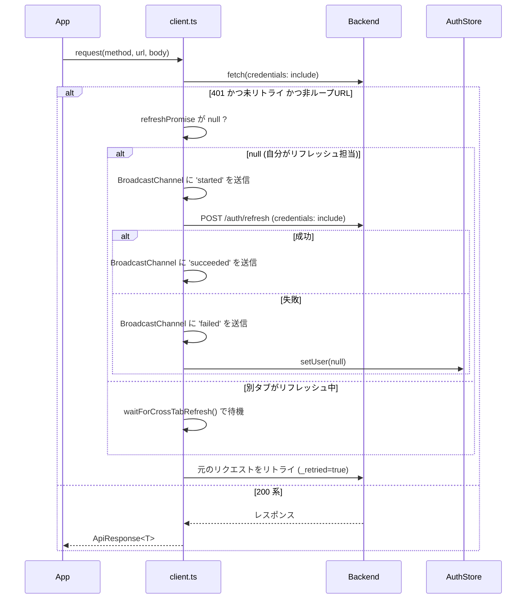

# フロントエンド仕様書

> 対象コード: `frontend/src/` 配下  
> 最終更新: 2026-04-15

---

## 目次

1. [概要](#1-概要)
2. [ディレクトリ構造](#2-ディレクトリ構造)
3. [ルーティング](#3-ルーティング)
4. [状態管理](#4-状態管理)
5. [API クライアント](#5-api-クライアント)
6. [主要 hooks](#6-主要-hooks)
7. [主要コンポーネント](#7-主要コンポーネント)
8. [スタイリング規約](#8-スタイリング規約)
9. [ビルド・テスト](#9-ビルドテスト)
10. [既知の不足](#10-既知の不足)
11. [フロントエンド変更時のチェックリスト](#フロントエンド変更時のチェックリスト)

---

## 1. 概要

### 技術スタック

| 分類 | ライブラリ / ツール | バージョン |
|---|---|---|
| UI フレームワーク | React | ^18.3.1 |
| 言語 | TypeScript | ^5.7.2 |
| ビルドツール | Vite | ^6.0.3 |
| スタイリング | Tailwind CSS | ^3.4.16 |
| アイコン | lucide-react | ^0.468.0 |
| グローバル状態 | Zustand | ^5.0.2 |
| サーバー状態 | TanStack React Query | ^5.62.0 |
| ルーティング | React Router v6 | ^6.28.0 |
| DnD | @dnd-kit/core + @dnd-kit/sortable | ^6.3.1 / ^10.0.0 |
| Markdown レンダリング | react-markdown + remark-gfm + mermaid | ^10.1.0 / ^4.0.1 / ^11.13.0 |
| エラー追跡 | @sentry/browser | ^8.0.0 |
| WebAuthn | @simplewebauthn/browser | ^13.3.0 |
| XSS 対策 | dompurify | ^3.3.3 |
| テスト | Vitest + Testing Library + MSW | ^2.1.0 / ^16.0.0 / ^2.6.0 |

### ポート・エントリポイント

- 開発サーバー: `http://localhost:3000`（Vite、`vite.config.ts` の `server.port: 3000`）
- エントリポイント: `frontend/src/main.tsx`
- ルートコンポーネント: `frontend/src/App.tsx`

### 起動シーケンス

`main.tsx` で以下の順に実行される。

1. `initSentry()` を呼び出し（非同期、バックエンドから DSN を取得）
2. `store/theme` をインポートし、`localStorage` の設定を即時適用（サイドエフェクト）
3. `ReactDOM.createRoot(...).render(<React.StrictMode><App /></React.StrictMode>)` でマウント
4. `App` → `AppInit` コンポーネントが `/auth/me` を呼び出し、Cookie ベースのセッションを確認

---

## 2. ディレクトリ構造

```
frontend/src/
├── main.tsx                  # エントリポイント
├── App.tsx                   # ルート: QueryClientProvider + BrowserRouter + ルート定義
├── index.css                 # Tailwind ベースCSS（@tailwind base/components/utilities）
├── globals.d.ts              # グローバル型定義（__BUILD_TIMESTAMP__ 等）
│
├── types/
│   └── index.ts              # 全ドメイン型定義（Task, Project, User, Bookmark 等）
│
├── constants/
│   └── task.ts               # タスク関連定数（STATUS_LABELS, PRIORITY_COLORS, BOARD_COLUMNS 等）
│
├── store/
│   ├── auth.ts               # Zustand: 認証状態（user, isInitialized）
│   └── theme.ts              # Zustand: テーマ設定（light/dark/system + localStorage永続化）
│
├── api/
│   ├── client.ts             # Fetch ベース HTTP クライアント（JWT自動付与・リフレッシュ）
│   ├── index.ts              # barrel export
│   ├── projects.ts           # projectsApi ラッパー
│   ├── tasks.ts              # tasksApi ラッパー
│   ├── bookmarks.ts          # bookmarksApi / bookmarkCollectionsApi ラッパー
│   ├── chat.ts               # chatApi ラッパー
│   ├── knowledge.ts          # knowledgeApi ラッパー
│   ├── secrets.ts            # secretsApi ラッパー
│   └── errorTracker.ts       # errorTrackerApi ラッパー + ErrorIssue 型定義
│
├── hooks/
│   ├── useSSE.ts             # SSE 接続管理（チケット取得→EventSource→QueryCache invalidate）
│   └── useGlobalErrorHandler.ts  # window error / unhandledrejection を Toast + Sentry に転送
│
├── lib/
│   └── sentry.ts             # Sentry 初期化（DSN はバックエンドの /public-config から取得）
│
├── components/
│   ├── common/               # 汎用 UI コンポーネント
│   │   ├── AppInit.tsx       # /auth/me ブートストラップ
│   │   ├── Layout.tsx        # サイドバー + Outlet ラッパー（useSSE 呼び出し元）
│   │   ├── ProtectedRoute.tsx # 認証ガード
│   │   ├── AdminRoute.tsx    # 管理者ガード
│   │   ├── ErrorBoundary.tsx # クラスコンポーネント境界 + PageErrorFallback
│   │   ├── Toast.tsx         # module-level store パターンのトースト
│   │   ├── ConfirmDialog.tsx # 非同期確認ダイアログ（Promise<boolean> API）
│   │   ├── MarkdownRenderer.tsx # Mermaid 対応 Markdown レンダラー
│   │   ├── AuthImage.tsx     # /api/ 画像を Cookie 認証付きで表示（Blob キャッシュ）
│   │   └── ThemeToggle.tsx   # ライト/ダーク/システム切替ボタン
│   │
│   ├── task/                 # タスク UI
│   │   ├── TaskBoard.tsx     # Kanban ボード（dnd-kit DnD + ステータス変更 + 複数選択）
│   │   ├── TaskList.tsx      # テーブルリスト表示（dnd-kit 並び替え対応）
│   │   ├── TaskCard.tsx      # カード表示（優先度バッジ、承認ボタン等）
│   │   ├── TaskDetail.tsx    # 詳細パネル（インライン編集、コメント、サブタスク）
│   │   ├── TaskCreateModal.tsx  # タスク作成モーダル
│   │   ├── TaskCommentSection.tsx  # コメント表示・投稿
│   │   ├── TaskSubtaskSection.tsx  # サブタスク一覧・追加
│   │   ├── SortableTaskCard.tsx    # dnd-kit useSortable ラッパー
│   │   └── DraggableTaskCard.tsx   # ドラッグ中の DragOverlay 用
│   │
│   ├── project/              # プロジェクト詳細タブ
│   │   ├── ProjectDocumentsTab.tsx  # ドキュメント一覧・編集
│   │   ├── ProjectBookmarksTab.tsx  # ブックマーク一覧
│   │   ├── ProjectMembersTab.tsx    # メンバー管理
│   │   └── ProjectSecretsTab.tsx   # シークレット管理
│   │
│   ├── bookmark/             # ブックマーク UI
│   │   ├── BookmarkCollectionSidebar.tsx
│   │   ├── BookmarkCreateModal.tsx
│   │   └── ClipContentRenderer.tsx
│   │
│   ├── settings/             # 設定 UI
│   │   └── ApiKeysSection.tsx  # MCP API キー管理
│   │
│   └── workspace/            # ワークスペース（管理者専用）
│       ├── AgentList.tsx
│       └── AgentRegisterDialog.tsx
│
├── pages/                    # ルートコンポーネント（1ファイル = 1ページ）
│   ├── LoginPage.tsx          # パスワード + Passkey ログイン + Google OAuth
│   ├── ProjectsPage.tsx       # プロジェクト一覧
│   ├── ProjectPage.tsx        # プロジェクト詳細（Board/List/Docs/Errors ビュー切替）
│   ├── ProjectSettingsPage.tsx # プロジェクト設定（メタデータ編集）
│   ├── DocumentPage.tsx       # ドキュメント詳細ページ
│   ├── KnowledgePage.tsx      # ナレッジベース
│   ├── DocSitesPage.tsx       # DocSite 一覧
│   ├── DocSiteViewerPage.tsx  # DocSite ビューア（ツリーナビ + ページ表示）
│   ├── BookmarksPage.tsx      # ブックマーク
│   ├── ChatPage.tsx           # Chat セッション
│   ├── SettingsPage.tsx       # アカウント設定（Passkey 管理等）
│   ├── AdminPage.tsx          # 管理者画面（タブ切替）
│   ├── ErrorTrackerPage.tsx   # エラートラッカー（Sentry UI互換）
│   ├── WorkspacePage.tsx      # ワークスペース（管理者専用）
│   ├── GoogleCallbackPage.tsx # Google OAuth コールバック処理
│   └── NotFoundPage.tsx       # 404
│
└── __tests__/                # テスト（詳細は「9. ビルド・テスト」参照）
    ├── setup.ts
    ├── mocks/
    │   ├── handlers.ts
    │   ├── server.ts
    │   └── factories.ts
    ├── utils/
    │   └── renderWithProviders.tsx
    ├── api/
    ├── components/
    ├── hooks/
    ├── pages/
    └── unit/
```

---

## 3. ルーティング

`App.tsx` で React Router v6 の `<BrowserRouter>` + `<Routes>` によって定義される。

### ルート一覧

| パス | コンポーネント | ガード | 遅延ロード |
|---|---|---|---|
| `/login` | `LoginPage` | なし | なし |
| `/auth/google/callback` | `GoogleCallbackPage` | なし | あり |
| `/` | `ProtectedRoute` > `Layout` | `ProtectedRoute` | なし |
| `/projects` | `ProjectsPage` | `ProtectedRoute` (継承) | なし |
| `/projects/:projectId` | `ProjectPage` | 同上 | あり |
| `/projects/:projectId/settings` | `ProjectSettingsPage` | 同上 | なし |
| `/projects/:projectId/documents/:documentId` | `DocumentPage` | 同上 | なし |
| `/knowledge` | `KnowledgePage` | 同上 | あり |
| `/knowledge/:knowledgeId` | `KnowledgePage` | 同上 | あり |
| `/docsites` | `DocSitesPage` | 同上 | なし |
| `/docsites/:siteId/*` | `DocSiteViewerPage` | 同上 | あり |
| `/chat` | `ChatPage` | 同上 | あり |
| `/bookmarks` | `BookmarksPage` | 同上 | あり |
| `/bookmarks/:bookmarkId` | `BookmarksPage` | 同上 | あり |
| `/workspaces` | `AdminRoute` > `WorkspacePage` | `AdminRoute` | あり |
| `/settings` | `SettingsPage` | `ProtectedRoute` (継承) | なし |
| `/admin` | `AdminRoute` > `AdminPage` | `AdminRoute` | あり |
| `*` | `NotFoundPage` | なし | あり |

> 注意: `/` にアクセスすると `<Navigate to="/projects" replace />` でリダイレクトされる。

### ルーティングフロー

```mermaid
flowchart TD
    A[URL アクセス] --> B{/login または /auth/google/callback ?}
    B -- Yes --> C[認証ページ表示]
    B -- No --> D[ProtectedRoute]
    D --> E{isInitialized ?}
    E -- false --> F[読み込み中スピナー]
    E -- true --> G{user != null ?}
    G -- false --> H[/login へリダイレクト]
    G -- true --> I[Layout + Outlet]
    I --> J{AdminRoute が必要 ?}
    J -- Yes --> K{user.is_admin ?}
    K -- false --> L[/projects へリダイレクト]
    K -- true --> M[管理ページ表示]
    J -- No --> N[通常ページ表示]
```

### 遅延ロード戦略

`App.tsx` のコメントに記載の通り、バンドルサイズを抑えるため初回表示に不要な重いページは `React.lazy()` で分割される（>15KB 相当）。`<Suspense fallback={<LoadingFallback />}>` でラップされ、ローディング中は「読み込み中...」テキストが表示される。

### URL 状態の活用

`ProjectPage` では表示状態を URL の `?view=` / `?task=` / `?doc=` クエリパラメータで管理しており、ブラウザバックやリンク共有が可能になっている。

---

## 4. 状態管理

### 設計方針

| 状態の種類 | 管理手段 |
|---|---|
| 認証ユーザー情報 / 初期化フラグ | Zustand (`store/auth.ts`) |
| テーマ設定（明暗） | Zustand (`store/theme.ts`) |
| サーバーデータ（タスク・プロジェクト等） | React Query |
| フォーム・UI ローカル状態 | React `useState` |
| Toast / ConfirmDialog | module-level mutable store（`useSyncExternalStore`）|

### 4.1 Zustand ストア

#### `useAuthStore` (`store/auth.ts`)

**State shape**

```typescript
interface AuthState {
  user: User | null          // ログイン中ユーザー。null = 未認証
  isInitialized: boolean     // AppInit が /auth/me を呼び終えたか
}
```

**Actions**

| アクション | シグネチャ | 説明 |
|---|---|---|
| `setUser` | `(user: User \| null) => void` | ユーザー情報をセット |
| `setInitialized` | `(v: boolean) => void` | 初期化完了フラグをセット |
| `logout` | `() => Promise<void>` | `POST /auth/logout` を呼び出してから `user` を null にする。サーバーエラーは `console.error` に記録し、ローカル状態は必ずリセットする |

**永続化方針**: 意図的に永続化しない。リロード時は `AppInit` が `/auth/me` で再確認する。トークン自体はバックエンドが設定する HttpOnly Cookie に保存されるため JS からは不可視。

**循環依存の回避**: `logout()` 内で `api/client.ts` を `import()` で動的 import している（`client.ts` が `store/auth.ts` を import しているため静的 import は循環になる）。

#### `useThemeStore` (`store/theme.ts`)

**State shape**

```typescript
interface ThemeState {
  mode: 'light' | 'dark' | 'system'
}
```

**Actions**

| アクション | 説明 |
|---|---|
| `setMode(mode)` | `localStorage('theme_mode')` に保存し、`document.documentElement.classList` の `dark` クラスを即時切替 |

**永続化方針**: `localStorage` の `theme_mode` キーに保存。モジュールロード時（`import './store/theme'` in `main.tsx`）に即時適用することで FOUC（スタイルのちらつき）を防ぐ。`window.matchMedia` の `change` イベントを監視し、`system` モード時はシステム設定の変化に自動追従する。

### 4.2 React Query

#### QueryClient 設定

```typescript
// App.tsx
const queryClient = new QueryClient({
  defaultOptions: { queries: { staleTime: 30_000, retry: 1 } },
})
```

- `staleTime: 30_000` — 30秒間はキャッシュをフレッシュとみなし、再フェッチしない
- `retry: 1` — 失敗時1回リトライ

#### クエリキー命名規則

| リソース | クエリキー | 備考 |
|---|---|---|
| プロジェクト一覧 | `['projects']` | |
| プロジェクト詳細 | `['project', projectId]` | |
| プロジェクトサマリー | `['project-summary', projectId]` | |
| タスク一覧 | `['tasks', projectId]` または `['tasks', projectId, showArchived]` | |
| タスク詳細 | `['task', taskId]` | |
| 管理者用プロジェクト一覧 | `['admin-projects']` | |

#### invalidate のタイミング

- **SSE イベント受信時** (`useSSE.ts`): バックエンドからプッシュされた変更を反映するため、対応するクエリキーを `invalidateQueries` で無効化する
- **Mutation 成功後** (`onSuccess`): 楽観的更新の有無によらず、変更を加えた対象のクエリを invalidate する
- **楽観的更新** (`onMutate`): `TaskBoard` のドラッグ＆ドロップ並び替えや、`Layout` のプロジェクト並び替えで使用。`onError` で `setQueryData` により元のデータに戻す

### 4.3 module-level store パターン（Toast / ConfirmDialog）

`Toast.tsx` と `ConfirmDialog.tsx` は React の外側にあるモジュールスコープの変数で状態を保持し、`useSyncExternalStore` で React に購読させるパターンを採用している。これにより、コンポーネントツリーのどこからでも `showErrorToast(...)` / `showConfirm(...)` を呼び出せる。

```
状態フロー（Toast）:

コード任意の場所
 └─ showErrorToast("メッセージ")
     └─ toasts 配列を更新 → emitChange()
         └─ useSyncExternalStore のリスナーが反応
             └─ ToastContainer が再レンダリング
```

---

## 5. API クライアント

### 5.1 クライアント構造

`api/client.ts` は Axios を使わず **Fetch API** ベースの薄いラッパーとして実装されている。

```typescript
export const api = {
  get:    <T>(url, config?)          => request<T>('GET',    url, undefined, config),
  post:   <T>(url, body?, config?)   => request<T>('POST',   url, body,      config),
  patch:  <T>(url, body?, config?)   => request<T>('PATCH',  url, body,      config),
  put:    <T>(url, body?, config?)   => request<T>('PUT',    url, body,      config),
  delete: <T>(url, config?)          => request<T>('DELETE', url, undefined, config),
}
```

すべてのリクエストは `Promise<ApiResponse<T>>` を返す。`ApiResponse.data` がレスポンスボディ。

**ベース URL**: `/api/v1`（バックエンドへのプロキシは Vite の `server.proxy` または Traefik が担う）

**タイムアウト**: デフォルト 30秒（`DEFAULT_TIMEOUT = 30000`）。`AbortSignal.any()` でカスタム `signal` と組み合わせ可能。

**クエリパラメータ**: `config.params` に渡すと `URLSearchParams` でシリアライズされる。`undefined` / `null` の値は除外される。

**Content-Type**: `FormData` の場合はブラウザに自動設定させる（boundary 付き）。それ以外は `application/json`。

**Cookie 送信**: `credentials: 'include'` を常に付与。

### 5.2 JWT 自動付与・リフレッシュフロー



**クロスタブ調整**: `BroadcastChannel('mcp-todo-auth-refresh')` を用いて、複数タブが同時にリフレッシュを試みるのを防ぐ。リフレッシュ中のタブは `waitForCrossTabRefresh()` でイベントを待ち、成否を受け取る。

**ループ検出**: `/auth/refresh` と `/auth/logout` エンドポイント自身が 401 を返した場合はリトライしない（`isAuthLoopUrl(url)` で判定）。

**FormData の制限**: `FormData` はストリーミングボディのため同一インスタンスでのリトライ不可。401 発生時はリトライせず呼び出し元に戻す。

### 5.3 エラークラス

```typescript
class ApiError extends Error {
  status: number         // HTTP ステータスコード
  data: unknown          // レスポンスボディ
  response: { status: number; data: unknown }  // 後方互換フィールド
  isApiError = true
}
```

`error.response.status` / `error.response.data` でアクセスすると、従来の Axios 互換コードとも合わせやすい。

### 5.4 ドメイン別 API ラッパー

`api/index.ts` から barrel export される。URL 文字列の重複を排除し、型安全な呼び出しを提供する。

| エクスポート名 | ファイル | 主なメソッド |
|---|---|---|
| `projectsApi` | `api/projects.ts` | `list`, `get`, `summary`, `create`, `update`, `remove`, `reorder` |
| `tasksApi` | `api/tasks.ts` | `list`, `get`, `create`, `update`, `remove`, `archive`, `unarchive`, `addComment`, `deleteComment` |
| `bookmarksApi` | `api/bookmarks.ts` | `list`, `get`, `create`, `update`, `remove`, `search` |
| `bookmarkCollectionsApi` | `api/bookmarks.ts` | `list`, `get`, `create`, `update`, `remove` |
| `chatApi` | `api/chat.ts` | `listSessions`, `getSession`, `createSession`, `updateSession`, `deleteSession`, `getMessages` |
| `knowledgeApi` | `api/knowledge.ts` | `list`, `get`, `create`, `update`, `remove`, `search` |
| `secretsApi` | `api/secrets.ts` | `list`, `create`, `update`, `remove`, `getValue` |
| `errorTrackerApi` | `api/errorTracker.ts` | `listProjects`, `updateProject`, `listIssues`, `getIssue`, `listEvents`, `resolve`, `ignore`, `reopen` |

### 5.5 SSE 接続

SSE は `api/client.ts` の `api` オブジェクトではなく、`hooks/useSSE.ts` 内で直接 `EventSource` を使用する（SSE は `fetch` API 経由では制御しにくいため）。ただし SSE 用の**ワンタイムチケット**取得には `api.post('/events/ticket')` を呼び出す。

---

## 6. 主要 hooks

### `useSSE` (`hooks/useSSE.ts`)

**用途**: バックエンドからのリアルタイムイベントを受信し、React Query キャッシュの無効化とトースト通知を行う。

**呼び出し元**: `components/common/Layout.tsx`（認証済みユーザーがいる間は常に接続）

**シグネチャ**

```typescript
function useSSE(): void
```

**動作概要**

1. `api.post('/events/ticket')` でワンタイムチケットを取得（JWT をURLに露出させないため）
2. `new EventSource('/api/v1/events?ticket=...')` で接続
3. メッセージ受信時: イベントタイプに応じて `queryClient.invalidateQueries()` を呼び出す
4. エラー / 切断時: 指数バックオフ（最大 30秒、最大 20回）でリトライ
5. `window.online` イベントでネットワーク復旧を検知し即座に再接続

**処理するイベントタイプ**

| イベントタイプ | invalidate 対象 | トースト |
|---|---|---|
| `task.created` / `task.updated` / `task.deleted` | `['tasks', projectId]`, `['project-summary', projectId]`, `['task', id]` | あり |
| `tasks.batch_created` / `tasks.batch_updated` | 同上 | あり |
| `comment.added` / `comment.deleted` | `['tasks', projectId]`, `['task', task_id]` | あり |
| `project.created` / `project.updated` / `project.deleted` | `['projects']`, `['admin-projects']`, `['project', projectId]` | あり |
| `connected` | なし（無視） | なし |

---

### `useGlobalErrorHandler` (`hooks/useGlobalErrorHandler.ts`)

**用途**: `window.unhandledrejection` と `window.error` を補足し、エラートースト + Sentry レポートを行う。

**呼び出し元**: `App.tsx` の `AppRoutes` コンポーネント（アプリ起動直後から全期間有効）

**シグネチャ**

```typescript
function useGlobalErrorHandler(): void
```

**動作概要**

- `Promise` の未処理 rejection: メッセージを `showErrorToast` に渡し、`captureException` で Sentry に送信。ただし 401 / 403 は API クライアント側で処理済みのため除外
- 同期エラー（`window.error`）: 同様に Toast + Sentry

---

## 7. 主要コンポーネント

### 7.1 `AppInit` (`components/common/AppInit.tsx`)

**役割**: マウント時に `/auth/me` を呼び出し、Cookie セッションの有無を確認する。`isInitialized` を `true` にすることで `ProtectedRoute` のブロックを解除する。

| props | 型 | 説明 |
|---|---|---|
| `children` | `ReactNode` | ラップする子要素（`AppInit` 自身は何も描画しない）|

---

### 7.2 `ProtectedRoute` (`components/common/ProtectedRoute.tsx`)

**役割**: `isInitialized` が `false` の間はローディング表示。`user` が `null` なら `/login` にリダイレクト。

| props | 型 | 説明 |
|---|---|---|
| `children` | `ReactNode` | 認証済みの場合に表示する要素 |

---

### 7.3 `AdminRoute` (`components/common/AdminRoute.tsx`)

**役割**: `user` が `null` なら `/login`、`user.is_admin` が `false` なら `/projects` にリダイレクト。

| props | 型 | 説明 |
|---|---|---|
| `children` | `ReactNode` | 管理者ユーザーのみ表示する要素 |

---

### 7.4 `Layout` (`components/common/Layout.tsx`)

**役割**: サイドバー（デスクトップ固定 / モバイルドロワー）と `<Outlet />` を持つシェルレイアウト。`useSSE()` の呼び出し元。

**内包する機能**
- プロジェクト一覧の表示（`useQuery(['projects'])` を内部で呼ぶ）
- プロジェクト並び替え（dnd-kit + 楽観的更新 mutation）
- ナビゲーションリンク（Chat, Bookmarks, Knowledge, DocSites, Workspaces, Settings, Admin）
- ログアウトボタン
- `ThemeToggle`
- ビルドタイムスタンプ表示（`__BUILD_TIMESTAMP__`）

---

### 7.5 `ErrorBoundary` (`components/common/ErrorBoundary.tsx`)

**役割**: React のレンダリングエラーをキャッチする。2種類の fallback を持つ。

| 種類 | 用途 |
|---|---|
| デフォルト fallback | 全画面エラー（`key={location.pathname}` でルート変更時にリセット）|
| `PageErrorFallback` | ページ内エラー（サイドバーを残す。`Layout` 内の `<Outlet>` を囲む）|

`componentDidCatch` でスタックトレースを `console.error` に記録する（Sentry への送信は TODO）。

---

### 7.6 `Toast` (`components/common/Toast.tsx`)

**役割**: ページ下部右に表示される通知バナー。コンポーネントツリー外からも呼び出せる。

**Public API（コンポーネント不要で呼び出せる関数）**

```typescript
showErrorToast(text: string): void   // 赤バナー、8秒表示
showSuccessToast(text: string): void // 緑バナー、4秒表示
showInfoToast(text: string): void    // 青バナー、4秒表示
```

**マウント場所**: `App.tsx` の `AppRoutes` 内に `<ToastContainer />` を1つだけ配置する。

---

### 7.7 `ConfirmDialog` (`components/common/ConfirmDialog.tsx`)

**役割**: 削除確認等の非同期確認ダイアログ。`Promise<boolean>` を返す命令型 API。

**Public API**

```typescript
showConfirm(message: string): Promise<boolean>
// true = 「実行」ボタン押下, false = 「キャンセル」または Escape キー
```

**マウント場所**: `App.tsx` の `AppRoutes` 内に `<ConfirmDialog />` を1つだけ配置する。

---

### 7.8 `MarkdownRenderer` (`components/common/MarkdownRenderer.tsx`)

**役割**: `react-markdown` + `remark-gfm` による Markdown レンダリング。`mermaid` コードブロックをダイアグラムに変換する。

| props | 型 | 説明 |
|---|---|---|
| `children` | `string` | Markdown テキスト |
| `className` | `string?` | コンテナの className（デフォルト: `prose prose-sm prose-gray dark:prose-invert max-w-none`）|
| `componentOverrides` | `Partial<Components>?` | react-markdown の components を上書きする |

**XSS 対策**: `react-markdown` がデフォルトで生 HTML をレンダリングしないため、追加の sanitize は不要（`dangerouslySetInnerHTML` は Mermaid SVG の表示にのみ使用し、Mermaid 自身が `securityLevel: 'strict'` で制限）。

---

### 7.9 `AuthImage` (`components/common/AuthImage.tsx`)

**役割**: `/api/` で始まる内部 URL の画像を、Cookie 認証付きで Blob としてフェッチし表示する。モジュールスコープの `Map<string, string>` でキャッシュする。

| props | 型 | 説明 |
|---|---|---|
| `src` | `string?` | 画像 URL。`/api/` 以外の URL は通常の `` にフォールスルー |
| `alt` | `string?` | alt テキスト |
| `onLoadError` | `() => void` | 3回リトライ後も失敗した場合に呼ばれる |
| その他 | `ImgHTMLAttributes` | `` に転送される |

---

### 7.10 `TaskBoard` (`components/task/TaskBoard.tsx`)

**役割**: Kanban ボード。5カラム（TODO / 進行中 / 保留 / 完了 / キャンセル）を dnd-kit で実装する。

| props | 型 | 説明 |
|---|---|---|
| `tasks` | `Task[]` | 表示するタスク全件 |
| `projectId` | `string` | |
| `onTaskClick` | `(id: string) => void` | タスクカードクリック時 |
| `onUpdateFlags` | `(taskId, flags) => void` | `needs_detail` / `approved` の切替 |
| `onArchive` | `(taskId, archive) => void` | アーカイブ / アーカイブ解除 |
| `onStatusChange` | `(taskId, status) => void` | ドラッグによるカラム間移動 |
| `onExport` | `(taskIds, format) => void` | 選択タスクのエクスポート |
| `onReorder` | `(taskIds: string[]) => void` | 同一カラム内の並び替え |
| `showArchived` | `boolean` | アーカイブ済みタスクを表示するか |
| `visibleColumns` | `TaskStatus[]?` | 表示するカラムを絞り込む（省略時は全カラム）|
| `selectMode` | `boolean` | 複数選択モード |
| `onExitSelectMode` | `() => void` | |

---

### 7.11 `TaskCard` (`components/task/TaskCard.tsx`)

**役割**: Kanban カード1枚。優先度バッジ・タグ・期限・承認ボタン・アーカイブボタンを表示。

| props | 型 | 説明 |
|---|---|---|
| `task` | `Task` | |
| `onClick` | `() => void` | カード本体クリック時 |
| `onUpdateFlags` | `(taskId, flags) => void` | 承認ボタン押下時 |
| `onArchive` | `((taskId, archive) => void)?` | 省略時はアーカイブボタン非表示 |
| `selectMode` | `boolean?` | チェックボックスを表示するか |
| `isSelected` | `boolean?` | 選択状態 |
| `onToggleSelect` | `(() => void)?` | チェックボックス切替時 |

**アクセシビリティ**: `role="button"` + `tabIndex={0}` + `onKeyDown`（Enter/Space でクリック）。`aria-label={task.title}`。

---

### 7.12 `TaskCreateModal` (`components/task/TaskCreateModal.tsx`)

**役割**: タスク作成フォームのモーダル。

| props | 型 | 説明 |
|---|---|---|
| `projectId` | `string` | タスクを作成するプロジェクト |
| `onClose` | `() => void` | 閉じる（キャンセル・作成成功どちらでも呼ばれる）|

**作成成功後**: `['tasks', projectId]` と `['project-summary', projectId]` を invalidate する。

---

### 7.13 `ThemeToggle` (`components/common/ThemeToggle.tsx`)

**役割**: ライト / ダーク / システムの3択切替ボタン群。`useThemeStore` を介してテーマを変更する。

---

## 8. スタイリング規約

### 基本方針

Tailwind CSS の **utility-first** アプローチを採用。`@apply` は `index.css` の `@layer base` 内での最小限の使用にとどめる。

### ダークモード

`tailwind.config.js` (TODO: 確認) の設定により、`dark:` プレフィックスが `class` 戦略で適用される。`document.documentElement` への `dark` クラスの付け外しは `store/theme.ts` の `applyTheme()` が担う。

コンポーネント内では必ず `light:dark:` のペアで記述する。

```html
<!-- 例: テキスト -->
<p class="text-gray-800 dark:text-gray-100">...</p>

<!-- 例: 背景 -->
<div class="bg-white dark:bg-gray-800">...</div>
```

### テーマカラー

| 役割 | クラス | 用途 |
|---|---|---|
| プライマリー | `indigo-600` / `indigo-400` (dark) | ボタン、アクティブ状態、リンク |
| 成功 | `emerald-600` | 承認済みバッジ、成功トースト |
| 警告 | `amber-600` | 確認ダイアログアイコン、保留ステータス |
| エラー | `red-600` | エラートースト、キャンセルステータス、期限超過 |
| 情報 | `indigo-600` | 情報トースト |
| 要判断タスク | `violet-600` | `task_type === 'decision'` のバッジ |

### 優先度カラー（`constants/task.ts`）

| 優先度 | バッジ (light / dark) |
|---|---|
| urgent | `bg-red-100 text-red-700` / `dark:bg-red-900/40 dark:text-red-400` |
| high | `bg-orange-100 text-orange-700` / `dark:bg-orange-900/40 dark:text-orange-400` |
| medium | `bg-yellow-100 text-yellow-700` / `dark:bg-yellow-900/40 dark:text-yellow-400` |
| low | `bg-gray-100 text-gray-600` / `dark:bg-gray-700 dark:text-gray-400` |

### タイポグラフィ

Markdown コンテンツには `@tailwindcss/typography` プラグインの `prose prose-sm prose-gray dark:prose-invert max-w-none` クラスを使用する（`MarkdownRenderer` のデフォルト値）。

インライン `code` 要素のバッククォートは `index.css` の `::before` / `::after` を空文字で上書きして除去している。

### `clsx` の使用

条件付きクラス結合には `clsx` ライブラリを使用する。テンプレートリテラルの三項演算子は可読性が低いため避ける。

```typescript
// 推奨
clsx('base-class', condition && 'conditional-class', { 'key-class': boolValue })

// 非推奨
`base-class ${condition ? 'conditional-class' : ''}`
```

### z-index 層

| 値 | 用途 |
|---|---|
| `z-20` | TaskBoard の浮きバー（複数選択時のエクスポートバー）|
| `z-40` | モバイルサイドバーのオーバーレイ |
| `z-50` | モバイルサイドバードロワー、TaskCreateModal |
| `z-[100]` | ToastContainer |
| `z-[200]` | ConfirmDialog |

---

## 9. ビルド・テスト

### `npm run` スクリプト一覧

| コマンド | 内容 |
|---|---|
| `npm run dev` | Vite 開発サーバー起動（port 3000） |
| `npm run build` | `tsc` 型チェック + `vite build` |
| `npm run preview` | ビルド成果物をプレビュー |
| `npm test` | `vitest run`（CI 用、watch なし）|
| `npm run test:watch` | `vitest`（開発時 watch モード）|
| `npm run test:coverage` | `vitest run --coverage`（v8 プロバイダー）|

### Vite ビルド設定

`vite.config.ts` の `build.rollupOptions.output.manualChunks` で以下のチャンク分割を行う。

| チャンク名 | 内容 |
|---|---|
| `vendor` | `react`, `react-dom`, `react-router-dom` |
| `markdown` | `react-markdown` |
| `dnd` | `@dnd-kit/*` |

`__BUILD_TIMESTAMP__` グローバル変数をビルド時に注入し、サイドバーのビルド日時表示と Sentry の `release` フィールドに利用する。

開発時は `/api` へのリクエストを `VITE_API_URL`（デフォルト: `http://localhost:8000`）にプロキシする。

### Vitest 設定

- 環境: `jsdom`
- setup ファイル: `src/__tests__/setup.ts`
- カバレッジ: v8 プロバイダー、HTML + テキストレポート
- カバレッジ対象: `src/**/*.{ts,tsx}`（`main.tsx`、`*.d.ts`、テストファイルを除く）
- カバレッジ閾値: **行カバレッジ 60%**（`thresholds.lines: 60`）

### MSW (Mock Service Worker) モック方針

テスト環境では `msw` v2 の Node.js サーバー（`msw/node`）を使用する。

**setup** (`__tests__/setup.ts`)

```typescript
beforeAll(() => server.listen({ onUnhandledRequest: 'warn' }))
afterEach(() => {
  server.resetHandlers()  // テスト間でハンドラーをリセット
  localStorage.clear()
})
afterAll(() => server.close())
```

**デフォルトハンドラー** (`__tests__/mocks/handlers.ts`): auth, projects, tasks の正常系を網羅。

**異常系テスト**: 各テスト内で `server.use(http.get('/api/v1/...', () => HttpResponse.json({...}, { status: 500 })))` で上書きする。

**注意**: `react-tweet` は `.module.css` を読み込むため jsdom で処理できない。`vi.mock('react-tweet', () => ({ Tweet: () => null }))` でモック化している。

### テストヘルパー

**`renderWithProviders`** (`__tests__/utils/renderWithProviders.tsx`)

```typescript
function renderWithProviders(
  ui: React.ReactElement,
  options?: {
    route?: string        // MemoryRouter の初期 URL（デフォルト '/'）
    path?: string         // Routes/Route でラップする場合のパターン
    queryClient?: QueryClient  // キャッシュを事前に設定したい場合
  }
): RenderResult & { queryClient: QueryClient }
```

テストごとに `QueryClient` を新規作成し、`retry: false` / `gcTime: 0` / `staleTime: 0` でキャッシュが各テストに影響しないよう設定する。

**フィクスチャファクトリ** (`__tests__/mocks/factories.ts`)

```typescript
createMockTask(overrides?: Partial<Task>): Task
createMockUser(overrides?: Partial<User>): User
createMockProject(overrides?: Partial<Project>): Project
```

### 現在のテストカバレッジ対象ファイル（16ファイル）

| カテゴリ | ファイル |
|---|---|
| API | `api/client.test.ts` |
| コンポーネント | `AdminRoute`, `AppInit`, `ProtectedRoute`, `TaskBoard`, `TaskCard`, `TaskCreateModal`, `TaskDetail`, `TaskList` |
| hooks | `useGlobalErrorHandler`, `useSSE` |
| pages | `AdminPage`, `LoginPage`, `ProjectPage`, `ProjectsPage` |
| unit | `auth.store` |

---

## 10. 既知の不足

### テストが薄い領域

| 領域 | 現状 | 優先度 |
|---|---|---|
| `store/theme.ts` | テストなし | 中 |
| `lib/sentry.ts` | テストなし | 中 |
| `api/client.ts` のリフレッシュフロー（クロスタブ） | テストなし（`BroadcastChannel` のモックが必要）| 高 |
| `components/common/Toast.tsx` | テストなし | 中 |
| `components/common/ConfirmDialog.tsx` | テストなし | 中 |
| `components/common/MarkdownRenderer.tsx` | テストなし（mermaid モック必要）| 低 |
| `components/common/AuthImage.tsx` | テストなし（Blob URL モック必要）| 低 |
| ドメイン別 API ラッパー（`projects.ts` 等）| テストなし | 低 |
| ページ（`BookmarksPage`, `ChatPage`, `DocSiteViewerPage` 等）| テストなし | 中 |
| エラートラッカー UI | テストなし | 中 |
| `useSSE` の SSE 接続自体 | MSW が SSE を完全サポートしないため限定的 | 高 |

### 技術的負債

- **Axios → Fetch 移行は完了しているが** `api/index.ts` のバレルコメントに "The raw `api` axios instance" という記述が残っている（実体は Fetch ベースなので修正要）
- **`TaskDetail` のインライン編集**: `useState` による複数フィールドの状態管理が煩雑になっており、フォームライブラリ（react-hook-form 等）への移行が将来的に望ましい
- **カバレッジ閾値 60%**: 現状の閾値は低めに設定されており、段階的に 80% 以上を目標にすることを推奨
- **`MarkdownRenderer` の `any` 型**: `useCallback` の code コンポーネントで `any` キャストを使用。react-markdown v10 の型定義に合わせた正確な型付けが必要
- **`Layout.tsx` の `useQuery`**: `projectsApi.list()` を使わず `api.get('/projects')` を直接呼んでいる（barrel export 経由に統一することを推奨）
- **`ErrorBoundary`**: `componentDidCatch` で `console.error` のみ行い、Sentry への送信をしていない。`captureException` の呼び出しを追加することを推奨
- **`AuthImage` のモジュールスコープキャッシュ**: `_blobCache` は `Map<string, string>` でモジュールスコープに保持されているため、コンポーネントアンマウント後も Blob URL を保持し続ける。大量の画像がある場合はメモリリークになりうる

---

## フロントエンド変更時のチェックリスト

### API 変更との整合

- [ ] バックエンドの API レスポンス型が変わった場合、`src/types/index.ts` の対応する型を更新する
- [ ] 新しいエンドポイントを追加した場合、対応するドメイン別 API ラッパー（`api/*.ts`）に追加し、`api/index.ts` から export する
- [ ] エンドポイントの URL が変わった場合、ドメイン API ラッパーの URL 文字列のみ修正する（コンポーネント側では直接 URL を持たない）
- [ ] 新しいクエリキーを追加した場合、このドキュメントの「クエリキー命名規則」テーブルを更新する
- [ ] SSE イベントタイプが追加された場合、`useSSE.ts` の `getEventMessage()` と invalidate ロジックに対応を追加する

### 型定義

- [ ] `types/index.ts` に定義されていない型を `any` で済ませない
- [ ] `api/*.ts` のメソッドシグネチャには必ず型引数（`api.get<Type>(...)`)を付与する

### 状態管理

- [ ] サーバーデータを `useState` にキャッシュしない（React Query を使う）
- [ ] `useQuery` の `queryKey` はこのドキュメントの命名規則に従う
- [ ] Mutation 後は対象データのクエリを `invalidateQueries` する
- [ ] Zustand に新しいストアを追加する場合は、このドキュメントの「4.1 Zustand ストア」セクションを更新する

### コンポーネント

- [ ] `showConfirm` / `showErrorToast` 等の命令型 API はコンポーネントのトップレベルではなくイベントハンドラ内で呼び出す
- [ ] `MarkdownRenderer` にはサニタイズ済みの文字列を渡す（外部入力をそのまま渡さない）
- [ ] 内部 API エンドポイントの画像には `AuthImage` を使用する（通常の `` では Cookie 認証が通らない）
- [ ] 削除・上書き等の不可逆操作には `showConfirm()` でユーザー確認を挟む

### スタイリング

- [ ] 新しいカラーはテーマカラー表を参考に `indigo`（プライマリ）・`emerald`（成功）・`red`（エラー）・`amber`（警告）の系統を使う
- [ ] ダークモードの `dark:` クラスを必ずペアで記述する
- [ ] 条件付きクラスには `clsx()` を使う（テンプレートリテラルの三項演算子は避ける）
- [ ] `z-index` は上記の層構造を守る

### テスト追加

- [ ] 新しいコンポーネントには最低限「レンダリングが成功すること」のテストを追加する
- [ ] API との連携部分は MSW ハンドラーを用いて正常系・エラー系のテストを追加する
- [ ] `renderWithProviders` ヘルパーを使用し、各テストのキャッシュ状態を分離する
- [ ] 新しいフィクスチャ型が必要な場合は `factories.ts` に `createMock*` 関数を追加する
- [ ] `npm test` でカバレッジ閾値（60%）を割らないことを確認する

### アクセシビリティ (a11y)

- [ ] クリック可能な非 `<button>` 要素には `role="button"` + `tabIndex={0}` + `onKeyDown`（Enter/Space）を付与する
- [ ] アイコンのみのボタンには `aria-label` を付与する
- [ ] モーダルダイアログには `role="dialog"` + `aria-modal="true"` + `aria-label` を付与する
- [ ] フォームの `<input>` には対応する `<label>` を紐付ける

### セキュリティ

- [ ] 外部ユーザー入力を `dangerouslySetInnerHTML` に直接渡さない
- [ ] `AuthImage` のキャッシュ（`_blobCache`）に追加した Blob URL は不要になったタイミングで `URL.revokeObjectURL()` することを検討する（現状は解放なし）
- [ ] 新しいリダイレクト先を `LoginPage` に追加する場合、`returnTo` パラメータが `/api/` 始まりの場合は `window.location.href`、それ以外は `navigate()` で処理するルールを維持する
